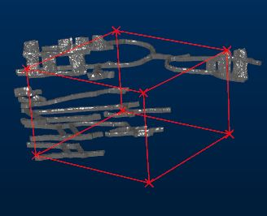
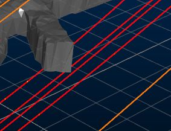
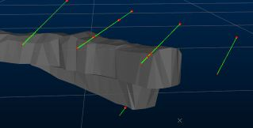

# Drillhole Break Through and Proximity Warnings

To access this screen:

  * **Sample Analysis** ribbon **> > Warning**.
  * Using the **[command line](<Command_Toolbar.md>)** , enter "borehole-warning-report"

  * Use the quick key combination "bhw".

  * Display the **[Find Command](<findcommand.md>)** screen, locate **borehole-warning-report** and click **Run**.

The Drillhole Break Through and Proximity Warnings screen is used to check for boreholes in the vicinity of excavations.

Select one or more loaded drillhole objects representing borehole object(s) you wish to investigate. Also load the corresponding excavation wireframe(s). Multiple instances of each can be loaded and selected as part of the same analysis.

If you wish, you can restrict your analysis to a 3D cube, ignoring all data outside of it. This is achieved by selecting the Limit Region for warning identification check box and defining the bounding points of the cube. You can do this interactively by picking points in a 3D window if you like. If this check box is unselected, all loaded and selected data is considered. 

If picking a bounding cube interactively, a temporary cube indicator is displayed to make it easier to visualize your constrained area of interest, e.g.:

**Tip** : Enable [snapping to wireframes](<SnapSettings.md>) and right-click to set your opposing cube points on your loaded excavation data.

Another way to restrict analysis is to specify a key field for either the drillhole(s), wireframe(s) or both. For example, you may only want to consider samples that lie close to a give **STOPEID** or **LEVEL**.

If you want to consider over-drill, set an Over Drill Distance and this will automatically be applied when considering excavation proximity. The default is zero, meaning the selected drillhole data is analysed as-is.

Calculated warning holes shown in red over original input drillholes (orange) - all red holes indicate a <15m Tolerance Distance from a drive wireframe

When you have set up your borehole proximity and display criteria, click OK to generate output tables 

If boreholes are found that pass within the Tolerance Distance, output data are generated, including:

During analysis, the Borehole Guarding and Warning progress bar displays. 

Settings from a previous session can be restored using Restore.

To calculate drillhole proximity warnings:

  1. Launch the **borehole-warning-report** command.

The **Drillhole Break Through and Proximity Warning** screen displays.

  2. Define the general **Parameters** that govern when a warning is issued:

     * Tolerance Distance: Required. Specify the distance below which drillholes are reported as concerning. For example, enter 20 and only boreholes within 20 measurement units of the specified wireframe objects are reported.

     * Max Deviation (Deg): The maximum deviation in degrees from plan that the drillholes in the selected object(s) could follow. The cone of possible positions is projected from the collar position. It is this cone that determines where potential proximity problems may occur with existing workings. For example, if 2 degrees is specified, each drillhole segment can vary from plan by a maximum of two degrees downhole, with the cone diameter increasing accordingly down the full length of the hole.

     * Over Drill Distance: To include a standard overdrill distance for each hole within the set, enter a value here. If left at zero, holes are considered as-is, with no extension from the planned end-of-hole expected.

  3. Define the **Volume within which to generate warnings** :

     * Limit Region for warning identification: specify or pick the opposing corners of a cube:

       * If **checked** , and a cube is defined, only data within the cube is considered during proximity reporting. You can preview the bounding cube in the primary 3D window using the Preview now button. This can help to visualize the volume within which borehole proximity assessment is made.

       * If **unchecked** , no constraining region is used and proximity warnings are issued whenever the specified **Parameters** are violated.

  4. Select Drillhole Objects to be considered. One or more loaded drillhole objects can be analysed. Only selected objects are included in the proximity check.

  5. Select the hole table(s) for reporting. If a Type Column is selected, the corresponding attribute value is assigned to the **BHTYPE** column in the output drillhole object.

  6. Select Woreframe Objects to be considered. One or more loaded structural wireframes can be analysed. Only selected objects are included in the proximity check.

  7. Choose which **Output Data** to produce:

     * Drillhole Report Table: after analysis, an output warning data object contains one row for each borehole that contravenes the proximity settings laid out in the settings.

You can view the contents of this table straight away, using the **[Data Object Manager](<Data%20Manager%20Dialog.md>)**. You can also export it to an external file for further analysis, include it as a table plot item in a hardcopy proximity report and automatically export the data to an external file 

     * Wireframe Report Table: an output report detailing holes and their breakthrough (**BREAKTH**) status.

     * Point Data Object: if a filename is specified (or an existing point object selected using the drop-down list), point data falling within the Tolerance Distance specified is output to a standalone points file.

     * Drillhole Object: holes that fail the proximity limit specified is included in an output drillhole object if a name is specified. Depending on the status of the Insersecting segments only check box, data is generated in one or two ways:

     * String: string data representing borehole segments of concern is generated if a name is set.   
  

Strings representing borehole segments within 15m of excavation

     * Deviation Cones: if an object name is specified, deviation cone wireframes for boreholes are generated, indicating potential breakthrough areas. These cones are based on the Max Deviation (Deg) setting specified.

     * Intersecting segments only disabled: entire drillholes are included or excluded based on their proximity to the specified wireframe data.

     * Intersecting segments only enabled: only the drillhole segments (represented by a distinct FROM and TO entry in the underlying table) are included or excluded. Segments that do not intercept the selected wireframe(s) will not be included in the output object.

  8. Choose to make physical file updates automatically once a proximity check is complete, using **Save to File on Completion**.

     * If **checked** , the drillhole data file(s) associated with the selected drillholes object(s) is updated automatically following proximity checks.

     * If **unchecked** , only loaded drillhole object data is modified. No physical file changes are made. To commit changes to the file, you will need to save the loaded object separately.

Related topics and activities

  * [Drillhole Planning](<Drillhole_Planning_Concept.md>)

  * [borehole-warning-report ("bhw")](<../command_help/borehole-warning-report.md>) (command)