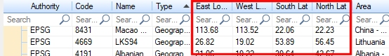

# Coordinate System Selection

To display this screen:

  * In the [Transform Coordinates](<Transform_Coordinates_Dialog.md>) dialog, select the browse button next to the Key list for either the Source Coordinate System or Target Coordinate System.

Select a standard coordinate system type for data coordinate transformation. This screen displays when picking both source and destination coordinate systems.

The concept of coordinate systems is essential to the operation of your application, and in fact, any application that displays data that needs to be shown in a dimensional and/or positional context. Coordinates are used to define a specific point in space. This 'space' can be 1, 2 or 3 or more dimensions; the simplest, one-dimensional coordinate array (consisting of a single number) can be used to define a point along a one-dimensional string - simply put, it is a 'count' of arbitrary units along the string from an origin (the 'zero point') in a given direction.

The Coordinate System Selection dialog is used to pick an industry-standard coordinate system for both the transformed and untransformed data, allowing conversion between them.

For example, if your input topography coordinates are represented by a commonly-used system such as _G:27700 (OSGB 1936 / British National Grid) 2 axes: Easting (metre) Northing (metre)_ but you want these coordinates to be updated so they are described according to the _G:27039 (Nahrwan 1967 / UTM zone 39N) 2 axes: Easting (metre) Northing (metre)_ system, you would select the Source and Target systems using the provided list, clicking OK to return to the Transform Coordinates dialog to complete the transformation.

## Coordinate System Types

All coordinate systems listed are a mixture of geographic (2D or 3D) and projected coordinate reference systems (CRS):

  * A geographic coordinate system can be expressed in 2D or 3D and is often optimal when you need to locate places on the Earth, or when you need to create global maps. However, latitude and longitude locations are _not_ located using uniform measurement units. Thus, geographic CRS systems are not ideal for measuring distance.  
  
A geographic CRS uses a grid that wraps around the entire globe. This means that each point on the globe is defined using the same coordinate system and the same units as defined within that particular geographic CRS.
    * One variant of a geographic CRS is a _geocentric_ system; a coordinate reference system based on a geodetic datum that deals with the Earth's curvature by taking the 3D spatial view, which removes the need to model the curvature. The origin of a geocentric CRS is at the centre of mass of the Earth. For example; _G 3822_ is a geocentric system accommodating Taiwan.
    * A _vertical_ CRS defines the origin for height or depth values. Like a horizontal coordinate system, a vertical coordinate system ensures that data is spatially located accurately in relation to other data.
  * The horizontal and vertical components of the description of a position in the space may sometimes come from different CRS systems. This is typically handled by a compound system. This is a system that describes position by two independent systems. A European spatial reference system could be described as a compound CRS, for example.

  * A projected coordinate system is defined on a flat, two-dimensional surface. Unlike a geographic coordinate system, a projected system has constant lengths, angles, and areas across the two dimensions. A projected coordinate system is always based on a geographic coordinate system that is based on a sphere or spheroid. Projecting data from a round surface onto a flat surface, results in visual modifications to the data when plotted on a map. Some areas are stretched and some are compressed, making this option suitable for localized coordinate system references.

**Tip** : check Projected CRS Onlyto show only projected, localized, coordinate reference systems in the table. 

**Note** : Studio products use an integrated component based on the PROJ coordinate transformation library. You can find out more about this engine [here](<https://proj.org/index.html>) (requires Internet connection).

## Coordinate System Table

The Coordinate System Selector showing optional latitude and longitude parameters

Virtually all coordinate systems allow for the presence of a false easting (+x_0) and northing (+y_0). Note that these values are always expressed in meters even if the coordinate system is some other units. Some coordinate systems (such as UTM) have implicit false easting and northing values.

The main table lists all coordinate systems your application recognizes, and has the following data columns by default:

Authority |  The coordinate system authority that represents a collection of _Well Known Text_ transformation systems. Use + and - to collapse or expand each group. Currently, the following authorities are represented:

  * G
  * ESRI
  * IGNF
  * OGC

  
---|---  
Code | The recognized index number for a coordinate system. These are listed in numeric order.  
Name | The formal title of the coordinate transformation system.  
Type | The type of coordinate system. Currently, all systems supported by Studio are of the Projected CRS (coordinate reference system) type.  
Area | The area represented by the localized coordinate system, according to the PROJ.4 coordinate transformation engine.  
  
You can edit the table columns.

For example, to view the latitude/longitude values representing the global area represented by a CRS, use the Columns... button to display the **Field Chooser**. Once displayed, drag either the East or West Longitude, South or North Latitude fields into the grid displayed on the Coordinate System Selection screen. One or more fields can be added in this way. To remove the fields, you simply drag them back into the Field Chooser.  

Related topics and activities

  * [Transform Coordinates](<Transform_Coordinates_Dialog.md>)

  * [PROJ.4 Documentation ](<https://proj.org/index.html>)(external topic, requires Internet Connection)