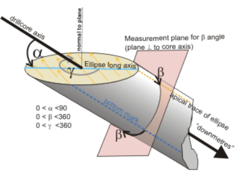
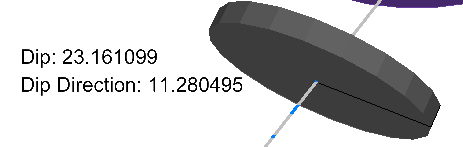

# Calculate Structural Orientations

To access this screen:

  * Enter "calculate-structural-orientations" into the Command tool bar and press <ENTER>.
  * **Sample Analysis** ribbon **> > Structures >> Orient Angles**.
  * Use the hot key combination "cso".

The **Calculate Structural Orientations** screen is used to convert logged alpha angle, beta angle and (if available) core orientation line data into dip and dip direction values. 

This screen assumes the following angle convention is used for logging oriented or partially oriented core:

The "bottom mark" shown in the diagram above references an angle measuring convention whereby angles are measured from the lowest position on the core. Values can also be taken from the uppermost position. This baseline is commonly referred to as the _core orientation line_ or _reference line_. Studio applications refer to the latter.

Dip and dip direction values can be used to visualize the orientation of planar structures of the core, using the 3D [**Drillhole Properties >>Symbols**](<../VR_Help/DHProp-format-structural-symbols.md>) tab, for example:

_Drillhole showing oriented 3D structural symbol_

To calculate dip and dip direction values from existing alpha and beta angle data:

  1. Load drillhole data containing alpha and/or beta angle attributes.
  2. Run the command "calculate-structural-orientations".

The **Calculate Structural Orientations** screen displays.

  3. Select the **Drillholes** data. 

**Note** : if only one drillholes object is loaded, it is automatically selected.

  4. Select Alpha and Beta attributes in the selected object.

  5. Either define a new **Dip column** and **Dip Direction** column to create, or select any existing numeric field to update. Both fields must be specified.
  6. Specify the **Alpha and Beta Angle convention** used to log the loaded oriented core data:
     1. If a fixed reference line is used throughout the drillhole data for angle measurement, select **Fixed** and choose either _Bottom_ or _Top_.
     2. If a variable convention is used throughout the data, and this is recorded in an attribute of the drillhole object, select the attribute using **Specify column**. Typically, this attribute will include a value representing either "top" or "bottom". Specify the attribute values indicating a uppermost (**Top**) and lowermost (**Bottom**) measurement using the drop down menus provided.
     3. Similarly to the above, specify **Alpha/Beta measured from** as either a **Fixed** or **Specify column** value. This convention can be set independently of the reference line convention above.
  7. Set the **Alpha** and **Beta** angle columns to an existing attribute in the loaded drillhole object. Both fields must be specified.
  8. Click **Apply** to calculate dip and dip direction values and either add them to the loaded object, or update the existing fields. Click OK to do the same, but close the screen afterwards.

**Note** : This does not update the contents of the physical drillhole file, only the data currently loaded. To commit this information to the file, you will need to export or save your file.

Related Topics and Activities

  * [calculate-structural-orientations ("cso")](<../command_help/calculate-structural-orientations.md>)
  * [Format Structural Symbols](<../VR_Help/DHProp-format-structural-symbols.md>)