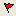

# Compositor Control Bar

The Compositor control bar is used to interactively query static or dynamic Drillhole segments or composites.

Note: Static or dynamic drillhole date must be loaded to use the Compositor control bar.

The Compositor control bar is a powerful tool for analyzing drillhole data. It provides the following functionality:

  * Works with dynamic and static drillhole data.

  * Use the compositor in conjunction with drillholes in any **Tables** , **Plots** , **3D** window or **Log** view.

  * Displays additional information such as horizontal and vertical thickness

  * Select intervals interactively and display composite results.

  * Slide composite or composite limits up and down the hole and observe composite values.

  * Select intervals by Hole Name and From - Todepth and display composite results.

  * Locate any interval on any hole on any section by synchronizing views from the compositor.

  * Save composited intervals to the intersections table with any selection of composite result fields.

  * Composite samples over Lithological domains.

  * Composite drillholes over fixed downhole lengths.

Composite results may include:

  * length weighted grades,

  * length @ grade,

  * length x grade,

  * dominant lithology,

  * specific gravity,

  * vertical and horizontal thickness,

  * from-to depths,

  * start, mid and end coordinates,

  * azimuth, inclination and declination.

By default, the data represented by the Compositor control bar relates to the selected segment. You can change the context of the Compositor control bar using its context menu (see section below). The easiest way to update the Compositor control bar with data relevant to a specific drillhole is to expand the relevant hole set folder in the [Holes](<Holes%20Control%20Bar%20Overview.md>) control bar. Selecting a borehole identifier will automatically update the contents of the Compositor.

The action of other views when a selection is synchronized is determined by the status of the **Linked** and **Live** settings. Choose theViewribbon to display the status of the **Linked** and **Live** settings for the current view:

View type |  Synchronization action  
---|---  
Linked only |  Select and display the same selection. The data selected will not always be visible.  
Linked and Live |  Select and display the same selection and modify the view so that the selected data is visible.  
Live only |  Modify the view so that the selected data is visible but not selected.  
  
The view in which the data was originally selected does not need to be Linked or Live to permit synchronizing with other views. Data can be selected in any table, section, 3D or log view and synchronized with all other linked table, section, 3D and log views.

**Note** : The Compositor is limited to 50 columns of data in the corresponding sample object. If more than 50 columns are detected, a warning displays.

The intersections table must contain at least the fields Hole Name, BHID, From, To and Zone.

Modifications include:

  * To remove a field from the table, select the field name in the Columns in View box and click Delete.

  * To add a field to the table, select a field type (Data Columns, Hole Data Fields, Length Weighted Averages or Dominant Text Values), select one of the available fields, then click Add.

  * The order of columns in the table can be adjusted using the Up and Down buttons.

## Compositor Context Menu:

Right-clicking a blank area of the Compositor control bar displays the following menu options:

  *  Synchronize  Synchronize the drillhole data selected in the Plots or 3D window with the Compositor display, as well as all other linked data views.

  * Save Selection Save the selected segment/composite to the intersections table using the default Zone Label, on confirmation; a new empty table is one does not already exist.

Whenever an intersection is saved, a record is added to the top of this table and all the defined fields are computed. For more information on intersection tables, see [Display intersections](<../PLOTS_LOGS/DisplayIntersections.md>), [Select, name and save intersections](<../PLOTS_LOGS/SaveIntersections.md>).

  * Select Collar Update the data in the compositor window for the selected borehole to show data relevant to the collar XYZ position, **Azimuth** , **Inclination** and **Declination** , among other properties.

  * Select End of Hole Update the data in the compositor window for the selected borehole to show data relevant to the drillhole's end of hole position. The fields shown are identical to those of the Select by Collar version (see above), but the contents of the field, particularly the mineral grade sections, are updated.

  * Select Entire Hole Show the full view of the Compositor table, denoting the mineral grade for the entire hole, start and end positions in 3D space, drillhole orientation and the current desurvey status.

  * Select By Sample End & Points Update the contents of the Compositor control bar by snapping to segment end points.

  * **Change Table** Display the [Snap to Table](<../PLOTS_LOGS/change%20table%20dialog.md>) screen, allowing you to select the drillhole object table the Compositor tool currently relates to.

  *  Change Fields Order Change or reset the grid table's field display order, using the [Change Fields Order](<ChangeFieldsOrder_Dialog.md>) screen.

  *  Show Composite Window Display the Compositor window (i.e. this window).

## Compositor Activities

To query drillhole composites in the 3D Window:

  1. Display the3Dwindow.

  2. In the Command toolbar, run the command [composite-drillholes](<../command_help/composite-drillholes.md>). 

**Tip** : You can also use the quick key combination "cmdh".

  3. Select a drillhole segment (click) or composite interval (click-and-drag).
  4. In the Compositor control bar, view the results.
  5. Click **Cancel** to close the command.

Query dynamic drillhole composites in the Plots Window:

  1. Display the **Plots** window.

  2. Select a drillhole segment and drag to encompass the relevant intervals.

  3. In the Compositor control bar, view the results.

To create a new intersections table and saving composites:

  1. Display the3Dwindow.

  2.   3. In the Command toolbar, run the command [composite-drillholes](<../command_help/composite-drillholes.md>). 

**Tip** : You can also use the quick key combination "cmdh".

  4. Select a drillhole segment (click) or composite interval (click-and-drag).
  5. In the **Compositor** control bar, right-click, select Save Selection.

At this stage, if an Intersections table does not exist i.e. is not loaded, a new table named Intersections is created. It is listed in the **Sheets** control bar, **Tables** folder:

It also appears in the **Loaded Data** control bar:

  6. Repeat for each composite, and click **Cancel** to end the command session.

## Changing the Intersection Table's Definition

To change the section definition of an intersection table:

  1. In the Sheets control bar, expand the Tables folder.

  2. Right-click the Intersections table, select Format.

  3. On the [Table](<../PLOTS_LOGS/tablefiltersortdialog.md>) screen, activate the [Columns](<../PLOTS_LOGS/Format%20Column%20Display%20Dialog.md>) tab.

  4. Modify the order or content of the fields listed in the Columns in View box.

  5. Click OK to apply the changes and view the table.

Related topics and activities

  * [Compositor Tools](<../PLOTS_LOGS/Composite_Tool.md>)

  * [Holes Control Bar](<Holes%20Control%20Bar%20Overview.md>)

  * [Select Tables](<select%20tables.md>)

  * [Working with Tables](<../PLOTS_LOGS/abouttables.md>)

  * [composite-drillholes](<../command_help/composite-drillholes.md>) (command)