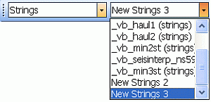
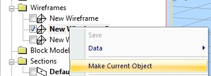
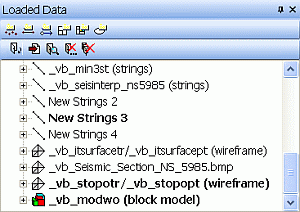

# The Current Object 

When a data _file_ is loaded into memory, an _object_ is created. 

Data objects can either be _visible_ (that is, they can be rendered using one or more 3D _overlays_) or _invisible_ , used for tabular data storage.

Your application recognizes many distinct types of 3D objects, such as points, strings, drillholes, wireframes, planes, block models and so on. Each loaded 3D _data_ file exists in memory as a distinct object of one of these types. 

When there are several 3D objects of one type, for example, strings, only one of them can be the _current_ object of that type. However, every independent data type can have its own current object.

The _current_ object is the one that is changed if data of that type is created or edited in memory. For example, if there are several string objects in memory and a new string is digitized, the current string object is updated. As such, it is important to know which of the loaded string objects are affected, or (where no current object has been set, or the current object has been unloaded) when a new data object is created automatically. As there are multiple possible data types, it is possible to have multiple current objects, although only one may exist for each type.

An 'object' is a data container, and can contain one or multiple instances of a particular data type. For example, three separate string entities can be contained within a single object, or represented as three separate objects containing a single string. 

The same type of data is found within an object; it is not possible to mix string and wireframe data in the same data object (or file), for example.

**Tip** : You can set any visible 3D object to the current one by right-clicking it in the 3D window and selecting **Make Current Object**.

## Managing Current Objects

You can identify the current object for each data type:

  * In the **Current Objects** toolbar, the current object, for the selected object type, is displayed in the Current Object field. 

  * In the Loaded Data control bar, the name of the current object of each type displays in bold.

  * In the Sheets control bar, all overlays associated with the current data object are shown in bold - multiple items are shown in bold if more than one overlay is associated with the current data object. For example, if you are showing the same topography using separate wireframe and flat-rendered surface overlays.

When more than one object of a type is loaded, the current object is changed by right-clicking an object in the **Sheets** control bar and selecting Make Current Object or by selecting the desired Object Type and object from the Current Object field in the Current Objects toolbar.

Once an object is _current_ it is affected by subsequent operations that relate to its data type; for example, when adding a new wireframe triangle, data is added to the current object. Similarly, when digitizing, newly-defined string data is added to the current string object.

  * Every data object (wireframe, string, drillhole, block model, points, planes) has a current object.

  * If current objects are unloaded from memory, the next object in the list (of the same data type) is automatically assigned as the current object.

  * Overlays of current 3D objects can be hidden. If you try to add data to an object where all available 3D overlays are hidden, a new object is created and set to current.

  * If no current object is set, one is created if subsequent operations require one. Digitizing a string in a new project, for example, automatically creates a "New Strings" object and a default overlay (sheet). Similarly, creating a DTM creates a new wireframe object if none is currently set.

## The Current Object Toolbar

The Current Object toolbar has two drop-down lists (shown above) which are used to manage the current object. The first Object Type drop-down is used to define the object type. The second Current Object list is used to select an object of the chosen type.

There are buttons for creating a new object, saving to the current object and deleting the current object.

## The Sheets and Project Data Control Bars

Right-click a 3D overlay to set the associated data object as 'current'. Where multiple representations of the visual object (overlays) exist, all associated overlays are displayed in bold. 

To set a non-visual data object as current, use the Loaded Data control bar (see below). 

**Note** : Your product provides a **Project Data** bar, which combines the functionality of the legacy **Sheets** and **Loaded Data** control bars, and offers other data management options that are specific to your operating domain.

## The Loaded Data Control Bar

Current objects are displayed in bold text in the [Loaded Data](<Loaded%20Data%20Control%20Bar.md>) control bar. In the above image, multiple strings exist in memory (either as loaded or new objects), while only one wireframe and one block model object have been loaded. The current objects, only one of each type, are highlighted in bold.

**Note** : The **Loaded Data** bar displays all data objects in memory, even those without a 3D representation.

Related topics and activities

  * [Loaded Data Control Bar](<Loaded%20Data%20Control%20Bar.md>)

  * [[Sheets Control Bar](<Sheets%20Control%20Bar%20Overview.md>)](<Loaded%20Data%20Control%20Bar.md>)

  * [The Current Objects Toolbar](<Current_Objects_Toolbar.md>)