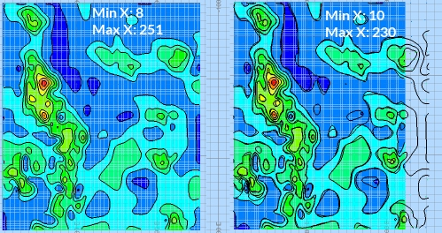

# Generate Distance Contours

Your product contains functionality to generate contour strings from an input points data object.

Contouring is the process of tracing contours - lines of equal z-value (such as grade, elevation, seismic travel time or drillhole intercept positions) - on a grid for representation of the surface on a map.

## Distance Contours

The input to this function is a loaded points object. This function can be used to generate output contours and a grid model representing the distance of each surface point from neighbouring samples. 

For more general information, see [Distance Contours ](<Contours_Distance_Introduction.md>).

To define data inputs for distance contouring:

This procedure is general, but exampledata is displayed.

  1. Load the points file containing sample grade information into any 3D window.
  2. If you plan to create contours based on a subset of loaded points, select them in the 3D window first. If no data is selected, all point data in the target data object is used for contouring.

  3. Run the generate-contours-from-points command.
  4. Choose the data to contour.

     * To contour all points in a particular points data **Object** , select the object from the list provided. If the data you loaded in step 1 is the only points object, it is already selected. 

     * To only contour selected points, choose **Selected points** followed by **Store Current Selection**. The number of selected points displays.

  5. Choose a **Plane Orientation** to use as a basis for contour data generation. This can be either a preset (**Horizontal** , **East-West** etc.), the **Current section** (the active section) or the **Current view** direction. 

Alternatively, set a custom plane orientation using the **Azimuth** and **Dip** fields.

To define the grid used for grade contouring:

  1. Click Next to display the Generate Contours Gridding screen.
  2. Choose the Extents of your output grid. 
     * Choose **Use data extents** to define the bounds of your output contour data to match the outer hull of your input points, or;

     * Specify a **Custom** area by setting minimum and maximum X and Y values for the output grid.

  3. Margin represents the amount by which the contours (and surface) are extended beyond the original data hull. This option is only available if Use data extents is enabled.   
  
The generated grid always uses the Min and Max values regardless or any intermediate changes to margin (although the actual grid maximum may be rounded up to the next whole cell size).  
  
  

  4. Resolution tools let you define the grid cell size or number of grid cells. This increases or decreases the distance between grid points. 

     * If setting the Cell Width and Cell Height, higher numbers will reduce the inter-point distance of the grid.
     * If setting the number of Cells Across and Cells Up, higher numbers increase the distance.

For example, in the image below, if only the **Cells across** and **Cells up** values are changed between contouring runs, the resolution of the output grid changes:  
  
  

To define output parameters for grade contouring:

  1. Click Next to display the Output Data screen.

  2. Choose to **Output contour strings** to either the **Current strings object** or a new object (and name it).

  3. Determine the distance between contour elevations using the **Interval** setting. 

If you wish to **Offset** intervals from their default position, enter a positive or negative value.

For example, to display contours 10 grade values apart, but at elevations 2, 12, 22, 32 etc., set **Interval** to "10" and **Offset** to "2".

Alternatively, define **Custom values** by adding any value to a bespoke list.

  4. Define the value range within which contours are generated:

     * Choose **Use data extents** to generate contours for the full value range.
     * If you wish to constrain the contours generated to upper and lower values, select Custom and set the Lowest and Highest value accordingly. The Interval does not have to be a precise factor of either the Lowest or Highest value.
  5. To **generate a grid object** with cells representing contour values, enable **Output grid object**. Essentially, if enabled, a block model is created, interpolating between the loaded data points. 

     1. Enter a **New grid object name**.

Choose where the grid model is generated, either directly under the input data points (Below data) or a **Custom** model of any height using a lower (**Min Z**) and upper (**Max Z**) elevation value.

If a faulted output has been chosen (on the **[Data](<GenerateContourDataPage.md>)** screen), the resolution of grid cells around the fault location can be increased or decreased using **Faulted Refinement**. By default, a value of "1" means no sub-celling is performed, whereas a value of "2" will permit quarter-area blocks to be generated. 

**Note** : Higher **Faulted Refinement** values lead to higher processing times and potentially bigger output data files.

     2. Choose how to colour the grid by picking a **Legend**.

        * The **From contours** option ensures the generated legend uses the default legacy rainbow scheme and legend values are created at the contour values specified in the **Output Contour Strings** section above(either at fixed intervals or at custom values, depending on what is selected up there).

        * Choose **Smooth** to select a **Colour scheme** , a legend interval **Count** (the total number of 'bins' in the final legend) and a **Distribution** type. This will generate a legend based on the input data that is used to generate the grid. So, if your drillhole grade values run from 0 to 29.96 and your bin count is set to 100, a legend is created with 100 intervals that span that range.

For example, the top image, below, shows grid output with an 'unsmooth' legend applied, whilst the lower image shows one of the custom smooth legend colouring options in action:

     3. Choose the **Output** name for your grid object.

  6. Click Finish and review your results.

Related topics and activities

  * [Contours from Points - Input Data](<GenerateContourDataPage.md>)

  * [Contours from Drillhole Intercepts - Input Data](<GenerateContourDHInterceptsDataPage.md>)

  * [Generate Contours - Gridding](<GenerateContourGridPage.md>)

  * [Generate Contours - Output Data](<GenerateContourOutputPage.md>)

  * [generate-contours-from-points](<../command_help/generate-contours-from-points.md>) (command)

  * [generate-contours-from-holes-intercepts](<../command_help/generate-contours-from-holes-intercepts.md>) (command)