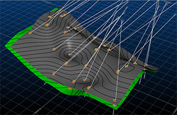
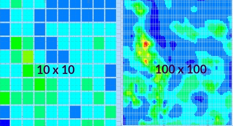
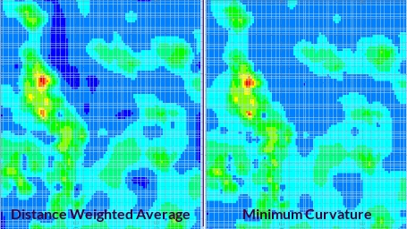
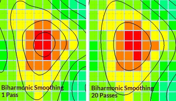
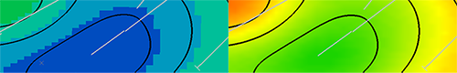
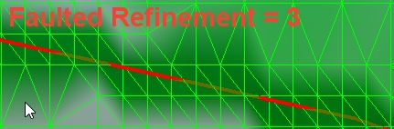
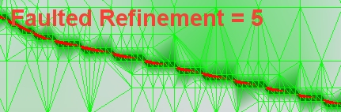
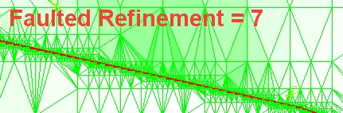

# Generate Drillhole Intercept Contours

Generate contour strings from an input desurveyed drillholes data object.

This method of contouring involves interpolation of a surface map between drillhole intercept positions. This function makes use of the [generate-contours-from-holes-intercepts](<../command_help/generate-contours-from-holes-intercepts.md>) command.

## Contouring Drillhole Data

The input to this function is a loaded drillhole object. The following optional inputs are also supported:

  * Strings to indicate fault lines and/or clipping regions 
  * Additional point data in the form of actual points or string vertices

The command optionally generates an output string file containing contours at nominated elevations, a grid model and/or a wireframe surface object.

It is not possible to generate a distance-from-samples style contour map with this command.

This tool supports the following:

  * Choice of different interpolation algorithms
  * Choice of highest or lowest elevation maps
  * Anisotropy
  * Data smoothing
  * Region clipping
  * Faulted data
  * Smooth contour lines
  * Gridded data output
  * Surfacing

## Generate a Lithology Contour

The following procedures outline the various steps to take when defining input data, output grid and other data.

To define input data and parameters for lithological contouring of drillhole data:

  1. Load a drillholes file into any 3D window.
  2. If you plan to generate contour data for a subset of loaded data, select them in the 3D window so they are highlighted.  

  3. Run the command [**generate-contours-from-holes-intercepts**](<../command_help/generate-contours-from-holes-intercepts.md>)

The **Generate Contours - Input Data** screen displays.

  4. Choose the data from which to base your contouring calculation:
     * Choose either a drillhole **Object**. This will ensure all data within the loaded object is considered when calculating contours, or;
     * If you have previously selected a subset of drillhole data for contouring, choose **Selected drillholes** and click **Store Current Section**.
  5. In the Contour attribute list, select the attribute containing categorical values that will form the basis for contouring. For example, this could be a lithological domain.
  6. In the Value list, select the categorical value to be contoured. All unique values of the **Contour attribute** are listed.
  7. Choose to contour either the **Highest Elevation** or the **Lowest Elevation** of the categorical value. This could represent a decision between modelling contours for a hangingwall or footwall, for example.
  8. To supplement your input data with additional points, Point data can be specified (by default, this isn't performed):
     1. Choose a points **Object** containing supplemental data, or;
     2. Preselect point data to use in contouring calculations first, then choose **Selected points** and click **Store Current Selection** to ensure they are considered.
  9. Similarly, if you're planning on generating contours within delineated **Fault** blocks, you can do so in reference to loaded string data:
     1. Choose a fault **Object** containing strings representing fault traces;
     2. Preselect string data to use in faulting calculations first, then choose **Selected strings** and click **Store Current Selection** to ensure they are considered.
  10. To choose how or if **Clipping Polygons** are used to restricted the output of contour string, grid or surface data:

     * Choose **None** to contour without constraining output data, or;

     * Enable **Object** and pick a string object representing a boundary to constrain output data, or;

     * Enable **Selected strings** and pick one or more strings interactively in the 3D view, before selecting **Store Current Selection**. The number of selected fault strings displays.

     * Choose to keep either generated contour data that is **Inside** or **Outside** the clipping polygon(s).

  11. Choose a **Plane Orientation** to use as a basis for contour data generation. This can be either a preset (**Horizontal** , **East-West** etc.), the **Current section** (the active section) or the **Current view** direction. 

Alternatively, set a custom plane orientation using the **Azimuth** and **Dip** fields.

To define the grid output from lithological contouring:

  1. Click Next to display the Generate Contours Gridding screen.
  2. Choose the Extents of your output grid. 
     * Choose **Use data extents** to define the bounds of your output contour data to match the outer hull of your input points, or;

     * Specify a **Custom** area by setting minimum and maximum X and Y values for the output grid.

  3. Margin represents the amount by which the contours (and surface) are extended beyond the original data hull. This option is only available if Use data extents is enabled.   
  
The generated grid always uses the Min and Max values regardless or any intermediate changes to margin (although the actual grid maximum may be rounded up to the next whole cell size).  

  4. Resolution tools let you define the grid cell size or number of grid cells. This increases or decreases the distance between grid points. 

     * If setting the Cell Width and Cell Height, higher numbers will reduce the inter-point distance of the grid.
     * If setting the number of Cells Across and Cells Up, higher numbers increase the distance.

For example, in the image below, if only the **Cells across** and **Cells up** values are changed between contouring runs, the resolution of the output grid changes:  
  
  

  5. **Estimation** parameters determine how the surface is generated between points. 

The options for estimation **Algorithm** are:

     * Distance Weighted Average: the estimate is the average of sample values used by weighting the inversely to the square of their distance from the node. 
     * Minimum Curvature: this is also an inverse distance weighted average method, but also uses slope information at the node being estimated.
     * Trend Surface: use a polynomial projection method to interpolate a trend surface between points. Select the polynomial order to determine the type of calculation performed.

For example:

  6. Set your **Estimation** method. For the majority of cases, the default [Slope] setting is fine.

  7. Similarly, there are multiple Smoothing options available for your contours (this will have no effect on the output grid model). **Biharmonic** applies a sensible smoothing level to most inputs and parameters e.g.:  
  

  8. Optionally, use a **Search Ellipse** to encourage a contouring trend:

     * Define the **Rotation** (azimuth) of the ellipsoid. This must be a value between 0 and 360 degrees (inclusive).

     * Set the Major axis length of the ellipse (the longest axis).

     * Set the Minor axis length.

     * Set the **Min. samples.** This is the minimum number of data points that must be present within the search ellipse before contouring is affected. Higher values lead to more generalized contour shapes.

To define output parameters for intercept contouring:

  1. Click Next to display the Output Data screen.

  2. Choose to **Output contour strings** to either the **Current strings object** or a new object (and name it).

  3. Determine the distance between contour elevations using the **Interval** setting. 

If you wish to **Offset** intervals from their default position, enter a positive or negative value.

For example, to display contours 10 grade values apart, but at elevations 2, 12, 22, 32 etc., set **Interval** to "10" and **Offset** to "2".

Alternatively, define **Custom values** by adding any value to a bespoke list.

  4. Define the value range within which contours are generated:

     * Choose **Use data extents** to generate contours for the full value range.
     * If you wish to constrain the contours generated to upper and lower values, select Custom and set the Lowest and Highest value accordingly. The Interval does not have to be a precise factor of either the Lowest or Highest value.
  5. Choose the base **Elevation** to use for the contour strings:

     * Select **Use attribute** to align contour strings at the same elevation as the input data points, or;

     * Position the contour strings below the data points using **Below data**.

     * Specify an absolute elevation (Z) value at which to generate contour strings.

  6. To generate a grid object with cells representing contour values, enable **Output grid object**. Essentially, if enabled, a block model will be created, interpolating between the loaded data points. 

     1. Enter a **New grid object name**.

Choose where the grid model is generated, either directly under the input data points (Below data) or a **Custom** model of any height using a lower (**Min Z**) and upper (**Max Z**) elevation value.

If a faulted output has been chosen (on the **[Data](<GenerateContourDataPage.md>)** screen), the resolution of grid cells around the fault location can be increased or decreased using **Faulted Refinement**. By default, a value of "1" means no sub-celling is performed, whereas a value of "2" will permit quarter-area blocks to be generated. 

**Note** : Higher **Faulted Refinement** values lead to higher processing times and potentially bigger output data files.

     2. Choose how to colour the grid by picking a **Legend**.

        * The **From contours** option ensures the generated legend uses the default legacy rainbow scheme and legend values are created at the contour values specified in the **Output Contour Strings** section above(either at fixed intervals or at custom values, depending on what is selected up there).

        * Choose **Smooth** to select a **Colour scheme** , a legend interval **Count** (the total number of 'bins' in the final legend) and a **Distribution** type. This will generate a legend based on the input data that is used to generate the grid. So, if your drillhole grade values run from 0 to 29.96 and your bin count is set to 100, a legend is created with 100 intervals that span that range.

For example, the top image, below, shows grid output with an 'unsmooth' legend applied, whilst the lower image shows one of the custom smooth legend colouring options in action:

  7. If you wish to output a wireframe surface that is an interpolation of your contour strings, select the **Output surface** option.

     1. Choose a **Tolerance**. This value is used for precision when generating data through the input data points. Higher values lead to more generalized surfaces where data points may align less precisely with the output wireframe than smaller values (although the calculation may be faster and errant noise may be removed automatically).

     2. As with the grid output (see above) you can choose how closely an output wireframe aligns with the input fault trace data, if specified. In essence, with the **Faulted Refinement** option, you are choosing how many wireframe data subdivisions are required to align data on either side of the fault with the fault string(s). This can be considered a measure of data granularity near the fault zone, with higher numbers giving rise to a closer match between the edge of the wireframe near the fault and the string itself.

Here are some examples of the same input data and parameters, and differing **Fault Refinement** values:

  8. You can either **Output surface** wireframe surface data to the Currrent wireframe object (which can be useful for building up multiple surfaces, say, reflecting each lithology within a drillhole set), or select any wireframe object in which to store your output surface (current or otherwise) using the drop-down list. 

Alternatively, enter a new name into the editable field, and it is created.

  9. Click Finish and review your results.

Related topics and activities

  * [Contours from Points - Input Data](<GenerateContourDataPage.md>)

  * [Contours from Drillhole Intercepts - Input Data](<GenerateContourDHInterceptsDataPage.md>)

  * [Generate Contours - Gridding](<GenerateContourGridPage.md>)

  * [Generate Contours - Output Data](<GenerateContourOutputPage.md>)

  * [generate-contours-from-points](<../command_help/generate-contours-from-points.md>) (command)

  * [generate-contours-from-holes-intercepts](<../command_help/generate-contours-from-holes-intercepts.md>) (command)