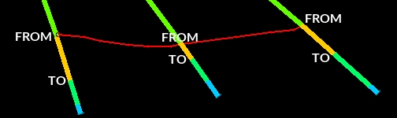
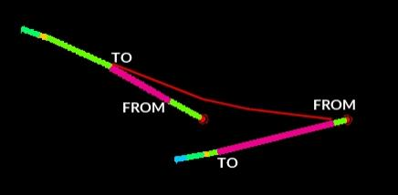
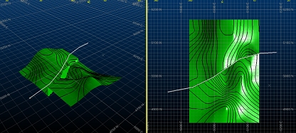

# Drillhole Intercept Contours

To access this function:

  * **Geology** ribbon >> **Contours** >> **Attribute**

  * Enter "generate-contours-from-holes-intercepts" into the [**Command Line**](<Command_Toolbar.md>)

Generate contour strings from an input desurveyed drillholes data object.

This method of contouring involves interpolation of a surface map between drillhole intercept positions. This function makes use of the [generate-contours-from-holes-intercepts](<../command_help/generate-contours-from-holes-intercepts.md>) command.

## Contouring Drillhole Data

The input to this function is a loaded drillhole object. The following optional inputs are also supported:

  * Strings to indicate fault lines and/or clipping regions 
  * Additional point data in the form of actual points or string vertices

The command optionally generates an output string file containing contours at nominated elevations, a grid model and/or a wireframe surface object.

It is not possible to generate a distance-from-samples style contour map with this command.

This tool supports the following:

  * Choice of different interpolation algorithms
  * Choice of highest or lowest elevation maps
  * Anisotropy
  * Data smoothing
  * Region clipping
  * Faulted data
  * Smooth contour lines
  * Gridded data output
  * Surfacing

## Modelling Drillhole Intercepts

This command is very similar to the [generate-contours-from-points](<../command_help/generate-contours-from-points.md>) command in that it will produce a range of output data (contour strings, grid model and/or surface) based on the input data. In this case, the input is a desurveyed drillhole file containing at least one attribute and unique key field value to be modelled. 

Due to the nature of the command (i.e. it models a unique value), attributes for modelling are restricted to alphanumeric only. 

The term "drillhole intercept", in this context, refers to the elevation positions of the drillhole interval(s) that match the selected Contour attribute. You can choose whether to model the highest or lowest interval limit (in Z) regardless of whether it is a FROM or TO value. For example:

In a situation where samples are aligned across a wide range of dip values, the highest elevation intercept is used, but it could be a TO value, for example:

You can model either the highest or lowest elevation values. Where multiple intervals exist on the same sample for the Contour attribute, only the highest and lowest elevation intercepts of all intervals can be modelled.  

## Modelling Faults

A fault object containing one or more strings can be an input to this command. Faulting is performed based on the arrangement of data on either side of the fault.

In the example below, the fault line generates a vertical discontinuity. Samples either side of the fault determine how the surface is projected up to the fault line:  
  

Faulting is honored by all output objects; contours, grid model and interpolated surface.