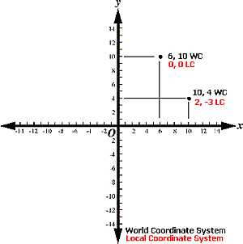
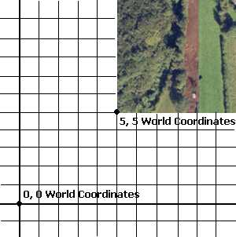
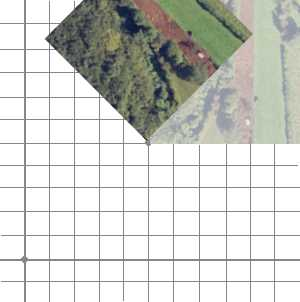
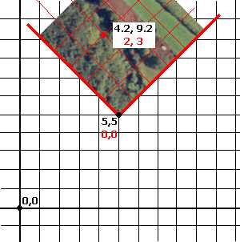

# Coordinate Systems

The concept of coordinate systems is essential to the operation of your application, and in fact, any application that displays data that needs to be shown in a dimensional and/or positional context. Coordinates are used to define a specific point in space. This 'space' can be 1, 2 or 3 or more dimensions; the simplest, one-dimensional coordinate array (consisting of a single number) can be used to define a point along a one-dimensional string - simply put, it is a 'count' of arbitrary units along the string from an origin (the 'zero point') in a given direction.

Moving up a dimension, a point can be defined by adding another parameter, to cover the additional dimension. Again, it is a count of units in X and Y directions, with positive and negative digits indicating the direction from the origin. In the commonly accepted (although by no means definitive) model of the planar coordinate system, X and Y directions are positive in both rightward and upward directions accordingly, and leftward and downward relative positions indicated by negative digits.

World and local coordinate systems

And the system continues upwards, when a dimension is increased (even beyond the spatial XYZ dimensions), another parameter in the coordinate array is added to cope with the additional information required to pinpoint a position in multi-dimensional space (although difficult to visualize dimensions above the 'natural' three, the system is perfectly suited to dimensions that extend to the non-visual/theoretical/mathematical).

Defining a point in a single coordinate system is, therefore, a straightforward definition of values along a spatial axis, the combination of which represent a unique position.

## Local and World Coordinate Systems

Complexities (at least, more information-rich situations) arise when more than one coordinate system is involved. It may not be obvious why more than one system should ever be required. If any system can define any point in space, why go to the bother of introducing another one? Surely this over-complicates matters? Not necessarily. It all depends on how data points are inter-related. Similarly, it depends on which information is available.

Up to now, the definition of a coordinate system has been made, and this system applies to any and all coordinate systems used to reference a point in space. However, sometimes it may not be practical to define everything using the same set of grid coordinates. For example, a flat (no Z dimension for ease of explanation) wireframe topography could be situated at point where the bottom left-hand corner is found in 3D space at 5, 5, that is, 5 units from the origin of the coordinate system in the positive direction for X and Y axes.

In this situation, using a 2D world coordinate system, the 0, 0 represents the world origin. The position at 5, 5 represents the location of the bottom left corner of the 'map', for example:

This is all straightforward, but when maps are involved, it is often useful to use a coordinate system that uses an origin that is on the map. Continuing the same context, this situation is achievable using two coordinate systems; local and coordinate. In the image above, the location of the bottom of the map is defined by a single position, related to the world origin. It is perfectly acceptable to use this single, all-encompassing system for all data points in your project. However, sometimes it is more useful to introduce another origin for a local coordinate system, which can be used either instead of, or as well as, the world system.

Consider the situation whereby the map is rotated, for example:

In this situation, neither of the world coordinates shown so far has moved, the world origin is still 0, 0 and the bottom left corner of the map is still at 5, 5. When defining points on the rotated map, to use a world coordinate system (where the origin is not only off the map, but using a different X and Y axis angle) although effective, does not easily denote relative distances from one point on the map to another (unless you can translate world to rotated local coordinate systems intuitively, which counts this Author out!).

The resolution here is to apply a local coordinate system, a standalone system in its own right. The origin of the local system would be 5, 5 in a world coordinate reference - this point can be accurately described using either system. When a new system is applied, the system of plotting points on the map becomes a little more informative. In the image below, two points on the map are described in both local (red) and world (black) system coordinates:

If the map were rotated to another alignment, the red coordinate would obviously change position, but the important point is that the coordinates would only be altered if the world coordinate system were used to define the point. The local-coordinate system in this example is self-sustaining. As the relationship between the two systems is known, a single equation could be used to translate from one system to the other easily if required, and, in Datamine products, this is what happens when the need arises, for example, a geological block model uses a local coordinate system to define the geometry of the model, including cell and sub-cell centres in I, J and K directions. The origin of the block model is defined in terms of a positional relationship with the world system, so the overall self-contained block model 'object' can be rotated without affecting the internal integrity of relationship between cells.

In coordinate systems, a term is often used to refer to the position that indicates the location of the origin of a local coordinate system, using world system coordinates. This term is referred to as the 'common point'. A 'common point' can only be indicated by values from both world and local systems. A project will contain a series of objects related positionally in 3D space using a combination of both the world (there is only one) and local (there can be many, one for each object if relevant) systems.

## Projected Coordinate Systems

A projected coordinate system (PCS), also known as a projected coordinate reference system, planar coordinate system, or grid reference system, is a type of spatial reference system that represents locations on Earth using Cartesian coordinates (x, y) on a planar surface created by a specific map projection.

Here are the key points about projected coordinate systems:

  * Unlike a geographic coordinate system, which uses latitude and longitude to define positions on a curved surface (such as the Earths surface), a projected coordinate system is defined on a flat, two-dimensional surface.

  * In a projected coordinate system, lengths, angles, and areas remain constant across the two dimensions.

  * A projected coordinate system is always based on a geographic coordinate system that is defined on a sphere or spheroid.

  * Locations in a projected coordinate system are identified by x, y coordinates on a grid, with the origin at the center of the grid.

  * The x-coordinate specifies the horizontal position, and the y-coordinate specifies the vertical position.

  * Units are consistent and equally spaced across the full range of x and y.

  * Positive values are above the origin (for both horizontal and vertical lines), while negative values are below or to the left.

  * Map projections transform the curved Earths surface into a flat map, allowing us to work with projected coordinates for mapping and analysis.

In summary, projected coordinate systems provide a way to represent Earths features on a flat map, making it easier to create accurate maps and perform spatial analyses in various applications.

Related topics and activities

  * [Command Line Coordinates](<Coordinates_Command%20Line.md>)

  * [Coordinate System Selection](<CRSBrowserDlg.md>)