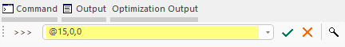
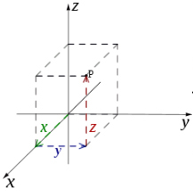
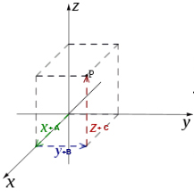
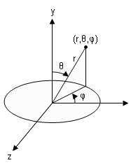
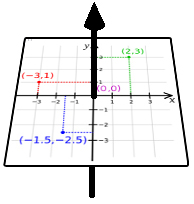
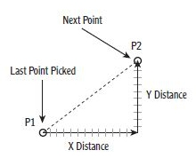
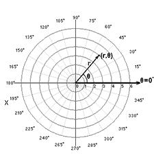

# Command Line Coordinates

In addition to interactive digitizing of point and string data using the cursor, you can also specify the next coordinate of your point or string vertex using the **[command line](<Command_Toolbar.md>)**. 

This is useful where you need the next string segment to, say, terminate at a precise 3D location, or relative distance from the previous point, at a given gradient or azimuth, and so on.

The syntax for doing this depends on how you want to specify your point. The options are:

  * Enter an absolute 3D coordinate.
  * Enter an absolute 2D coordinate on the [active section](<../VR_Help/Sections.md>).
  * Enter a relative 3D coordinate.
  * Enter a relative 2D coordinate on the active section.
  * Enter a polar coordinate (distance, azimuth and dip from last point).

You can combine manual digitizing with command line entry, for example, you can digitize part of a string on section, then enter 3D coordinates (absolute, relative or polar) into the command line to create vertices off-section, then return to manual digitizing within the same command session.

Command line coordinates can be entered as long as a supported command is still active. This is indicated by a yellow highlight in the command window as shown above, and a **Done** button on screen.

You can use any combination of these methods but you cannot mix methods within the same coordinate. For example, you can't enter a relative distance in X from the last point digitized and absolute coordinates for Y and Z. 

### Supported Commands

Lots of design commands support command line coordinates, including

  * [extend-string](<../command_help/extend-string.md>)
  * [new-string](<../command_help/new-string.md>)
  * [new-points](<../command_help/new-points.md>)
  * [circle-by-three-points](<../command_help/circle-by-three-points.md>)
  * [circle-from-center-to-edge](<../command_help/circle-from-center-to-edge.md>)
  * [circle-from-edge-to-edge](<../command_help/circle-from-edge-to-edge.md>)
  * [circle-with-defined-radius](<../command_help/circle-with-defined-radius.md>)
  * [rectangle-from-center-to-corner](<../command_help/rectangle-from-center-to-corner.md>)
  * [rectangle-from-corner-to-corner](<../command_help/rectangle-from-corner-to-corner.md>)
  * [square-from-center-to-edge](<../command_help/square-from-center-to-edge.md>)
  * [square-from-center-to-corner](<../command_help/square-from-center-to-corner.md>)
  * [square-from-corner-to-corner](<../command_help/square-from-corner-to-corner.md>)
  * [square-from-edge-to-edge](<../command_help/square-from-edge-to-edge.md>)

There are others. You can recognize a supported command as the Command Line turns yellow when the command is active, meaning you can define coordinates there, for example:

### Entering Coordinates

Coordinate _statements_ either comprise 2 or 3 elements, depending on whether a 2D or 3D coordinate is required.

  * 2D absolute orrelative coordinates include X and Y values for the active section. The new point/vertex will always be on-section.
  * 3D absolute orrelative mixed coordinates are used to determine the location of the point even if not on the active section. 
  * Polar coordinates are described by a distance and an angle using the current [gradient convention](<GradientConvention_Dialog.md>), and can be specified as both 2D and 3D coordinates.

Depending on the method you are using, the value delimiter will either be a comma, @ symbol or > symbol. See below for more details. Your coordinate elements cannot be a mixture of absolute and relative values.  

### 3D Coordinate Examples

3D coordinates can be absolute (Cartesian), relative or polar.

  * Absolute 3D coordinates   
  
   
  
Defined as comma-separated values and will comprise 3 elements. For example, to enter a point at the world origin, regardless of the current active section definition, you would execute one of the supported commands and then enter the following into the command line:  
  
0,0,0 <ENTER>  
  
2D and 3D absolute coordinates can be used for the first and any subsequent points or string vertices within the command session.
  * Relative 3D coordinates   
  
   
  
This coordinate type can be used for the second and subsequent points during a command session. They are positioned in relation to the last digitized point. 3D relative coordinate values are specified using the "@" character.  
  
For example, if the first point of a string is digitized at 0,0,0 world coordinates and you wished to add a point 30m away in the X direction and 40m in the vertical direction whilst maintaining the same elevation as the previous point, you would enter:  
  
@30,40,0 <ENTER>

  * Polar 3D coordinates   
  
   
  
This coordinate type be defined for second and subsequent points. The coordinate requires a relative distance element (from the last point), an azimuth value in degree and a value to indicate the dip, using the [current gradient convention](<GradientConvention_Dialog.md>). As with all relative coordinates, the "@" symbol is used to denote the distance and the ">" symbol is used to determine both the azimuth and dip values (in that order).  
  
For 3D polar coordinates the dip value is positive-downwards.  
  
For example, if you wish to enter a new string point that is 30m away from the previous one, at an azimuth of 90 degrees and a dip of 15 degrees (downwards), you would use:  
  
@30>90>15

### 2D Coordinate Examples

2D coordinates can also be absolute (Cartesian), relative or polar.

2D coordinates rely on the active section to define the third dimension. For example, if the 3D view is locked to the section (so you are looking straight at it), 2D X and Y coordinates will correspond to the screen X and Y regardless of the section orientation. For a horizontal section, this defines the elevation (Z) value, but for a vertical section it could define easting, northing or both, depending on the section rotation.

  * Absolute 2D coordinates   
  
   
  
As with 3D absolute coordinates, the 2D variety are defined as comma-separated values but comprise only 2 elements. The current section is used to determine the elevation (Z) values.  
  
To enter a point at the 0,0 position on the currently active section, enter:  
  
0,0 <ENTER>  
  
The resulting point is set at the elevation of the active section. This section is used even if a fixed-size section is active and the new point lies outside the section limits. The section definition will not change.
  * Relative 2D coordinates   
  
   
Relative 2D coordinates can be set for the second and subsequent points of the current command session. This allows you to set the next point position in X and Y only, using the currently active section to determine the elevation. This 2D relative coordinate will always result in an on-section point, for example, if the first point is at 100,80,0 and the next point needs to bet -10m away in X and -20m away in Y, you would use:  
  
@-10,-20 <ENTER>  
  
In this case, the 2nd point's absolute coordinates would be -90, -60, 0.

  * Polar 2D coordinates   
  
   
  
If you are specifying a 2D polar coordinate, there are two elements to define: a relative distance and a 2D rotation value which is positive-anticlockwise, using the [current gradient convention](<GradientConvention_Dialog.md>).  
  
The initial element (distance) is relative, so needs an "@" prefix. The 2D rotation angle on the current section is prefixed by ">". For example, if you wish to enter a new point on the current section, 50m away from the previous point at a rotation angle of 180 degrees, use:  
  
@50>180

### Command Line Coordinates and Advanced String Controls

If you specify command line coordinates, and **[advanced string digitizing constraints](<advanced_string_design.md>)** are in effect, the coordinates are honoured only so far as they don't violate digitizing constraints. 

For example, if you have restricted string segments to a particular length, and you enter a precise command line coordinate for the next string vertex, the length constraint is honoured, but the direction (azimuth, gradient) of the segment is determined by the specified location, similar to the way a snap point would be handled in the same situation.

Note: Advanced string controls are ignored and not applied if you are using [Auto Node](<../command_help/auto-node-switch.md>) or [Rapid Digitize Mode](<../command_help/rapid-digitize-switch.md>) for digitizing.

See [Advanced String Design](<advanced_string_design.md>) and [Snapping to 3D Data](<Snapping-3D-windows.md>).

Related topics and activities

  * [Command Control Bar](<command%20control%20bar%20overview.md>)

  * [Advanced String Design](<advanced_string_design.md>)

  * [Snapping to 3D Data](<Snapping-3D-windows.md>)

  * [The Command Toolbar](<Command_Toolbar.md>)

  * [Digitizing Concepts](<../VR_Help/Digitizing_In_VR.md>)

  * [Designing Introduction](<../VR_Help/Designing_in_VR.md>)

  * [rapid-digitize-switch ("rap")](<../command_help/rapid-digitize-switch.md>)

  * [auto-node-switch ("ans")](<../command_help/auto-node-switch.md>)