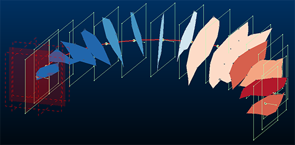
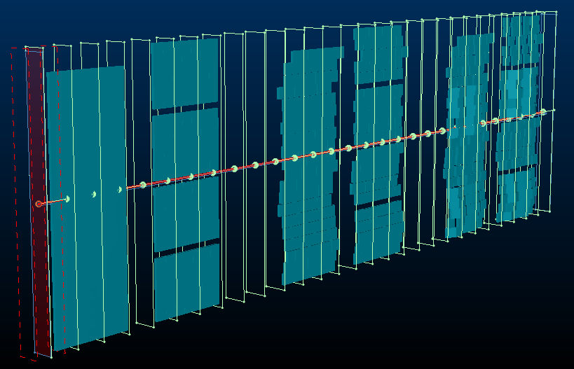

# Create Multiple Sections Along String

Note: This activity describes how to use the [create-multiple-sections](<../command_help/create-multiple-sections.md>) command.

You can generate multiple 3D sections along a design string and orient each either to a fixed azimuth and inclination, or to be perpendicular to the string at the assigned location. 

;>)

An example of multiple sections previewed around an arc (Along String and Relative to String)

Decide to create sections at fixed intervals, or specify the number of sections to fit onto the string (where the spacing adjusts automatically).

;>)

Multiple sections generated along a string using a fixed orientation

To generate multiple sections along a string:

  1. Load or digitize a string along which 3D sections are to be placed. Ensure the string is visible. It doesn't matter if it is selected or not.

  2. Display the **Create Multiple Sections** screen (for example, run the `create-multiple-sections` command).

Note: You can also create or modify string data whilst the **Create Multiple Sections** screen is displayed.

  3. Select Along string.

  4. Use the pick button to select a string in any 3D window.

The string highlights in red and the message "1 string selected appears"

Note: There can be a very brief delay between selecting the string and it showing as highlighted.

  5. Choose the section **Orientation** :

     * Select Fixed to apply the same section **Azimuth** and **Inclination** to all generated sections. These sections will always be parallel, with the section reference point aligning with the selected string.

Note: This differs from the **Parallel** section type, which doesn't use a string to guide section location (sections are added through all loaded data). See [Create Multiple Parallel Sections](<Create-multiple-sections-parallel.md>).

Choose the fixed orientation from either of the following:

       * **Current View** Use the currently active 3D windows view direction to set the section orientation.

       * Horizontal  Sections will all be horizontal (flat)

       * North - South Align all sections with the NS axis.

       * East - West Align all sections with the EW axis.

       * Pick orientation by 2 points Select and digitize 2 points in the 3D window to define the azimuth and inclination of the generated sections.

       * Azimuth / Inclination Manually define orientation settings. These are overridden if one of the automatic options above is used.

     * Select Relative to string to align sections perpendicularly with the target string. This can be useful, for example, if following a string representing an orebody trend. Strings are oriented based on the azimuth and inclination of the string edge they transect.

  6. Choose the Section Spacing or define a Number of Sections to add along the string. 

Note: Adjusting one field and clicking **Preview** automatically updates the other.

  7. If you need to position one of the sections at a precise point along the line, uncheck **Automatic reference point** and pick a point in the 3D window.

  8. You can either set section heights and widths automatically (default) or you can uncheck Automatic dimensions and define your own Height and Width. This applies to all generated sections.

If set to automatic, an attempt is made to encapsulate data fully by each section along the string. For example, if you have a series of stope volumes running (approximately) in an East-West direction, a string along the North-South axis could be used to automatically define sections that fully enclose data, for example:

;>)

  9. [Clipping](<../VR_Help/Clipping-Data.md>) distances (primary, secondary) can be also be set automatically (default) or manually, by unchecking Automatic clipping and defining Primary and Secondary clipping parameters. 

See [Multiple Sections: Automatic Settings](<Create-multiple-sections-auto-manual.md>).

  10. Click Preview and see if the generated section outlines are where you want them. 

  11. When your section preview looks good, click **OK** to generate a section object containing multiple definitions. This section appears in the **[Sheets](<Sheets%20Control%20Bar%20Overview.md>)** and **Project Data** control bars.

  12. Save your project.

Tip: When you create a new section set, the section parent is automatically set to the active section, meaning you can go straight to the 3D View ribbon and step back and forth through the sections.

Related topics and activities:

  * [create-multiple-sections ("cms")](<../command_help/create-multiple-sections.md>) (command)

  * [Create Multiple Parallel Sections](<Create-multiple-sections-parallel.md>)

  * [Create Multiple Sections Per String](<Create-multiple-sections-per.md>)

  * [3D Sections](<../VR_Help/Sections.md>)

  * [Section Properties](<../VR_Help/Section%20Properties%20Dialog.md>)

  * [Clipping 3D Data](<../VR_Help/Clipping-Data.md>)