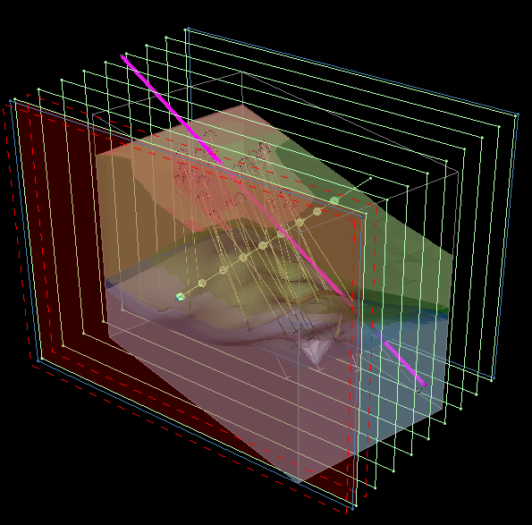
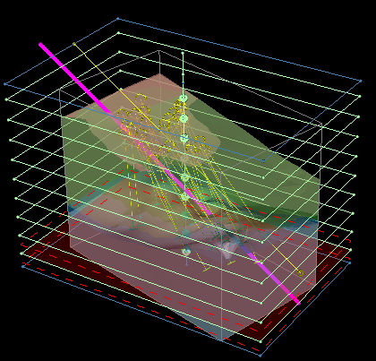
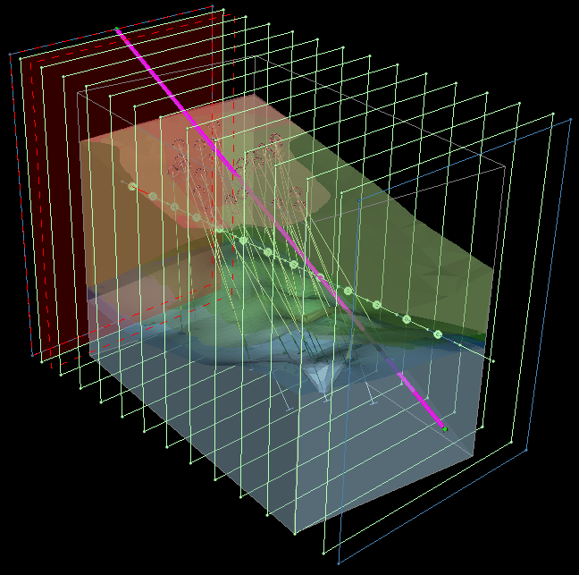
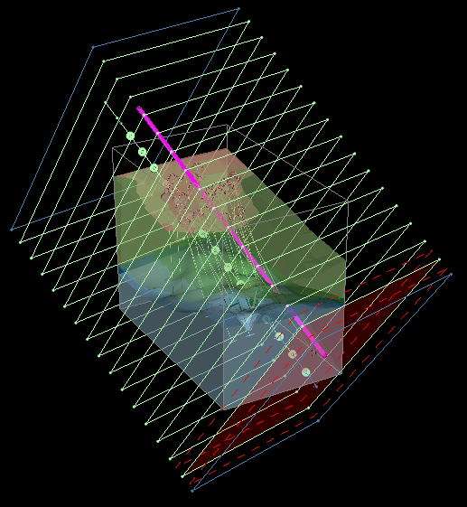
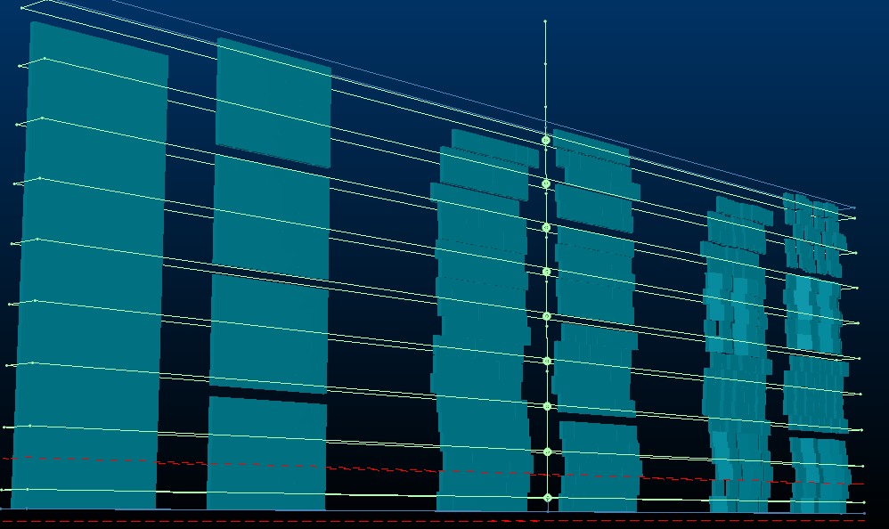

# Create Multiple Parallel Sections

Note: This activity describes how to use the [create-multiple-sections](<../command_help/create-multiple-sections.md>) command.

Generate sections through loaded data at the specified orientation and spacing.

In can be useful to show a cross section of your data at fixed intervals. For example, you could step through an estimated block model to better assess the distribution of grades within structures. 

The **Create Multiple Sections** command lets you create sections that accommodate all loaded 3D data, distributed throughout your scene at regular intervals. 

To generate multiple parallel sections throughout your loaded 3D :

  1. Load your 3D data. You can add or remove data after sections have been generated, although if automatic sizing, positioning and clipping is needed, you should load all appropriate data first.

  2. Display the **Create Multiple Sections** screen (for example, run the `create-multiple-sections` command).

  3. Select Parallel.

  4. Choose the section **Orientation** :

     * Select Fixed to apply the same section **Azimuth** and **Inclination** to all generated sections. These sections will always be parallel, with the section reference point aligning with the selected string.

Note: This differs from the **Parallel** section type, which doesn't use a string to guide section location (sections are added through all loaded data). See Create Multiple Parallel Sections.

Choose the fixed orientation from either of the following:

       * **Current View** Use the currently active 3D windows view direction to set the section orientation.

       * Horizontal  Sections will all be horizontal (flat)

       * North - South Align all sections with the NS axis.

       * East - West Align all sections with the EW axis.

       * Pick orientation by 2 points Select and digitize 2 points in the 3D window to define the azimuth and inclination of the generated sections. You can then choose to orient the section in one of the following ways (a pop up window displays on digitizing the second point:

         * **Parallel** Sections are created vertical and parallel to the guideline. For example (2 point orientation string is in pink):

;>)

         * Horizontal  Sections are created horizontal to the guideline, for example:

;>)

         * Vertical  Sections are created vertically and perpendicularly to the string, for example:

;>)

         * Perpendicular  Sections are created fully perpendicular to the string, including dip and azimuth adjustment, for example:

;>)

       * Azimuth / Inclination Manually define orientation settings. These are overridden if one of the automatic options above is used.

  5. Choose the Section Spacing or define a Number of Sections to add along the string. 

Note: Adjusting one field and clicking **Preview** automatically updates the other.

  6. If you need to position one of the sections at a precise point along the line, uncheck **Automatic reference point** and pick a point in the 3D window.

  7. You can either set section heights and widths automatically (default) or you can uncheck Automatic dimensions and define your own Height and Width. This applies to all generated sections.

If set to automatic, an attempt is made to encapsulate data fully by each section along the string, for example:

;>)

  8. [Clipping](<../VR_Help/Clipping-Data.md>) distances (primary, secondary) can be also be set automatically (default) or manually, by unchecking Automatic clipping and defining Primary and Secondary clipping parameters. 

  9. Click Preview and see if the generated section outlines are where you want them. 

  10. When your section preview looks good, click **OK** to generate a section object containing multiple definitions. This section appears in the **[Sheets](<Sheets%20Control%20Bar%20Overview.md>)** and **Project Data** control bars.

  11. Save your project.

Tip: When you create a new section set, the section parent is automatically set to the active section, meaning you can go straight to the 3D View ribbon and step back and forth through the sections.

Related topics and activities:

  * [create-multiple-sections ("cms")](<../command_help/create-multiple-sections.md>) (command)

  * [Create Multiple Sections Along String](<Create-multiple-sections-along.md>)

  * [Create Multiple Sections Per String](<Create-multiple-sections-per.md>)

  * [3D Sections](<../VR_Help/Sections.md>)

  * [Section Properties](<../VR_Help/Section%20Properties%20Dialog.md>)