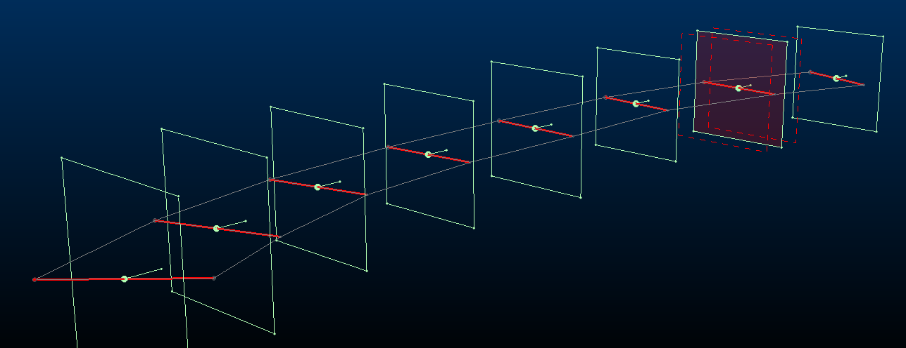
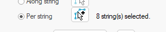
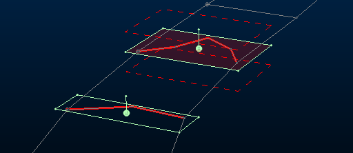

# Create Multiple Sections Per String

Note: This activity describes how to use the [create-multiple-sections](<../command_help/create-multiple-sections.md>) command.

Generate sections around individual loaded strings.

These strings could represent blast areas or underground workings, for example. Sections would typically be created in the plane of the digitised string, for example:

;>)

To generate multiple parallel sections throughout your loaded 3D :

  1. Digitize or load one or more strings in any 3D window and ensure they are visible.

  2. Display the **Create Multiple Sections** screen (for example, run the `create-multiple-sections` command).

  3. Select Per string.

  4. Click the pick button and select one or more strings in any 3D window. Selected strings highlight in red.

Tip: Pick multiple strings using the current box or swipe selection method. See [Selecting 3D Data Interactively](<Selecting3DDataInteractively.md>).

As strings are picked, the screen updates to show the number of strings currently selected:

Note: To deselect a string, select it again.

  5. Choose the section **Orientation** :

     * Select Fixed to apply the same section **Azimuth** and **Inclination** to all generated sections. These sections will always be parallel and centred around the centre of gravity of each target string.

Note: This differs from the **Parallel** section type, which doesn't use a string to guide section location (sections are added through all loaded data). See [Create Multiple Parallel Sections](<Create-multiple-sections-parallel.md>).

Choose the fixed orientation from either of the following:

       * **Current View** Use the currently active 3D windows view direction to set the section orientation.

       * Horizontal  Sections will all be horizontal (flat)

       * North - South Align all sections with the NS axis.

       * East - West Align all sections with the EW axis.

       * Pick orientation by 2 points Select and digitize 2 points in the 3D window to define the azimuth and inclination of the generated sections.

       * Azimuth / Inclination Manually define orientation settings. These are overridden if one of the automatic options above is used.

     * Select Relative to string to align sections with the best-fit plane of each target string. For example:

;>)

  6. If you need to position one of the sections at a precise point along the line, uncheck **Automatic reference point** and pick a point in the 3D window.

  7. You can either set section heights and widths automatically (default) or you can uncheck Automatic dimensions and define your own Height and Width. This applies to all generated sections.

  8. [Clipping](<../VR_Help/Clipping-Data.md>) distances (primary, secondary) can be also be set automatically (default) or manually, by unchecking Automatic clipping and defining Primary and Secondary clipping parameters. 

See [Multiple Sections: Automatic Settings](<Create-multiple-sections-auto-manual.md>).

  9. Click Preview and see if the generated section outlines are where you want them. 

  10. When your section preview looks good, click **OK** to generate a section object containing multiple definitions. This section appears in the **[Sheets](<Sheets%20Control%20Bar%20Overview.md>)** and **Project Data** control bars.

  11. Save your project.

Tip: When you create a new section set, the section parent is automatically set to the active section, meaning you can go straight to the 3D View ribbon and step back and forth through the sections.

Related topics and activities:

  * [create-multiple-sections ("cms")](<../command_help/create-multiple-sections.md>) (command)

  * [Create Multiple Parallel Sections](<Create-multiple-sections-parallel.md>)

  * [Create Multiple Sections Along String](<Create-multiple-sections-along.md>)

  * [3D Sections](<../VR_Help/Sections.md>)

  * [Section Properties](<../VR_Help/Section%20Properties%20Dialog.md>)