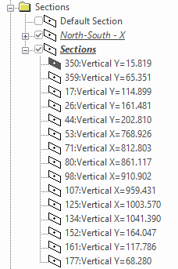

# Create Multiple Sections

To access this screen:

  * **3D View** ribbon **> > Sections >> Multiple Sections**.

  * Using the **[command line](<Command_Toolbar.md>)** , enter "create-multiple-sections"

  * Use the quick keys 'cms'

  * Display the **[Find Command](<findcommand.md>)** screen, locate **create-multiple-sections** and click **Run**.

Create multiple 3D window [sections](<../VR_Help/Sections.md>) automatically either at intervals throughout loaded data or in relation to guiding string data (either along the string or around individual strings).

The creation of multiple sections uses similar controls to those required for independent sections, but in the multiple sections scenario, you can create a series of sections that can be used to quickly orient the view or clip data at milestone positions. 

;>)

An example of multiple sections previewed around an arc (Along String option)

For example, you may want to create sections around individually located strings, where these strings could represent blast areas or underground workings, or creating sections that follow the directional trend of a string (always remaining perpendicular to it) to assess sections through an orebody. There are countless other use cases: Use this command to generate sections where a predictable pattern of section orientation, spacing or size is required.

Tip: When you create a new section set, the section parent is automatically set to the active section, meaning you can go straight to the 3D View ribbon and step back and forth through the sections.

Once sections are generated, they appear as a multi-section definition in the [Sheets](<Sheets%20Control%20Bar%20Overview.md>) or **Project Data** control bar. For example:

Note: Generated sections can be further editing using their corresponding [**Section Properties**](<../VR_Help/Section%20Properties%20Dialog.md>) screen.