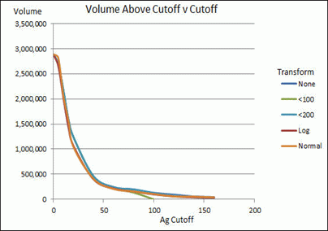

# Create Isoshells - Condition

To access this screen:

  * Display the [Create Isoshells](<Create_Isoshells.md>)screen and select the **Condition** tab.

The Create Isoshells tool allows categorical or continuous isoshells to be created from a point sample input, such as drillholes or chip samples.

The **Condition** tab is used to condition the input data before it is passed to the interpolator. The values on this screen are only relevant when working with continuous isolevels (see [Create Isoshells](<Create_Isoshells.md>)).

For continuous isoshells (for example, representing grade), conditioning allows you to transform data to a different distribution - converting it to the log of the input data, or mapping it to fit a normal distribution. If the input sample distribution is approximately lognormal, then the normal and log transformations will usually reduce the effect of high sample values.

The following graph illustrates the relationship between cutoff (isolevel) grade, and volume above cutoff for different transformations, and for top cuts of 100 and 200. The input sample file has a lognormal distribution with a mean of 28g:  

;>)

To define conditioning parameters for isoshell modelling:

  1. Define the upper and lower value constraints for modelling, using the Top/Bottom Cut parameters:

     * Set a **Maximum** value so that all values above the maximum are considered as the maximum value (the top cut).

     * Set a **Minimum** value, below which values are ignored (the bottom cut).

  2. To transform data to a different distribution after the top and bottom cut is performed (and before interpolation onto a regular grid) choose a transformation option:
     * **None** input data is not transformed. It is modelled as-is.
     * **Log transform** perform a conversion to the log (Logarithm) of the input data.
     * Normal transformmap the input data to fit a normal distribution.

If the input sample distribution is approximately lognormal, then the normal and log transformations will typically reduce the effect of high sample values.

**Note** : value transformations are performed internally so you don't need to consider the transformation process when specifying isolevels on the **[Input](<CreateIsoshells_Input.md>)** tab.

Related topics and activities

  * [Create Isoshells](<Create_Isoshells.md>)

  * [Create Isoshells - Input](<CreateIsoshells_Input.md>)

  * [Create Isoshells - Estimation Parameters](<CreateIsoshells_EstParams.md>)

  * [Create Isoshells - Volume](<CreateIsoshells_Vol.md>)

  * [Create Isoshells - Output](<CreateIsoshells_Output.md>)

  * [Isoshells Report](<CreateIsoshells_IsoShellsRep.md>)

  * [Create Categorical Surfaces](<../STUDIO_RM/Implicit_Surface_From_Drillholes_Categorical.md>)

  * [Create Grade Shells](<../STUDIO_RM/Implicit_Surface_From_Drillholes_Continuous.md>)