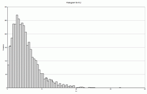
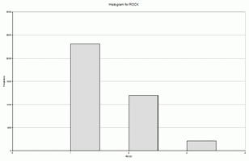

# Create Isoshells - Input

To access this screen:

  * Display the [Create Isoshells](<Create_Isoshells.md>)screen and select the **Input** tab.

The Create Isoshells tool allows categorical or continuous isoshells to be created from a point sample input, such as drillholes or chip samples.

Use the **Input** tab to select a sample file (usually a drillhole or points file) and associated coordinate fields. The field of interest is also defined here as well as isolevel values and the type of isoshells to be generated. 

#### Continuous vs. Categorical Values

The isoshells you produce can contain either **Continuous** or **Categorical** values the type you select determines access to other functions on other screens of the **Isoshells** console

  * **Continuous** \- values vary continuously between samples, as illustrated below, and are assumed to have an infinite number of possible values - for example, grade. In isoshells created using continuous values, interpolated values between sample data are created. This type of value is always numeric:  
  

  * **Categorical** \- a specific set of values with no numerical relationship - for example, zone or rock type, as illustrated below. Samples with a specific target value are used, rather than interpolated values. This type of value is numeric or alphanumeric:  
  

To define input parameters for isoshell modelling:

  1. Specify an input **Sample File**. This must be of the drillholes or points data type. 

The coordinate fields of the input file are detected automatically if possible, otherwise, select the relevant **X Field** , **Y Field** and Z Field values from the respective list (all numeric fields are listed).

  2. In the Isolevel Values group, pick the Type of isoshells to be generated:

     * Continuousvalues vary continuously between samples - for example, grade. In isoshells created using continuous values, interpolated values between sample data are created. This type of value is always numeric.
     * Categoricala distinct set of values with no numerical relationship - for example, zone or rock type. Samples with a specific target value are used rather than interpolated values. This type of value is either numeric or alphanumeric.

  3. Select the **Value** field which contains the values being interpreted - depending on the type of isolevel you select, either alphanumeric or numeric fields are displayed. 

**Note** : subsequently changing the isolevel type may result in a different default field being displayed in this drop-down list, if the previous selection was incompatible with the requested type.

  4. You can also define an optional **Weighting Field** which is used for interpolation. This is only available for continuous isolevels.

  5. Choose your isolevel Values.
  6. You can either do this individually or by specifying a range. The value liston the right shows currently-selected values.
     * Add Single Valueenter values individually by entering a **Value** and pressing **- >** to transfer the value to the list (which is sorted automatically into increasing alphabetical or numeric order, depending on the **Value Field** type.
     * **Add Values from Range** choose a **Minimum** and **Maximum** value and a **Step**. All (inclusive) qualifying values between the lower and upper bounds are transferred to the list on the right with **- >**.
  7. Review the value list. You can delete individual items by highlighting them and pressing DELETE. You can also select multiple items, either concurrently or as separate values, using the SHIFT and CTRL keys respectively. 

**Note** : if you need to define a new range, select **Remove All** and generate new values.

Related topics and activities

  * [Create Isoshells](<Create_Isoshells.md>)

  * [Create Isoshells - Condition](<CreateIsoshells_Condition.md>)

  * [Create Isoshells - Estimation Parameters](<CreateIsoshells_EstParams.md>)

  * [Create Isoshells - Volume](<CreateIsoshells_Vol.md>)

  * [Create Isoshells - Output](<CreateIsoshells_Output.md>)

  * [Create Categorical Surfaces](<../STUDIO_RM/Implicit_Surface_From_Drillholes_Categorical.md>)

  * [Create Grade Shells](<../STUDIO_RM/Implicit_Surface_From_Drillholes_Continuous.md>)