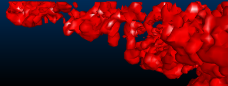
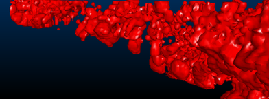
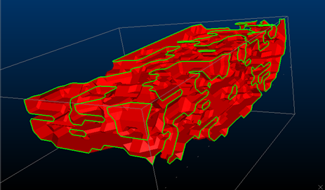
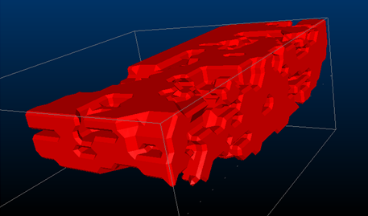
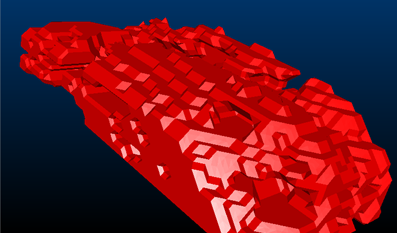
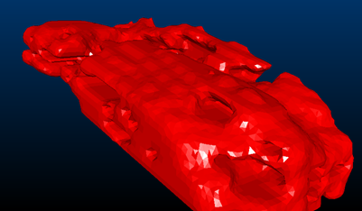
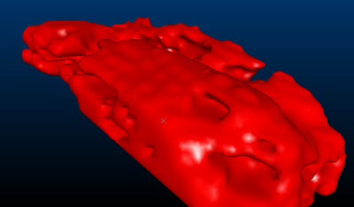

# Create Isoshells - Output

To access this screen:

  * Display the [Create Isoshells](<Create_Isoshells.md>)screen and select the **Output** tab.

The Create Isoshells tool allows categorical or continuous isoshells to be created from a point sample input, such as drillholes or chip samples.

This tab is used to specify output parameters for wireframe isoshells. This includes smoothing and triangle spacing options.

### Triangle Spacing

Setting up triangle spacing allows you to define a value related to the size of the triangles used in generating the output. Larger triangles are processed faster, but produce coarser wireframes which may not show smaller structures. 

**Note** : triangle size can also be set automatically for the size of bounding box specified in the [Volume](<CreateIsoshells_Vol.md>) tab by selecting Calculate from bounding box. 

Consider the following examples of different triangle spacing parameters:

;>)

Triangle Spacing set to '10'

;>)

Triangle Spacing set to '5'

;>)

Triangle Spacing set to '2.5'

### Volume boundaries

By selecting the Include volume boundary in isosurface option, isoshells are automatically closed where they pass through the bounding box boundary otherwise they remain open. Since wireframes must be closed to allow volumetric calculations and other wireframe processes to be run, it is recommended to select this option.

;>)

A categorical isoshell left open at the volume boundary - open edges are highlighted.

;>)

A categorical isoshell closed at the volume boundary.

### Smoothing Isosurfaces

When using larger triangle sizes, noticeable ramping steps may be visible in the output wireframe. These can be smoothed during generation by selecting the Smooth Isosurfaces option. This process averages out regional differences between existing vertices, rather than adding additional vertices to the wireframe. Smoothing can also be performed on the wireframe after generation by using the [wireframe-smooth](<../command_help/wireframe-smooth.md>) command. Excessive smoothing should be avoided, however, as this can reduce volumes.

The following images show the effects of smoothing on the output wireframe:

;>)

An isosurface with no smoothing

;>)

An isosurface with low smoothing

;>)

The same Low-smoothed isosurface, now with smooth shading

To define output parameters for isoshell modelling:

  1. Define an Object Base Name. 

If the Different object for each isolevel option is unchecked (see below), the Object Base Name is the name new wireframe object. If the Different object for each isolevel option is checked, this box allows you to define the base name of multiple objects, suffixed by a description of the isolevel \- for example, Isosurface (AU=0.5).

  2. Define your **Triangle spacing** (see above for details). Choose a value which is related to the size of the triangles used to generate the output. Larger triangles are processed faster, but produce coarser wireframes which may not show smaller structures.

Choose **Calculate from bounding box** to set the appropriate triangle size automatically, in relation to the size of bounding box specified on the Volume tab. To specify an explicit value for triangle spacing, uncheck this option and enter the required size.

**Tip** : start with higher values for triangle spacing and reduce the amount to refine initial results. This allows a rough output to be generated for initial review quickly.

  3. Choose whether a separate wireframe object is created for every isolevel, or whether all isolevels are written to a single object. No empty wireframe objects are created in either case. As the isolevel column is added to the wireframes, different isolevels within a single object may be managed by filtering, or using legends. Separate objects make the visualization of nested isolevels easier to manage - however, creating isoshells as a single object enables you to sequence them in the VR window, allowing you to view each isolevel individually as part of an animated sequence.
     1. If **Different object for each isolevel** is **checked** , an independent wireframe data object is created for each distinct isolevel value. Each object is prefixed with the **Object Base Name** (see above) and a unique, incremental suffix.
     2. If **Different object for each isolevel** is **unchecked** , a single wireframe object is output, with the Value Field (from the Input tab) copied to the output wireframe to indicate each isolevel value. This lets you filter the resulting object to show specific isolevel values, for example.
  4. Use the Smooth Isosurfaces option to remove the effect of outlier data, or to create a less erratic output surface. Choose from Low, Medium or High levels of smoothing. Excessive smoothing can reduce wireframe volumes.

**Tip** : smooth your output isoshell after generation using the **[wireframe-smooth](<../command_help/wireframe-smooth.md>)** command.

  * [Create Isoshells - Input](<CreateIsoshells_Input.md>)
  * [Create Isoshells - Condition](<CreateIsoshells_Condition.md>)

  * [Create Isoshells - Estimation Parameters](<CreateIsoshells_EstParams.md>)

  * [Create Isoshells - Volume](<CreateIsoshells_Vol.md>)

  * Create Isoshells - Output

  * [Isoshells Report](<CreateIsoshells_IsoShellsRep.md>)

  * [Create Categorical Surfaces](<../STUDIO_RM/Implicit_Surface_From_Drillholes_Categorical.md>)

  * [Create Grade Shells](<../STUDIO_RM/Implicit_Surface_From_Drillholes_Continuous.md>)

  * [wireframe-smooth](<../command_help/wireframe-smooth.md>) (command)