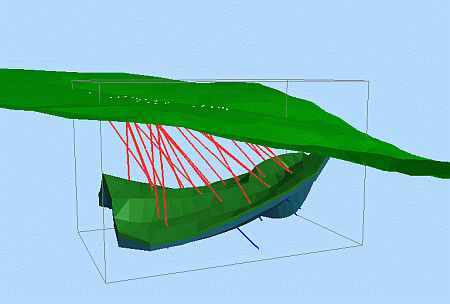

# Create Model Prototype

To access this screen:

  * Activate the Model ribbon and select Create >> Auto Prototype

  * Using the **[command line](<Command_Toolbar.md>)** , enter "create-model-prototype"

  * Use the quick key combination "cmp"

  * Display the **[Find Command](<findcommand.md>)** screen, locate **create-model-prototype** and click **Run**.

Define, preview and generate rotated or non-rotated block model prototypes, using parameters, an existing file or selected objects.

**Note** : This screen uses the [PROTOM Process](<../Process_Help_XML/protom.md>).

### Block Model Prototype Origin

The 'origin' of a model prototype is the lower, left-hand corner of the block model when viewed in a combination of plan view and west-east section in Studio's generic World Coordinate System.

  * When a **non-rotated** block model prototype is created and saved to file, the **XMORIG** , **YMORIG** and **ZMORIG** default attributes values are the same as those displayed in the X Origin, Y Origin and Z Origin fields.

  * When a **rotated** model prototype is created, the default values for the **XMORIG** , **YMORIG** and **ZMORIG** are set to zero, as this represents the block model origin in the rotated coordinate system.

The 'origin' and 'maximum' coordinate values are located at the corners of the block model parent cells, and not at the cell centers. Likewise, the 'length' values represent the distance to the corners of the respective X, Y or Z model edges. See [Block Models](<../STUDIO_RM/Block_Models_Evaluation.md>).

### Previewing a Prototype

You can preview your prototype either by dynamically updating a 3D view each time a setting is changed, or by manually updating the preview when you're happy all settings are defined.

The limits of the block model prototype are shown as grey lines along each edge of the cuboid enclosing the block model prototype space. This should be viewed along with other relevant 3D data - for example, the wireframe models which will later be used to generate the block model(s). The aim of this is to make sure that the model prototype limits enclose the correct 3D space. In the example below, the preview lines are shown in grey along with drillhole and wireframe model data.

**Note** : the model prototype preview is temporary. It disappears when the **Create Isoshells** screen is dismissed. To preserve the prototype, an output **Model prototype** file name must be specified. 

### Define a Prototype Manually

You can define your prototype absolutely if you know the required dimensions, location and cell resolution.

  1. Display the **Create Model Prototype** screen.

  2. Define the parent cell size of your prototype using the **X Size** , **Y Size** and **Z Size** fields. All values must be above zero.

  3. Define the origin on the model prototype (in world coordinates) using the **X Origin** , **Y Origin** and **Z Origin** fields. Values can be positive or negative. See Block Model Prototype Origin, above.

  4. Specify the length of the prototype in each direction using **X Maximum** , Y Maximum and Z Maximum fields. Editing these values automatically adjusts the **Cell Count** (see below).

  5. Optionally, set the **Cell Count** in each direction using the relevant **Number of cells** field. This automatically updates the associated **Maximum** field (see above).

  6. If you are defining a **Rotated model** prototype:

     1. **Check** **Rotated model**.

**Note** : this option is unchecked by default, but is automatically checked when either the **Fit 2D rotated prototype** or the Fit 3D rotated prototype options are selected - see below).

     2. Using the **Rotations** table, define up to 3 axes and their associated rotation.

**Positive** rotation angles result in a _clockwise_ rotation about an axis when viewed along an axis in the direction of the origin. The XYZ axes are those from Studio's generic World Coordinate System, where:

        * **X axis** is positive East.

        * **Y axis** is positive North.

        * **Z axis** is positive upwards. 

**Note** : at least one axis and rotation angle must be defined. Angles can have a range of -360 to 360 degrees.

  7. If you need one, define a **Data margin** to extend the model prototype beyond the extents of the selected loaded data objects. **X** , **Y** and **Z** margins are values above zero. 

     * If **Equal margins** is **checked** , changing any axis value automatically updates the other two to the same value.

  8. Specify your **Output** file name by defining a **Model prototype** name and location. You can use the **Project Browser** to update an existing project file or define a new name and location.

  9. Assess your manual prototype using a **Preview** option:

     * Dynamic Previewautomatically display the generated block model prototype limits in the primary **3D** window. The hull indicator updates after every parameter change.

     * Preview nowpreview the block model prototype limits in the **3D** window using the current parameters.

  10. Optionally, check **Save** to permit the current settings to be **Restore** d in a later model prototype creation session.

  11. Click **OK** to generate a model prototype file using the specified parameters.

**Note** : the model prototype isn't automatically loaded. 

### Define a Prototype from Loaded Data

It may be useful to define a prototype based on the outer hull of other data, such as desurveyed drillholes, or an implicit wireframe model, for example.

  1. Display the **Create Model Prototype** screen.

  2. In the **Set from Data** section, you can:

     * Use an existing **Model prototype** as a basis for further editing. To do this, use the browse button to display the **Project Browser** and load any block model file. 

Once a model prototype is chosen, click **Copy existing prototype** to update the prototype details (size, origin, length and so on) automatically.

Note: If copying from a rotated model prototype, **Rotated model** is automatically selected and the angles used in the prototype appear in the **Rotations** table.

Note: When an existing model (rotated or unrotated) is loaded, and a new origin is selected, the model origin snap to a new origin where the new blocks align with the previous unrotated or rotated model. This can be useful when you want to create a smaller model where the cells align (in X, Y, Z according to the **XINC** , **YINC** and **ZINC** attribute values).

     * Select one or more **Loaded data** objects. A prototype is then calculated based on the extents of all selected data. You can also use the pick button to choose a visible 3D data overlay to enable it in the list.

You can then:

       * Fit unrotated prototype to dataselect this option when generating non-rotated prototypes. The Model Size and Cell Count parameters are updated using the combined extents of the selected object(s).

**Note** : If you select this option, the **X/Y/Z Origin** fields are automatically populated with values divisible by the current **Cell size** settings, as it can be difficult to work with origins that are not whole numbers and its easier to spot errors when your numbers are whole or aligned with your blocks.

       * Fit rotated prototype to data using anglesselect this option when generating prototypes for rotated models defined by the angles specified in the Rotated model group. 

**Note** : this option is unavailable if **Rotated model** is **unchecked**.

       * Fit 2D rotated prototype to dataselect this option when generating prototypes for rotated models defined by one rotation in a single plane. The Model Size, Cell Count and Rotated Model parameters are updated using the combined extents of the selected object(s).

       * 2D Planeif Fit 2D rotated prototype to data is selected, choose one of the following plane options: 

XY  |  Rotation is in the horizontal 'plan view' plane,  
---|---  
XZ |  Rotation is in the horizontal vertical (West-East) plane,  
YZ |  Rotation is in the horizontal vertical (North-South) plane.  
       * Fit 3D rotated prototype to dataselect this option when generating prototypes for rotated models defined by at least two rotations. The Model Size, Cell Count and Rotated Model parameters are updated using the combined extents of the selected object(s).
  3. If you need one, define a **Data margin** to extend the model prototype beyond the extents of the selected loaded data objects. **X** , **Y** and **Z** margins are values above zero. 

     * If **Equal margins** is **checked** , changing any axis value automatically updates the other two to the same value.

  4. Specify your **Output** file name by defining a **Model prototype** name and location. You can use the **Project Browser** to update an existing project file or define a new name and location.

  5. Assess your manual prototype using a **Preview** option:

     * Dynamic Previewautomatically display the generated block model prototype limits in the primary **3D** window. The hull indicator updates after every parameter change.

     * Preview nowpreview the block model prototype limits in the **3D** window using the current parameters.

  6. Optionally, check **Save** to permit the current settings to be **Restore** d in a later model prototype creation session.

  7. Click **OK** to generate a model prototype file using the specified parameters.

**Note** : the model prototype isn't automatically loaded. 

Related topics and activities

  * [create-model-prototype](<../command_help/create-model-prototype.md>)

  * [CDTRAN Process](<../Process_Help_XML/cdtran.md>)

  * [PROTOM Process](<../Process_Help_XML/protom.md>)