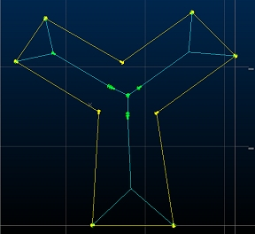
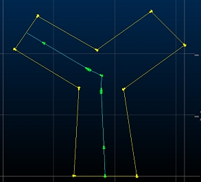
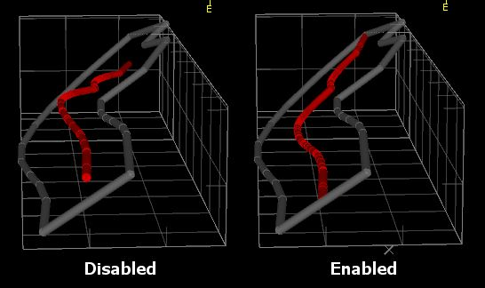
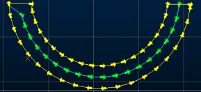
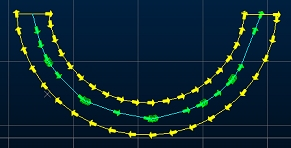
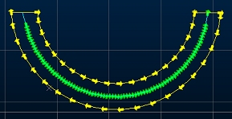
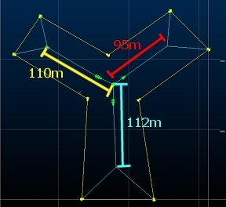
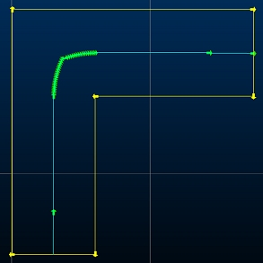
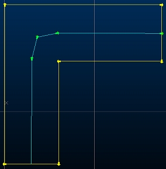

# Create Centerlines from Selected Outlines

To access this screen: 

  * **Digitize** ribbon **> > Tools >> More >> Create Centerlines**.

  * Using the **[command line](<Command_Toolbar.md>)** , enter "create-centerlines-from-outlines"

  * Use the quick key combination "cen".

  * Display the **[Find Command](<findcommand.md>)** screen, locate **create-centerlines-from-outlines** and click **Run**.

Generate centerlines for selected string data, treating the selected strings as perimeters. One or more closed strings must be pre-selected to use this command (you are unable to select Generate unless this is done). Optionally, you can transfer the selected string attribute data to the generated centerline(s). 

**Note** : centerline data is generated within the current string object.

Branched or bifurcated centerlines can be created and you can control the resolution of the centerline and other settings as indicated below.

This screen is the user interface for the [create-centerlines-from-outlines](<../command_help/create-centrelines-from-outlines.md>) command. 

Activity steps:

  1. Display the perimeter data for which you wish to create centerline data in any 3D window.

  2. Choose which attributes are copied to the centerline:

     * If **Copy Perimeter Data** is **checked** , string attribute data from the selected perimeter(s) is copied to the generated centerline. 

     * If **Copy Perimeter Data** is **unchecked** , attributes are not copied to the centreline. 

  3. Choose if branching centerlines are permitted:

     * If **Allow Branching Centerline** is **checked** , an attempt is made to create forked centerline data where appropriate, for example:

;>)

     * If **Allow Branching Centerline** is **unchecked** , a single, continuous centerline is generated within the selected perimeter string data, regardless of its shape. For example:

;>)

**Note** : branched centerlines are sensitive to the Minimum Branch Length setting (see below).

  4. Choose the plane on which centerline is generated:

     * If **Project Centerline to Surface** is **checked** , centerlines are created that follow the trend of the outline, i.e. onto a theoretical surface created by filling the outline.

     * If **Project Centerline to Surface** is **unchecked** , centerline data is generated on a flat/horizontal plane.

;>)

_Generated centerlines that are projected to a flat plane (left) and to the mean plane of the perimeter string (right)_

  5. Define how the outline is considered when generating a centerline using **Outline Simplification Tolerance**. Zero ensures all outline points are considered, regardless of the density of perimeter string points.

This value is a distance that determines how closely the centreline must be adjusted to allow for perimeter string node positions. A non-zero value decreases the complexity of the generated centerline(s). 

Consider the example below, which shows the results of an unbranched centreline calculation (shown in green):

Outline Simplification Tolerance = 0

Outline Simplification Tolerance = 4

  6. Choose how detailed your centerline is using **Outline Resolution**. This setting determines the number of nodes (as a factor) used to define centerline data (and as a result, how complex a shape that can be generated). Higher values lead to more complex centerlines. Consider the following examples:

Centreline Resolution = 1

Centreline Resolution = 3

  7. If **Allow Branching Centerline** is checked, the **Minimum Branch Length** is the minimum length a centerline branch has to be in order to be deemed viable. Smaller values can lead to a greater number of branches for the same input data (although this depends on the shape of the input outline data).

**Note** : If **Allow Branching Centerline** is unchecked, this setting has no effect.

For example, in the images below, the upper view shows a bifurcated centerline generated with a Minimum Branch Length of zero (this means that a centerline branch is generated of any length, if it accurately represents the mid-position of a branch of an outline shape. Note the lengths of the branches:

If **Minimum Branch Length** is set to 100 (and nothing else is changed), the shortest branch is excluded as the primary segment is <100m in length:

  8. You can merge centerline points that are close together using **Centerline Simplification Tolerance**. This is a distance along the generated centerline that, should multiple string nodes occur, they are merged into a single node. For example, the images below show the difference between two settings, where no other values are changed. Consider the following examples:

_Centerline Simplification Tolerance = 0.01_

Centerline Simplification Tolerance = 1

  9. Click **Generate** to create the new centerline data and dismiss the screen. Data is created in the current strings object.

Related topics and activities

  * [create-centerlines-from-outlines](<../command_help/create-centrelines-from-outlines.md>) (command)