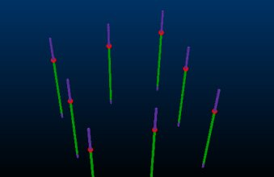
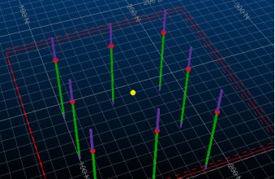
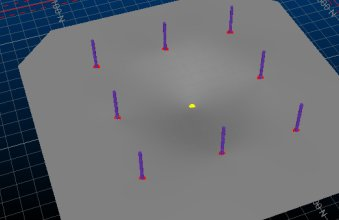

# Adding Points for Implicit Modelling

There can be occasions where you wish to control the extrapolation of surface data between known sample points using a more direct method than globally adjusting [boundary](<Vein_Modelling_Boundary_Clipping.md>) settings, or by [disabling or reversing](<Create_Vein_Surfaces_6_Reversal.md>) sample positions.

The Create Contact Surface command lets you add sample points into the grid of points used to construct the resulting surface.

You can add any loaded point or string data to an 'additional points' object by selecting one or more point or string entities and using the Add Selected String Data... option.

Adding [positive](<Create_Vein_Surfaces_5_PositiveNegative.md>) samples will, depending on other vein modelling settings, cause the generated surface(s) to intercept the new positions.

**Tip** : To introduce [negative](<Create_Vein_Surfaces_5_PositiveNegative.md>) samples into your data, consider using the Drillhole Planner in conjunction with the Create Contact Surface command. 

If string data is selected, each vertex of the string becomes a new HW or FW point. 

As such, it is useful to align the section in an appropriate manner before you start to digitize; ideally, the section is roughly perpendicular to the mean plane of your data although it is likely that the orientation of your digitizing section will change depending on its position within the implied structure.

  
   
During digitizing, additional points are visible as string vertices

**Note** : If loaded or digitized additional points are found to be coincident with others, this is highlighted in the Output window report. Coincident points may have an adverse effect on surface modelling.

### Example

In the following simplified example, a set of 8 holes form a square boundary:  
  

Selecting the Use additional points check box, and adjusting the 3D section to fall just below the previously generated surface, enables the Create additional points button. Selecting that allows a 9th contact point to be position in the middle of the existing contact point locations (although slightly below). Only one point is added (a single-point string):

New Surface then recreates the new contact surface, honouring the additional point:  
  

Related topics and activities

  * [Create Contact Surface](<../STUDIO_RM/Surface_From_Samples.md>)