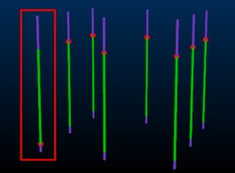

# Create Contact Surface: Edit Samples

This topic explains how the Create Contact Surface task's sample editing commands let you reverse samples, and ignore sample start and/or end positions.

### Start and End of Hole Situations

The surfaces-from-samples command treats the end-of-hole (EOH) and start/collar positions of input drillholes as special cases.

Either can be used as snap positions when forming a contact surface (Snap), or can be eliminated from the calculation (Ignore). You can also choose to allow a contact surface to pass through or above the collar of a hole (Pass above), but never below, or, you can allow the surface to be constructed below the EOH position (Pass below), but never above.

Note: By default, surface data is snapped to the contact positions of each drillhole.

### Sample Reversal and Usage

The surfaces-from-samples command attempts to assess the overall orientation of the implied structure and assign contact points accordingly. This assessment involves determine which side of the trend surface a point lies, with the assumption being that.

However, in other cases (such as deeply dipping/vertical lodes), there is an increased tendency for drillholes to intercept the trend surface from different sides, meaning that there is no consistent assignment of drilling direction. Your application will always attempt to assign contact points in a sensible way, using the mean plane of the data to determine the orientation of the samples being considered and assigning a contact point at the appropriate intercept position along the hole.

Generally, this automatic assessment is sufficient, but there may be situations where one or more samples needs to be reversed or ignored before generating a contact surface.

Choose one or more holes, then check Reverse to swap the contact point from the uppermost downhole intercept position (FROM) between Above and Below values to the lowermost (**TO**). Note that this is not the same as just reversing the First and Last assignment for a particular hole. In the following example, a single drillhole intercept position has been reversed, positioning the contact at the end of the Above attribute group, not the start:  
  

In summary, to alter the direction in which a contact surface point is calculated:

  1. Select the hole(s) containing the contact point to be reversed.

  2. Check Reversed. 

  3. Click Apply. The contact point on all selected holes is repositioned from the entry intercept to the exit intercept position. The hole data itself is not reversed (collar and EOH positions remain are unchanged) but the assignment of the contact point is made using reversed logic.

Similarly, you can select one or more samples, and uncheck **Use** (and **Apply**) to remove contact points associated with those holes so they will not be considered during surface calculations. The Use check box is available for all points. For example, you can disable points to determine if selected sample(s) are used in surface generation; select the sample(s) you wish to toggle on or off, then select or de-select this check box, then Apply the change to the selected samples. 

**Tip** : Revert contact point usage and orientation data to default settings by clicking **Reset Contact Points**.

Related topics and activities

  * [Create Contact Surface](<../STUDIO_RM/Surface_From_Samples.md>)