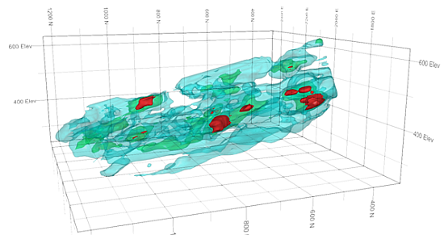

# Create Isoshells

To access this screen:

  * **Explicit** ribbon **> > Automatic >> IsoShells**.

  * Using the **[command line](<Command_Toolbar.md>)** , enter "create-shells"

  * Use the quick key combination "csh".

  * Display the **[Find Command](<findcommand.md>)** screen, locate **create-shells** and click **Run**.

The Create Isoshells tool allows categorical or continuous isoshells to be created from a point sample input, such as drillholes or chip samples, and is accessed as follows:

Creating a resource model is an iterative process with greater understanding of the geology and grade distribution being achieved as the study proceeds, and more data becomes available. Isoshell wireframes can assist in this process: surrounding an area in 3D space, they allow boundaries between rock types to be delineated, and enable you to model the spatial distribution of grades by representing different cutoffs. Where controls on mineralization are unclear, Isoshell wireframes allow different levels of a lower cutoff to be investigated - providing a suitable domain for grade estimation.

An example showing three levels of nested isoshells

A slice through the nested isoshells

**Note** : Isoshells functionality can be scripted using the ParseCommand method, and providing parameters to define behavior. See [Create Isoshells: Automation](<CreateIsoshells_Scripting.md>).

The Create Isoshells screen is split into the following areas, accessed by tabs along the top of the screen:

  * **Input** select a sample file (usually a drillhole or points file), and associated coordinate fields. The field of interest is defined, as well as isolevel values and the type of isoshells to be generated (either categorical or continous. 

See **[Create Isoshells - Input](<CreateIsoshells_Input.md>)**.

  * **Condition** condition the input data before it is passed to the interpolator, allowing upper and lower limits to be imposed on the input samples. This is only valid for continuous isolevels.

See **[Create Isoshells - Condition](<CreateIsoshells_Condition.md>)**.

  * **Estimation Parameters** define a search ellipsoid and select the interpolation algorithm used to estimate the values which lie between samples.

See [Create Isoshells - Estimation Parameters](<CreateIsoshells_EstParams.md>).

  * **Volume** define a bounding box within which isoshells are calculated. This provides the advantages of restricting the volume to a specific area of interest, and minimizing the effects of extrapolation. 

See **[Create Isoshells - Volume](<CreateIsoshells_Vol.md>)**.

  * **Output** specify output name and triangle spacing parameters for isoshells, as well as specifying different objects for each isolevel, and selecting whether to include volume boundaries in the output data.

See **[Create Isoshells - Output](<CreateIsoshells_Output.md>)**.

### Completing the Process

When all appropriate parameters are set, click OK to calculate isoshells.

When the Create Isoshells process is running, a progress bar is shown and additional information is displayed in the Command control bar. You can stop this process by clicking Cancel.

When the process is complete, a summary of resulting isolevel wireframes is displayed in the Isoshell Report. This contains one row for each isolevel. The first column lists the value being converted into isoshells (only non-empty isoshells are listed). If an isoshell contains open edges - for example, because the **Include volume boundary in isosurface** option was not selected in the Output tab - a "Not closed message is displayed in the Volume and Area columns.

Save the summary as a Datamine file or export it to Microsoft Excel. See **[Isoshells Report](<CreateIsoshells_IsoShellsRep.md>)**.

Clicking Finish closes both the Isoshell Report and the Create Isoshells screens. All Parameters in the Create Isoshells screen are automatically saved and can be restored when the Create Isoshells process is run again. This is done by clicking Restore during the next session.

**Note** : Your application can also use implicit modelling techniques to generate **[categorical](<../STUDIO_RM/Implicit_Surface_From_Drillholes_Categorical.md>)** and **[grade](<../STUDIO_RM/Implicit_Surface_From_Drillholes_Continuous.md>)** shells.  

Related topics and activities

  * [Create Isoshells - Input](<CreateIsoshells_Input.md>)

  * [Create Isoshells - Condition](<CreateIsoshells_Condition.md>)

  * [Create Isoshells - Estimation Parameters](<CreateIsoshells_EstParams.md>)

  * [Create Isoshells - Volume](<CreateIsoshells_Vol.md>)

  * [Create Isoshells - Output](<CreateIsoshells_Output.md>)

  * [Isoshells Report](<CreateIsoshells_IsoShellsRep.md>)

  * [Create Categorical Surfaces](<../STUDIO_RM/Implicit_Surface_From_Drillholes_Categorical.md>)

  * [Create Grade Shells](<../STUDIO_RM/Implicit_Surface_From_Drillholes_Continuous.md>)