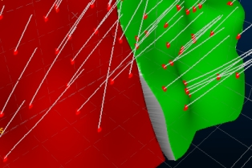
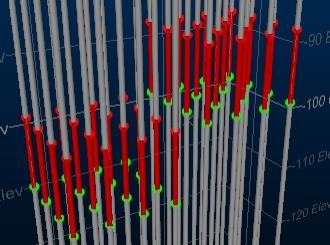
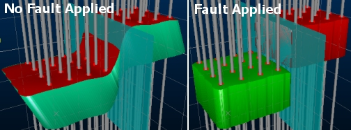
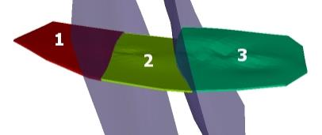
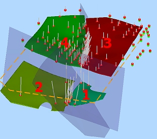
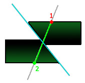
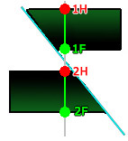
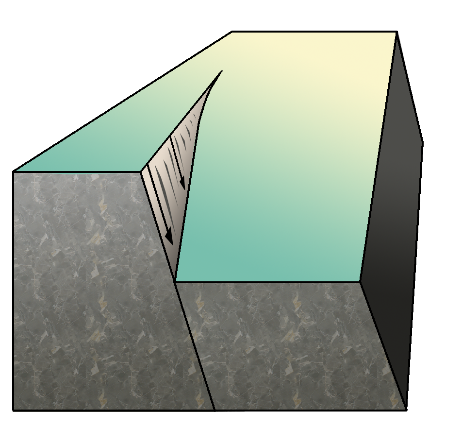
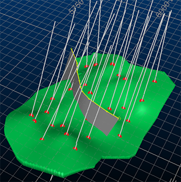
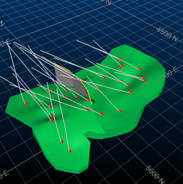

# Model Faults

The following information relates to the vein-from-samples and surface-from-samples commands.

The [Create Vein Surface](<Create_Vein_Surfaces_Overview.md>) task is a focussed tool for the calculation of hanging wall (HW) and/or footwall (FW) surfaces that represent vein or vein-like lodes. Similarly, the [Create Contact Surface](<../STUDIO_RM/Surface_From_Samples.md>) task is used to generate contact surfaces between groups of contiguous categorical values.

_A fault modelled between two lithological zones_

Note: A Datamine [eLearning course](<https://datamine.learnupon.com/>) is available that covers functions described in this topic. Contact your local Datamine office for more details.

In the examples below, a 4x8 grid of positive intervals (two groups of data at different elevations, representing a 10m shear). Regular 20m spacing exists:

This data is used as an input to the **vein-from-samples** command. In both cases, the Alpha Shape boundary option is used, with a segment length of 5m. See [Boundary Options](<Vein_Modelling_Boundary_Clipping.md>).

The right hand image below shows output where no fault data is used. In this case, the output is a continuous, single volume. In the left hand image, a vertical fault wireframe (shown in transparent blue) splits the input data into two 4x4 sample grids.

In the faulted output, two distinct fault blocks are created. Each block is influenced by the HW and FW samples in its own block only. Data on the remote side of the fault sheet is not considered for each block. One other difference is that the output faulted model is coloured according to the assigned FaultID (although this can be [formatted](<../VR_Help/Wireframe_Properties_Dialog.md>) however you like afterwards).

## Fault Modelling

Wireframe sheets are used to differentiate independent blocks of data. These 'fault blocks' are modelled to mimic the natural outcome of material shear/thrust.

If multiple fault wireframes are required they must be contained within the same wireframe object and attributed with a unique ID within a dedicated table column.

  * The Fault Surfaces drop-down list is used to select a loaded wireframe object containing one or more fault wireframes
  * The Fault ID Column drop-down list is used to determine unique fault wireframes within the loaded data. If <none> is selected, the full wireframe file will be treated as a single faulting structure.

**Tip** : Fault wireframes can be modelled quickly and easily using the **[Model Faults](<../STUDIO_RM/ModelFaults.md>)** managed task. 

Once a **Fault ID** column has been selected, the loaded fault wireframe will update automatically to highlight the different **Fault ID** values within the selected attribute.

Each output fault block is assigned a unique Fault ID value. Fault surfaces within the specified fault wireframe (e.g. according to a SURFACE attribute) determine how many fault blocks are created.

For example; in the input fault wireframe below, shown in blue, the SURFACE attribute is used to define two separate fault sheets. This produces three output fault blocks, each with a unique FaultID.

In the following example, 3 fault sheets are used to split modelling output into four fault blocks. All fault wireframes fully intersect each other, although they don't have to:

**Tip** : To isolate fault blocks as individual wireframe data objects, use the [Extract Data Object](<ExtractDataObject_Dialog.md>) function. To visualize them independently without changing the underlying data, use the [Quick Filter](<QuickFilterLegendDialog.md>) control bar.

If fault data is used, the Output window report will show the object used to generate the fault blocks and the number of fault blocks generated.

## Fault Data that Splits Intervals

Positive sample intervals can be either fully or partly within a fault block. A hanging wall (HW) point in one block and the corresponding footwall (FW) point in another, as a result of a fault wireframe passing through the positive interval, is permitted.

Your application handles split intervals by considering data on each side of the fault separately. In the diagram below, the intervals near the boundary are split by a fault surface. This leads to a situation where the interval HW and FW lie in separate fault blocks. 

In the case above case, the HW (1) is used (only) in calculating the volume on the right of the fault and the FW (2) is used to calculate the volume on the left. 

As input data within each fault block is considered independently (and as the trend surface points are treated similarly), modelling normal vs. reverse faults is the same process, i.e. defining one or more fault surfaces and calculating output.

For a more severe shear, where each element is fully dislocated, it is possible for multiple positive sample intervals to exist in the input data, e.g.:  
  

In an unfaulted scenario, you would need to treat the above sample as a continuous positive interval (from top HW to bottom FW) using the Merge Samples option, or ignore it using the Ignore Samples option. However, where fault surfaces are used, as the data on each side of the fault(s) is considered independently, the sample can be used as-is.

In this case, the upper HW and FW samples (1H and 1F) will contribute to the volume created on the right and the lower HW and FW pair (2H and 2F) are used to construct the fault block on the left.

## Faults Terminating within a Block ("Scissor Faults")

Where a fault sheet either fully transects the positive sample data extents, or it fully intersects with another fault sheet, a discontinuity is created representing the typical shear or thrust expected in nature. This scenario gives rise to fully-independent fault blocks.

However, fault sheets can terminate within a fault block. In this situation, the fault throw is gradually reduced to zero up to its terminus, allowing a 'scissor fault' to form, for example, the green fault block below is partly intruded by a fault sheet:

The adjustment of the scissor fault along its length can be managed using additional points and other shape generation settings. Without additional input, a fault that terminates within the positive volume or surface will gradually minimize in shear/throw as data moves away from the fault sheet.

**Tip** : Vein modelling requires a 'best fit' plane to ensure generated surface normals (and the direction of the HW-FW conjoining surface for volumes). It is recommended to check the orientation of the best-fit plane before you embark on a modelling run as, where faulted data exists, there can be a large disparity in the throw/shear distance between positive samples. As such the **Auto** option may not be appropriate in some cases. If so, set the orientation of the section manually and use the **Current Section** option instead.

## Automatically Extending Fault Data

By default, fault wireframes are used 'as-is' to determine distinct fault blocks.

The **Automatically extend faults** option can be used to control this behaviour. If enabled, each fault wireframe within the specified data object is extended outwards and upwards/downwards to the extent of the loaded sample data (essentially, a cube wrapped around the minimum and maximum extents of your loaded positive sample data.

Consider the following simple example, where a single fault wireframe sheet partly transects a previously modelled (unfaulted) vein volume:

With the **Automatically extend faults option** unchecked (and the command run again), an unfaulted output is produced (exactly as shown above), because two distinct fault blocks could not be created. 
    
    
    --------------------------------------------------------
    
    
    - Your fault did not fully intersect your input data.
    
    
    If results are unexpected, please review your input data.
    
    
    Consult your Help file for more information.
    
    
    --------------------------------------------------------

However, with the **Automatically extend faults** option checked, the fault wireframe is automatically extended to the data boundary, ensuring a full intersection with the loaded data. 

**Note** : Fault wireframes aren't modified during modelling; instead, a working copy of your fault wireframe is extended internally and used to created fault blocks.

However, fault extension will occur to all aspects of the fault, meaning all wireframe sheets are fully extended along a surface trend all the way out to the data boundary (a cube wrapping the input positive samples. This could cause unexpected faulting to occur if multiple wireframe sheets terminate within the area of positive samples representing the structure.  

## Considerations when Modelling Faulted Data

Consider the following when creating faulted vein models:

  * Use the **Faults** managed task to create a fault network. See [Model Faults](<../STUDIO_RM/ModelFaults.md>).

    1. Generate an unfaulted model for the selected domain first and ensure the output is displayed.

    2. This becomes a good reference for the **Faults** task; run it and create your fault network in relation to the unfaulted model.

    3. Return to the **Create Vein Surfaces** task and select the output faults object you created above.

    4. Generate an output and adjust parameters as necessary, then recompute.

  * HW and FW surface don't converge towards the trend surface over distance from the peripheral samples in a fault block.
  * Fault blocks must contain at least 3 distinct HW and FW points in order for a fault block to be formed. Even if part of a positive interval is encapsulated within a fault block, unless the block contains at least 3 HW and FW points, the block is considered to be empty. If this happens in your data, you can use [Additional Points](<Create_Vein_Surfaces_9_Adding.md>) to inject points into the empty block regions, ensuring a fully-representative model.
  * Use additional points to reinforce expected output. This can be useful to shape a surface trend up to a fault, for example.
  * Sample data, either positive or negative cannot influence a structure on the remote side of any fault sheet.
  * Each fault block is modelled separately. Increasing numbers of fault blocks will lead to longer processing times.
  * Fault blocks are output to a single wireframe object, but can be split into separate objects using [Extract from Object](<Data%20Object%20Pick%20Dialog.md>) or can be visualized individually using the [quick-filter](<Quick%20Filter%20Dialog.md>) command (based on the **Fault ID** value of the generated data).
  * Your input fault wireframes should be of sufficient resolution to model the expected boundaries, but be aware that very dense fault data can lead to extended processing times.
  * A custom boundary, if specified, will apply to all output data, including all fault blocks.
  * You can select **Use Faults** in combination with any other setting, including Controls, Boundary, Edit Points and Additional Points command groups.
  * Faulted cases honour pre-selection. This can be useful to constrain input data to produce expected shapes.
  * If the **Automatically extend faults** option is unchecked: if fault wireframes don't fully transect the input samples (actually, the hull formed by them), the intersecting fault wireframe surfaces must meet completely or actually cross over each other. Otherwise, a fault block may not be formed correctly.

Alternatively, force all faults to extend to the data boundary by checking **Automatically extend faults**.

  * Fault wireframes must project fully above and below the sample data if the _Automatically extend faults_ option is unchecked.
  * Fault wireframes should be open surfaces, but can be any shape or alignment. Any loaded wireframe data can be used, such as an imported DXF wireframe, for example.

For a worked activity demonstrating all **Create Vein Surfaces** functionality, see [Create a Vein Model](<Create_Vein_Surfaces_2_Activity.md>).

Related Topics and Activities

  * [Create Vein Surfaces](<Create_Vein_Surface.md>)

  * [Create a Vein Model](<Create_Vein_Surfaces_2_Activity.md>)

  * [Using Preselected Data](<Create_Vein_Surfaces_1_Data.md>)

  * [Boundary Clipping Options](<Vein_Modelling_Boundary_Clipping.md>)