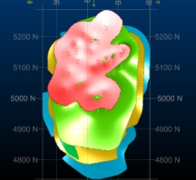

# Process a Batch of Vein Models

The following information relates to the vein-from-samples and surface-from-samples commands.

The [Create Vein Surface](<Create_Vein_Surfaces_Overview.md>) task is a focussed tool for the calculation of hanging wall (HW) and/or footwall (FW) surfaces that represent vein or vein-like lodes. Similarly, the [Create Contact Surface](<../STUDIO_RM/Surface_From_Samples.md>) task is used to generate contact surfaces between groups of contiguous categorical values.

This topic describes how the vein-from-samples command can be used to produce multiple models in a single run.

Note: A Datamine [eLearning course](<https://datamine.learnupon.com/>) is available that covers functions described in this topic. Contact your local Datamine office for more details.

_A batch of vein models produced for all lithological zones in a hole set_

## Generate Multiple Vein Models as a Batch

When you set up the Create Vein Surfaces dialog to generate a surface or volume, various parameters are defined controlling how the output is created. See [Vein Modelling](<Create_Vein_Surfaces_Overview.md>).

These settings are normally relevant to a particular **Column** and **Value** combination. The settings for each combination are stored and reinstated if that particular combination is set again in the future. This applies to all values for a given modelling attribute, providing they are in the list described on the [Batch Settings for Veins](<Batch_Veins.md>) screen, which is defined in advance. This storage approach facilitates batch processing.

**Note** : custom modelling section **Azimuth** and **Inclination** values are also stored with each **Column** and **Value** combination, so you're not restricted to a single section definition for all values. See [Select Data for Implicit Modelling](<Create_Vein_Surfaces_1_Data.md>).

In summary:

  1. Select the **Drillholes** containing the values to be modelled.
  2. Select the attribute **Column** containing the values to be modelled.
  3. Define the **Values** you wish to model by clicking Batch Settings. 
  4. Choose if **global** or **per-value** settings are applied in a batch run:
     * Use the same (global) settings for each value by **checking** the relevant check boxes on the right. Each check box corresponds to an area of the **Create Vein Surfaces** panel. 

**Note** : To set global values, close the **Batch Settings** screen, then pick _< Batch>_ in the **Value** list and update the values on the panel.  

     * **Uncheck** values on the right to enforce per-value settings during a batch run. These are the values that appear when each **Value** is selected in the **Create Vein Surfaces** panel. Each value can have its own parameters, and these are reinstated during a batch run.

  5. If required, select each value to be modelled and set up the appropriate modelling parameters (check individual outputs with Compute Surface). Alternatively, you can just run a batch with default values.
  6. Generate a batch of outputs using either predefined or custom modelling parameters. Each modelled structure is coloured according to the default legend for the select Column.

**Note** : Batch Settings is only available if <Batch> is selected in the Value list.

## Batch Generation Logic

If _< Batch>_ is selected, as opposed to an explicit value for modelling, other settings on the form are disabled (there are exceptions, such as fault wireframe specification). When Compute Surface is selected, batch processing will do the following:

  1. For the first value of the selected attribute, check if the value is in the current list of values to be modelled (as defined in the Batch Settings dialog).
  2. If the attribute value is to be modelled, check if modelling parameters have already been defined.
     * If so, generate a surface or volume using the custom settings
     * If not, generate a surface or volume using the default settings for the **Column** and **Value** combination.
  3. When the first volume is created, repeat for all successive values for the selected field. 
  4. All output data are created within the same object (as described in the Vein surface field). Similarly, if a Trend surface is selected, trend data is output to the same object.
  5. Processing finishes when output for all selected values is complete.

Data is output independently for each **Column** and **Value** combination, although can be combined later using other structural editing commands if required.

**Note** : Batch-generated models are coloured according to the default legend for the selected modelling attribute (Column).

Output wireframe data is appended with the selected Column, allowing the resulting multi-structure file to be coloured and filtered as required.

**Tip** : Use the [quick-filter](<Quick%20Filter%20Dialog.md>) control bar to see the individual structures within your batch-generated output. Filter using the Column name and whichever value(s) you need to work with.

Related topics and activities

  * [Create Vein Surface](<Create_Vein_Surface.md>)

  * [Select Data for Implicit Modelling](<Create_Vein_Surfaces_1_Data.md>)

  * [Create Vein Surface: Automation](<Create_Vein_Surfaces_10_Automation.md>)