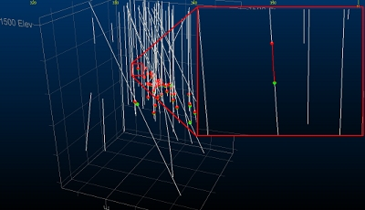
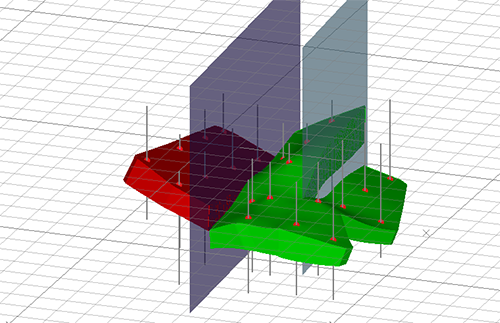

# Create a Vein Model

The [**Create Vein Surface**](<Create_Vein_Surface.md>) screen is the interactive interface for the **[vein-from-samples](<../command_help/vein-from-samples.md>)** command.

Both are used to model linear, continuous structures representing vein or vein-like structures according to the presence of [Positive and Negative Samples](<Create_Vein_Surfaces_5_PositiveNegative.md>). 

Throughout this help topic, the following acronyms are used:

  * "HW" Hangingwall. The initial surface of a vein model transected by a drillhole.

  * "FW" Footwall. The final surface of a vein model transected by a drillhole.

**Note** : To find out more about creating a batch run of vein models, see [Process a Batch of Vein Models](<Create_Vein_Surfaces_11_Batch_Processing.md>)

To create a single vein model based on loaded drillhole data:

  1. If required, preselect drillhole data in any **3D** view. See [Select Data for Implicit Modelling](<Create_Vein_Surfaces_1_Data.md>).

  2. Display the **[Create Vein Surfaces](<Create_Vein_Surface.md>)** screen.

  3. In the **Data Selection** area, select a loaded static **Drillholes** object containing samples to be used for vein modelling. 

**Note** : if the selected drillhole object is subsequently unloaded, it and all settings relating to it are removed from the screen.

  4. Select the **Column** (also known as the 'attribute', 'property' 'key field' or 'field) containing a value to be modelled. This will contain distinct numeric or alphanumeric values, with each representing a particular domain to be modelled.

  5. Select the column **Value** that represents the category to be modelled. All unique values of the selected **Column** are listed alongside their respective default legend colour.

Note: you are warned if the selected **Value** has over 100 unique values. You can still continue if you wish, but system performance may be degraded.

Once a value is selected, samples that match it are highlighted in the **3D** window to show the positive intervals. 

Symbols are added to each interval's FROM and TO positions. This indicates the '**[positive](<Create_Vein_Surfaces_5_PositiveNegative.md>)** ' intervals to be modelled. For example:

  6. Data can be modelled only if it is **Selected** and/or **Visible** , using a combination of settings. 

     * If **Selected** is **checked** :

       * If no data is selected, everything is modelled.

       * If data is selected, only selected holes are modelled.

If selected is unchecked, all data is modelled regardless of data selection.

     * If Visible is **checked** , only drillhole data that is visible is used for modelling, otherwise data is modelled even if it is filtered from the view.

  7. Define your implicit modelling section using a combination of tools in the **Section Controls** and **Best Fit Plane** groups.

By default, the normal direction of the output wireframe data is orthogonal to the **Best fit plane**. This is calculated by one of the following methods:

     * Automatically (**Auto**) as a mean plane passing through the positive intervals of the sample data.

     * Using the current **3D** window section definition to guide normal creation (**Current section**). 

You can adjust the current 3D section using the tools shown in the **Section Controls** group, some of which are replicated on the **3D View** ribbon (where more options can be found for section management).

**Tip** : Enable **Auto look** to automatically align with the positive samples corresponding to the selected **Value**. This will happen each time the **Value** changes.

     * As a **Custom** section, by setting any **Azimuth** and **Inclination** values. This does not affect the current default section in the 3D view.

  8. **Edit** samples if required:

     1. Expand the **Edit Samples** group.

     2. Edit samples by reversing or changing their activation status.
     3. Click  **Done** to exit the current editing mode.

See [Edit Samples](<Create_Vein_Surfaces_6_Reversal.md>).

**Note** : sample reversal won't be performed if **Ignore gaps** is checked and the **Merge** option selected (see below). This is because, if enabled, the first instance of a **FROM** position for the selected **Value** will always be an HW point, and the final **TO** position will always be a FW point. If you must reverse samples where intervals contain gaps, those gaps must be resolved first, possibly using the **[Assign Lithology](<Assign_Sample_Lithologies.md>)** task. 

  9. Choose how **Collar Points** and **EOH Points** (end-of-hole points) are considered during vein modelling.

     * Choose **Snap** to force the modelled vein surface to adhere to the collar or end-of-hole position if the modelled sample contains a collar or EOH record. In this scenario, the surface cannot pass above the collar position where the drillhole intercepts the model.

     * Choose **Ignore** to treat the collar or EOH position as absent if the modelled sample contains an initial or terminal record. In this case, the surface can pass above or below the start or end of a hole at the point of intersection.

     * Choose **Pass above** (Collar points) to permit the surface to occur above the collar position (if one is located in the sample) but not below it (if the surface would naturally be generated below the collar, it is moved up to be coincident with the collar position.

     * Choose **Pass below** (EOH points) to permit the surface to occur below the end-of-hole position (if one is located in the sample) but not above it (if the surface would naturally be generated above the EOH position, it is moved down to be coincident with the EOH position.

See [Edit Samples](<Create_Vein_Surfaces_6_Reversal.md>).

  10. Choose if you wish to **Ignore gaps** (that is, the selected positive sample has one or more gaps between contiguous positive intervals). **Ignore gaps** is **unchecked** by default. **Check** this option to activate the following options:
     * **Merge** the positive intervals to create a single interval starts at the first **FROM** value and ends at the last **TO** value.

**Note** : sample reversal can't be performed if **Ignore gaps** is checked and the **Merge** option selected. This is because, if enabled, the first instance of a **FROM** position for the selected Value will always be an HW point, and the final **TO** position will always be a FW point. If you must reverse samples where intervals contain gaps, those gaps must be resolved first, possibly using the **[Assign Lithology](<Assign_Sample_Lithologies.md>)** task. 

     * **Ignore holes with gaps**. If a gap appears in a positive interval, that drillhole (and any values it represents) will not be considered in surface modelling.

See [Edit Samples](<Create_Vein_Surfaces_6_Reversal.md>).

  11. To insert HW, FW **Additional Points** into the data set before surface computation, or to insert new 'dummy' intervals containing both HW and FW:

     1. Expand the **Additional Points** command group.

     2. Enable **Use additional points** (disabled by default).

     3. If required, select an existing points **Object** to host the additional data. Additional points are not added to the selected **Drillholes** object.

     4. Use the tool group provided to add new HW, FW, trend points or dummy intervals. 

Use the section editing tools to set the 3D section beforehand (to make sure you are adding points at the expected position.

**Tip** : Enable the display of the **3D** section and use the **[Snap to Plane](<../command_help/snap-to-plane.md>)** command to set the position in relation to other HW and FW points. The **[Interactive Section Editor](<Section_Widgets.md>)** is useful here too.

     5. If a loaded string object's vertices represent HW or FW additional points, pick **Add selected strings as additional HW points** or **Add selected strings as additional FW points** , then pick a string in the 3D window. This is useful if you already have additional points data saved as separate string objects.

See [Add Extra Vein Points & Intervals](<Create_Vein_Surfaces_9_Adding.md>).

  12. Define the **Boundary** to constrain the output surface(s):

     1. Expand the **Boundary** group.

     2. Choose a boundary method:

        * Choose **Auto** to use the hull of the loaded drillhole data to determine the shape of the output surface data in one of two ways; _Aligned Square_ or _Alpha Shape_. If selected, an **Extension** distance lets the output surface be generated beyond the hull up to a fixed limit. 

If using an _Alpha Shape_ boundary, set the **Segment length** to control the granularity of segments around the edge of the output shape.

        * Choose **Custom** to use an outline string to constrain the generation data. Optionally, pick an existing string or digitize your own. One or more perimeters can be selected.

        * Choose **Proto** to pick an existing block model object. The cuboid hull of the block model constrains output wireframe data generation, with an optional **Extension distance**.

See [Boundary Options](<Vein_Modelling_Boundary_Clipping.md>).

  13. If you have fault wireframes representing discontinuity zones, you can model independent fault blocks instead of a single, continuous surface or volume. To model fault blocks:

     1. If not already loaded, load wireframe data and display it in the **3D** window. This data represents the faults upon which discontinuities in the resulting implicit model are computed.

     2. Expand the **Faults** group.

     3. Enable **Use faults**.

     4. Expand **Fault surfaces** and pick a wireframe object containing one or more fault sheets.

     5. If the loaded wireframe object contains a key field that uniquely identifies fault sheets, select a **Fault ID column**. If no column is selected, all wireframe data is considered as a single, continuous fault sheet.

     6. You can generate **Scissor faults** if you wish. 
        * If **checked** , faults are extended beyond the nominated boundary and can terminate within a fault block, whereupon the throw of the fault is gradually reduced to zero over distance. For example, in the image below, the green and red blocks are fully isolated, but the green block is partly faulted as scissor faulting is permitted:  
  

        * If **unchecked** , fault wireframes must fully transect the exterior hull of the positive drillhole samples (or another fault sheet) in order for fault blocks to be created. Scissor faults will not be created.  

  14. Define the remaining surfacing controls to manage thickness, pinching out and output data resolution, using the **Controls** group.
     * Set the **Minimum thickness** of the vein. This can be interpreted in one of two ways:

       * If Expand to is selected, the output vein will never be thinner than the value set and no pinching out (see below) will occur. Where you're confident of a continuous output, this can be a good option to enforce a single, uninterrupted strata.

       * If **Remove below** is selected, if the output vein true thickness falls below the value set, material is removed, created a void. This occurs regardless of the **Pinch out** setting.

     * Set the **Maximum thickness** by enabling the option and defining a value. This constrains the maximum thickness of the output vein shape. This can be used to constrain 'blow out' of shapes where there are significant interval depths between neighbouring samples.

     * Choose a **Boundary thickness**. This is the value at the edge of the output model you want to achieve. This can be useful to reduce the gradual reduction of thickness as the model moves beyond the terminal positive samples, but is still within the modelling boundary.

  15. Choose **Output** options:
     * Choose to **Generate** a **Hanging wall** , **Foot wall** or **Both**. If **Both** is selected, HW and FW surfaces are joined to create a watertight volume.

**Tip** : An output volume includes a _SurfaceT_ attribute with either a _FootWall_ , _HangWall_ or _Connection_ value. Filtering out _Connection_ leaves isolated hangingwall and footwall surfaces.

     * Choose where to store output **Vein surface** ; enter a new name to create a new object, or pick an existing object to overwrite.
     * Sometimes, it is useful to generate a **Trend surface**. This can help you to visualize issues caused, for example, by incorrectly reversed samples or errant HW and FW positions. If checked, a trend surface wireframe is generated with the selected object name.
     * Generate a hull string that represents the intersection of the active 3D section and the generated surface or volume by enabling **Boundary**. Create a new object name or pick an existing object to overwrite.
     * If you wish to generate **Contact points** data separately, select a points object using the list provided, or enter the name of a new points object to create.
     * After setting up formatting to show vein surface(s) and trend surfaces as an intersection in a custom colour, you can retain this formatting for recomputed data by checking **Retain output formatting**. This means you don't have to keep reapplying my formatting settings when experimenting with the various controls.

If unchecked, formatting is reset each time you recompute a vein model.

  16. Generate your vein model:

     * Select **Update Vein** to overwrite an existing vein model (if one of the same name exists). If the current **Vein surface** object doesn't exist, this is the same as **Compute New**.

     * Select **New Vein** to generate output without overwriting data of the same Vein surface name. If a duplicate object name is detected, the output data will contain a suffix to make it unique.

Related topics and activities

  * [Vein Modelling](<Create_Vein_Surfaces_Overview.md>)

  * [Create Vein Surface](<Create_Vein_Surface.md>) (screen)

  * [Select Data for Implicit Modelling](<Create_Vein_Surfaces_1_Data.md>)

  * [Positive and Negative Samples](<Create_Vein_Surfaces_5_PositiveNegative.md>)

  * [Edit Samples](<Create_Vein_Surfaces_6_Reversal.md>)

  * [Add Extra Vein Points & Intervals](<Create_Vein_Surfaces_9_Adding.md>)

  * [Boundary Options](<Vein_Modelling_Boundary_Clipping.md>)

  * [Model Faults](<Create_Vein_Surfaces_10_Faults.md>)

  * [Vein Generation Controls](<Create_Vein_Surfaces_7_Thickness.md>)

  * [Process a Batch of Vein Models](<Create_Vein_Surfaces_11_Batch_Processing.md>)

  * [Vein-from-samples Command](<../command_help/vein-from-samples.md>)

  * [Scripting the Vein Modelling Command ](<Create_Vein_Surfaces_10_Automation.md>)