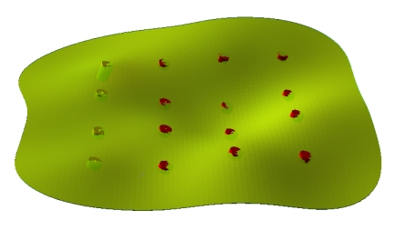
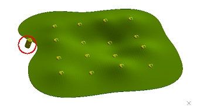

# Positive and Negative Samples

The following information relates to the vein-from-samples and surface-from-samples commands.

The [Create Vein Surface](<Create_Vein_Surfaces_Overview.md>) task is a focussed tool for the calculation of hanging wall (HW) and/or footwall (FW) surfaces that represent vein or vein-like lodes. Similarly, the [Create Contact Surface](<../STUDIO_RM/Surface_From_Samples.md>) task is used to generate contact surfaces between groups of contiguous categorical values.

This topic explains how the vein-from-samples command responds to the presence of sample intervals that match the designated value to be modelled (_positive_ samples) and those that do not, indicating a void or structure boundary (_negative_ samples).

Note: A Datamine [eLearning course](<https://datamine.learnupon.com/>) is available that covers functions described in this topic. Contact your local Datamine office for more details.

Negative and positive samples strongly influence how a vein surface is calculated,

The [Create Vein Surfaces](<Create_Vein_Surfaces_Overview.md>) tool uses a **Minimum Curvature** surfacing method, which is a contouring-style approach to surfacing between positive sample points. Generally, it will produce geologically realistic structures. 

The Minimum Curvature calculation attempts to generate surface edges between known positive sample points without converging the surface(s) to a mean trend surface. This approach is similar to the approach taken when contouring between points and, as such, is not managed by a covariance function that reduces the influence of a sample over distance. 

The Minimum Curvature method is suited for a wide range of input configurations, including irregular hangingwall (HW) and footwall (FW) layouts and scenarios where neighbouring sample elevations vary widely. It avoids excessive surface undulation and is therefore a good 'all-rounder' method, and is the default setting.  
  
Generally, surface thickness will remain continuous with a minimal tendency for HW and FW surfaces to move towards a mean trend surface over distance. So, it is a useful option where the personality of the lithology is a more continuous, linear deposit.  
  
A volume profile generated below for the same data and comparable settings, showing how the Minimum Curvature method compares to a more probabilistic, Gaussian result.

**Note** : Gaussian processes are not used in implicit modelling in Studio products due to their tendency to produce excessively convoluted surface shape and a potential for the generated surface to deviated from known sample intercept locations.

;>)

## The Influence of Negative Samples

Where samples exist that do not include an interval that matches the selected key field and value, they are considered _negative_.

Negative samples work in tandem with positive samples to control the shape of the resulting surface or volume. They exert an opposite but equal influence over shape generation as positive samples.

Consider the following positive-only sample set, comprising 16 samples:

With the same settings, introducing a negative sample into the set causes an intrusion into the structure:

The negative sample exerts an identical influence over the modelled surface as all of the positive sample points, although the final shape of the structure can be further controlled by other parameters, including [boundary clipping](<Vein_Modelling_Boundary_Clipping.md>)**** settings and the overall arrangement of samples.  

Related topics and activities

  * [Vein Modelling](<Create_Vein_Surfaces_Overview.md>)

  * [Create Vein Surface](<Create_Vein_Surface.md>)

  * [Create Contact Surface](<../STUDIO_RM/Surface_From_Samples.md>)

  * [Create a Vein Model](<Create_Vein_Surfaces_2_Activity.md>)

  * [Edit Samples](<Create_Vein_Surfaces_6_Reversal.md>)

  * [Add Extra Vein Points & Intervals](<Create_Vein_Surfaces_9_Adding.md>)

  * [Boundary Options](<Vein_Modelling_Boundary_Clipping.md>)