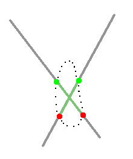
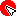
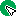
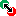
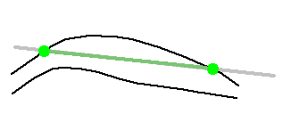
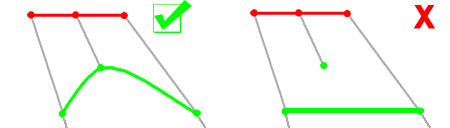

# Edit Samples

The following information relates to the vein-from-samples and surface-from-samples commands.

The [Create Vein Surface](<Create_Vein_Surfaces_Overview.md>) task is a focussed tool for the calculation of hanging wall (HW) and/or footwall (FW) surfaces that represent vein or vein-like lodes. Similarly, the [Create Contact Surface](<../STUDIO_RM/Surface_From_Samples.md>) task is used to generate contact surfaces between groups of contiguous categorical values.

This topic explains how the vein-from-samples sample editing commands let you reverse samples, or ignore hanging wall or foot wall positions by deactivating them.

Note: A Datamine [eLearning course](<https://datamine.learnupon.com/>) is available that covers functions described in this topic. Contact your local Datamine office for more details.

The vein-from-samples command assesses the overall orientation of an implied structure and will assign HW and FW points accordingly. This assessment involves determining which side of the _trend surface_ a point lies, with the assumption being that all hanging wall points are on one side and all foot wall points on the other, or pinching out will occur. In cases where the general direction of drilling is similar, the default assignment is typically acceptable. 

However, in other cases (such as deeply dipping or vertical lodes, or where a structure has multiple implied anisotropic trends), there is an increased tendency for drillholes to intercept the trend surface from opposite sides and directions, meaning there is no consistent assignment of hanging wall and foot wall points. This poses a challenge to implicit modelling routines (but not ours).

Consider the example below where the trend surface is formed by holes in different alignments. The implied surface is vertical and the dip of hole descent varies from 70 to 120 degrees. Constructing a surface with the default point assignment will result in excessive pinching out as the hanging wall and footwall surfaces become inverted in several places:

Where the underlying structure (based on the presence of drillholes in the vicinity) strongly implies a steeply-dipping vein, it makes sense to reverse samples in this case and if the general trend is for holes to penetrate the structure from opposing sides, the Auto Reverse All option could be useful as it will determine the mean plane of the intervals (near to vertical) and apply hanging wall and foot wall assignments appropriately.

### Editing and Reversing Samples

Interactively editing samples is achieved using the **Enable / Disable Contacts** command group.

  * **Colours** : edit the colour of **HW** or **FW** points using the colour picker menus. Your change are saved to the current project.

  * **Points** can be enabled or disabled. Alter the action of a hanging wall (From) or foot wall (To) point by clicking either the **On** or **Off** buttons for the corresponding point type and then picking one or more points in the 3D window. 

    *  **HW on** enable a previous disabled hanging wall point.

    *  **HW off** disable an enabled hanging wall point.

    *  **FW on** enable a previous disabled foot wall point.

    *  **FW off** disable an enabled foot wall point.

Click **Done** to complete point editing mode.

  * **Swap Contacts** to change the HW and FW assignation of points of either one or more intervals:

    * **Swap HW/FW Points** switch a sample between a hanging wall and a foot wall - if done at both ends of the interval, this results in a full inversion of the interval.

You can convert a sample into a double-hanging-wall or double-foot-wall interval. This might be useful where a hole is aligned so that it intercepts the lode hanging wall or foot wall in two places, for example:

Click **Done** to complete point editing mode.

**Note** : sample reversal can't be performed if **Ignore gaps** is checked. This is because, if enabled, the first instance of a **FROM** position for the selected Value will always be an HW point, and the final **TO** position will always be a FW point. If you must reverse samples where intervals contain gaps, those gaps must be resolved first, possibly using the **[Assign Lithology](<Assign_Sample_Lithologies.md>)** task. 

    *  Reset HW/FW Pointscreate a trend plane through all sample intervals and determine how intervals align in relation to the normal of this plane, automatically reversing them if their direction is significantly different from what is expected.

**Note** : automatic reversal is performed when an attribute value is first selected for modelling.

### Collar and EOH Point Influence

Depending on the command you are using, either a positive interval is comprised between a hanging wall and foot wall point (vein modelling) or a single contact point is used to denote the coincident location of lithological domains (contact surface modelling). In both cases, where drilling terminates within the selected lithology, the end-of-hole position can either be used to denote the foot wall or contact point, or it can be ignored, assuming the structure within which the sample has terminated is more substantial than the drilling implies. 

For example, based on the location of surrounding points, it may be more likely that the undrilled lithology beyond the end of hole is positive.

You can consider collar and end-of-hole points to be treated using the following options:

  * Snapwhere collar or EOH points are positionally critical, select this option to force the generate surface to be snapped to the points. This is the default setting for new models.

  * **Pass above** , **Pass below** treat points as a minimum or maximum bound (which allows the surface to pass above a collar or below an EOH point).

  * **Ignore** points are not considered in modelling. For example, if EOH points are ignored, only the _FROM_ (hanging wall) point of the hole is used to construct the hanging wall surface. The end-of-hole isn't considered in this case when the foot wall surface is generated:

**Note** : it is possible, if positive samples rise completely to the collar position, or all samples fall to the end-of-hole, for surface generation to fail as no sample mid points can be calculated (this is important to allow a trend surface to be calculated). If this happens, your modelling report indicates this is the case and that the collar or EOH positions may be better 'snapping' positions, rather than using the **Pass Above** or **Pass Below** options.

Related topics and activities

  * [Create Vein Surface](<Create_Vein_Surface.md>)
  * [Add Extra Vein Points & Intervals](<Create_Vein_Surfaces_9_Adding.md>)