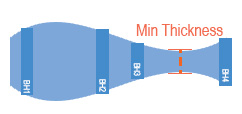
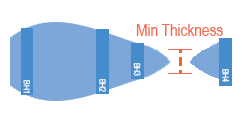
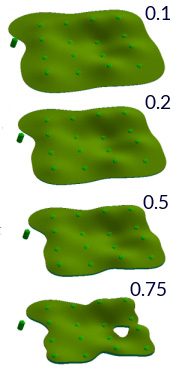
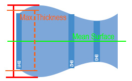
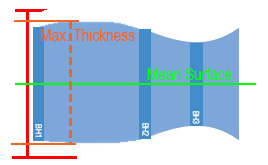
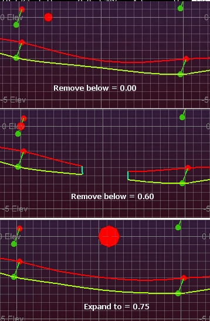
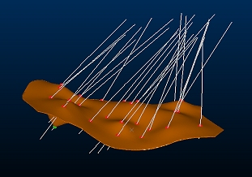
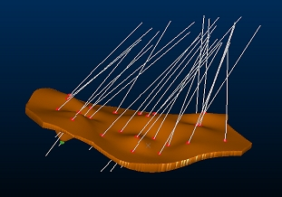

# Vein Generation Controls

The following information relates to the vein-from-samples and surface-from-samples commands.

The [Create Vein Surface](<Create_Vein_Surfaces_Overview.md>) task is a focussed tool for the calculation of hanging wall (HW) and/or footwall (FW) surfaces that represent vein or vein-like lodes. Similarly, the [Create Contact Surface](<../STUDIO_RM/Surface_From_Samples.md>) task is used to generate contact surfaces between groups of contiguous categorical values.

Note: A Datamine [eLearning course](<https://datamine.learnupon.com/>) is available that covers functions described in this topic. Contact your local Datamine office for more details.

This topic explains how the vein-from-samples command can be controlled by either setting a minimum or maximum permitted thickness or by forcing the generated structure to adhere to a minimum thickness distance.

Tools are available to constrain or expand your volume generally, using Minimum and Maximum Thickness settings and you can also determine the point at which a 'pinch out' occurs, i.e. a void occurs in the modelled volume as the hangingwall and footwall surfaces converge to a specified distance. See Minimum and Maximum Thickness Settings, below, for more details.

Another option, which can be used in tandem with other thickness settings, is the Boundary Thickness setting. This lets you determine the thickness of the calculated volume at the boundary, and can be useful for controlling how conservative or generous your modelled lode is, with respect to the modelled intercept positions. See Boundary Thickness, below, for more details.

These settings are only relevant where a volume is created (using the Both option in the Output control group).

## Minimum and Maximum Thickness Settings

Thickness limit settings will have an influence over the extents of your structure and internal continuity. 

The Minimum thickness parameter is only applied if you choose to Pinch out and Both HW and FW surfaces are generated, the Minimum thickness setting allows you define a distance below which the structure is pinched out. Pinching out is performed by tapering the HW and FW surfaces to force them to converge.

  * In the vein-from-samples command, you can choose to administer a minimum thickness in two ways; either to force a pinch out below a given thickness (= anything below a thickness value is removed) or you can expand the structure to adhere to a minimum value, forcing continuity.

### "Remove Below" Mode

In this mode (which is the default for the vein-from-samples command), setting a higher Minimum thickness will produce a smaller and potentially more fragmented structure, although this will depend on the inter-sample spacing and the interval lengths of positive samples. 

Setting a Minimum thickness to zero will allow HW and FW surfaces to converge and align, although if they are calculated as overlapping/inverting they will still result in a pinch out if the Pinch out option is selected. Otherwise, they can get as close as they like.

Continuing the example above, increasing the Minimum thickness generates a more restricted boundary as the HW and FW surfaces converge down to the thickness value at a point closer to the sample intervals:  
  

In the final image, the HW and FW surface in the lower right quadrant (as viewed) dips below 0.75 so is pinched out.

Setting a Maximum thickness will cause HW and FW surface to be adjusted so the maximum limit is not exceeded. This can be useful to control unexpected swells where neighboring sample intervals are very different.

During Max thickness adjustments, the HW and FW points are adjusted proportionally in relation to their distance from the mean surface.

### "Expand To" Mode (vein-from-samples command only)

In this mode, your structure will be expanded to a specified thickness value if the calculated mathematical trend of the HW and FW surfaces would ordinarily provide either a crossover or a thickness that is lower that the specified amount.

Consider the following Gaussian example (which compares the Remove Below and Expand To options):

In the lower image, you can see how the HW and FW surfaces are pushed apart to satisfy the minimum requirement of 0.75m. This expansion is applied before negative sample influence is applied; voids will still occur where a negative sample intercepts a structure, pinching it out.

## Boundary Thickness

The Boundary Thickness control is used to manage the depth of your modelled lode at the external boundary. This setting doesn't affect any internal voids produced by, say, pinching out due to negative samples or material removed below a given thickness (Remove below).

Consider the example below. In both images, the positive intercept positions for hangingwall and footwall are honoured, but a differing **Boundary Thickness** is applied. 

In the upper image, the boundary has been constrained to a 2 metre maximum whereas the lower image shows an unconstrained output with otherwise identical settings:

Boundary Thickness = 2

Boundary Thickness = unchecked

Boundary Thickness is optional, and can be used in conjunction with other thickness management options. 

You can use the Remove below setting to void volumes wherever the internal thickness of a lode falls below a given amount - and also - set the Boundary Thickness to be an even lower value. For example; material could be removed internally below 2 metres whilst the external boundary can be pinched down to 1 metre.

Similarly, you can use Expand to and increase the general thickness of the inter-sample volumes to at least 5 metres and also constrain the boundary thickness to 2 metres.

## Boundary Thickness and Boundary Clipping Controls

Boundary Thickness is applied in different ways depending on Boundary settings:

Alpha Shape (Auto) | Boundary shape is calculated then volume is reduced to set amount  
---|---  
Aligned Square (Auto) | Boundary shape is calculated then volume is reduced to set amount  
Custom Boundary String | Boundary shape is calculated then volume is reduced to set amount  
Prototype Model | Boundary shape is calculated with a constrained edge but no boundary clipping, then trimmed back to the prototype model. Effectively, the unconstrained edge shape with a constrained thickness is 'cookie cut' back to the prototype model  
  
Related topics and activities

  * [Create Vein Surface](<Create_Vein_Surface.md>)

  * [Boundary Options](<Vein_Modelling_Boundary_Clipping.md>)