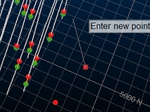
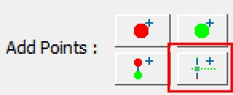
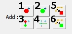
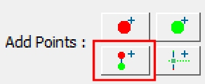

# Add Extra Vein Points & Intervals

The following information relates to the vein-from-samples and surface-from-samples commands.

The [Create Vein Surface](<Create_Vein_Surfaces_Overview.md>) task is a focussed tool for the calculation of hanging wall (HW) and/or footwall (FW) surfaces that represent vein or vein-like lodes. Similarly, the [Create Contact Surface](<../STUDIO_RM/Surface_From_Samples.md>) task is used to generate contact surfaces between groups of contiguous categorical values.

This topic explains how the vein-from-samples sample editing commands let you add hanging wall, foot wall and trend points prior to generating a surface or volume.

There can be occasions where you wish to control the extrapolation of surface data between known sample points using a more direct method than globally adjusting continuity, [boundary](<Vein_Modelling_Boundary_Clipping.md>) and/or [thickness](<Create_Vein_Surfaces_7_Thickness.md>) settings, or by [disabling or reversing](<Create_Vein_Surfaces_6_Reversal.md>) sample positions.

The Create Vein Surface and Create Contact Surfaces commands let you inject sample points into the grid of points used to construct the resulting hanging wall (HW) or foot wall (FW) surface, or combined volume. You can either insert HW or FW points independently, or insert a complete interval. 

You can add any loaded string data to an 'additional points' object by selecting one or more loaded and visible string or point entities and using Add Selected String Data... for either the hangingwall or footwall.

In fact, it is possible to generate a vein surface or volume using only additional points as this facility is accessible without loading a drillholes object or defining a value to be modelled.

Note: To introduce [negative](<Create_Vein_Surfaces_5_PositiveNegative.md>) samples into your data, consider using the Drillhole Planner in conjunction with the Create Vein Surface command.

If string data is selected, each vertex of the string becomes a new HW or FW point. 

   
During digitizing, additional points are visible as string vertices   
  
It is useful to align the section in an appropriate manner before you start to digitize; ideally, the section is roughly perpendicular to the trend surface, or to an imaginary mean plane (trend plane) throughout your positive interval mean positions, although it is likely that the orientation of your digitizing section will change depending on its position within the implied lode.

**Note** : If loaded or digitized additional points are coincident with others, this is highlighted in the Output window report. Coincident or near-coincident points may have an adverse effect on surface or volume modelling as they can cause extreme changes of direction within the trend surface.

### Add Trend Surface Data

The Create Vein Surface tool makes use of a trend surface, used to calculate the alignment of the Auto best fit plane. You can use this option to influence the best fit plane calculation.

You can also insert points into the underlying trend surface. This lets you influence the convolution and direction of modelled surfaces. By just adding "Trend Points" you can influence the general direction of the surface in the inter-sample space whilst still honouring the originally interval data.

If digitized, (as opposed to adding selected data) points are inserted onto the currently active 3D section, so it is important to position this correctly beforehand. A set of section editing tools are available, and you can also manipulate the current 3D section using other tools available on the **3D View** ribbon.

### Identify Additional Point Types

Additional points are displayed using a fixed colour scheme to help you identify landmark points and data types:

| Hangingwall points  
---|---  
| Footwall points  
| Trend surface points  
  
### Create Hanging Wall and Foot Wall Points

To add extra HW, FW, trend or interval data to a vein modelling scenario:

  1. Digitize a new string containing vertices representing hanging wall points. These will be considered with the currently loaded drillhole positive samples (FROM positions) to generate a hanging wall surface or upper surface of a combined volume. As with any string data, you can condition your design to introduce more points, edit points, delete points etc.; any string editing function can be applied to hanging wall string data. Data will be output to the object selected in the Strings drop-down list (see above).

  2. Digitize new foot wall data points. As above, this is specified as a string and can be treated as any other string data. (Create Vein Surfaces only)

  3. Digitize intervals. The first point will be a HW point and the final point a FW point. Any number of vertices can be digitized in between. (Create Vein Surfaces only)

  4. Digitize trend points; introduce new points into the trend surface with this option. (Create Vein Surfaces only)

  5. Add Selected String Data as HW Points: only available if string data is selected in the 3D window. Selecting this option will convert the selected data to additional hanging wall points. This feature is particularly useful, for example, if you have imported face map data and wish to include digitized/sketched contacts in your structural model. (Create Vein Surfaces only)

  6. Add Selected String Data as FW Points: only available if string data is selected in the 3D window. Adds selected data as footwall additional points. (Create Vein Surfaces only)

### Create Dummy Intervals

In addition to adding HW and FW points independently, you can insert full intervals as 2-point strings. These strings may be used for example, to simulate infilling with dummy samples, allowing you to revert to a previous, more conservative continuity and a constrained boundary:

Intervals are added as independent strings. The first click denotes the HW position and the final click the FW position (these can be reversed or disabled using other tools if necessary).

Related topics and activities

  * [Vein Modelling](<Create_Vein_Surfaces_Overview.md>)

  * [Create Vein Surface](<Create_Vein_Surface.md>)

  * [Create a Vein Model](<Create_Vein_Surfaces_2_Activity.md>)

  * [Select Data for Implicit Modelling](<Create_Vein_Surfaces_1_Data.md>)

  * [Positive and Negative Samples](<Create_Vein_Surfaces_5_PositiveNegative.md>)

  * [Edit Samples](<Create_Vein_Surfaces_6_Reversal.md>)