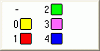
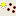
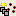
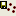
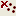

# The Current Objects Toolbar

To display or hide this toolbar:

  * On the Home ribbon, use the Show menu to toggle the display of the Current Objects item.

The Current Objects toolbar is used to set the current object, set attributes and values for the current objects when digitizing new data. It can also be used to to create, save or delete current objects.

By default, the Current Objects toolbar appears at the bottom of the screen, but can be repositioned wherever convenient. See [Customizing Control Bars](<Customizing.md>).

**Tip** : You can set any visible 3D object to the current one by right-clicking it in the 3D window and selecting **Make Current Object**.

See [The Current Object ](<Concept_Current_Object.md>).

To manage current objects using the Current Objects toolbar:

  1. Select an **Object Type** from the leftmost list. 

  2. To choose an existing object to become the current object, select it from the second list. 

**Note** : the current object for the selected **Object Type** displays in bold font in the **Sheets** and **Project Data** control bars.

  3. Choose an **Attribute** and **Value** to set during subsequent digitizing or data creation, using the corresponding lists. For example, to ensure future string data is digitized in cyan, choose _COLOUR_ and _43_. You can also set other constant attribute values such as _BHID_ and _BLOCKID_.

Displayed values are determined by the data legend associated with the column. When an object is loaded or created in memory, each column is automatically assigned a default legend. This can be changed. Right-clicking in this field displays a context menu with the following menu items:

     * Show Fill \- this option only applies if a non-system legend has been selected; select this option to show a preview of the fill type associated with the value/legend combination.

     * Show Line \- this option only applies if a non-system legend has been selected; select this option to show a preview of the line style associated with the value/legend combination.

     * Show Symbol \- this option only applies if a non-system legend has been selected; select this option to show a preview of the symbol associated with the value/legend combination.

     * Change Legend \- displays the Default Legend screen, for changing or creating a new data legend.

The example below shows a user-defined attribute field's attribute value palette, with only the Show Fill option selected:

Selecting a different value automatically starts a new data object.

**Note** : to select an attribute field when setting attribute values, the field (data column) needs to already exist in the object, even if new data has not yet been digitized or created. For more information on adding data columns, see [Attributes](<Attributes.md>).

  4. To create a new data object, you have the following options:

     1. Use **Create New Standard Object** () to create a new data object based on the selected Object Type. The data object is created with the standard object 'template' for the type. If no template exists for the object type, an object is created with the **[minimum system fields](<filetype.md>)** required to define the object as belonging to that type.

**Note** : data object default and custom attribute templates are created using the [Attribute Manager](<Attribute_Manager.md>).

     2. You can create a new data object using any custom data object attribute template by selecting **Create New Object from Template** (). This displays the Select Template. All custom object templates created using the **Attribute Manager** are displayed here.

  5. You can save the displayed current object using Save Current Object (). 

  6. If you wish to unload the current object (and be prompted to save it if recent changes have been made), choose **Unload Current Object** ( ). This unloads the current object from memory, removing all overlays from all corresponding views. This does not delete any file data from disk.

Related topics and activities

  * [Manage Object Attributes](<Attribute_Manager.md>)

  * [Attributes](<Attributes.md>)

  * [The Current Object](<Concept_Current_Object.md>)

  * [Edit Attributes](<edit%20attributes%20pick%20dialog.md>)

  * [Customizing Control Bars](<Customizing.md>)