# Custom Cursors

To access this screen:

  * On the **Format** ribbon, select **General >> Cursor** and pick <New Cursor> from the drop-down list.

  * Double click the "Cursor" section of the [Status Bar](<Interface_Status%20Bars.md>).

  * Run the command [select-cursor](<../command_help/select-cursor.md>)

Create your own cursor designs for use in the primary [3D](<../VR_Help/VR_Introduction.md>) window. By default, a system cursor is used.

Cursor are constructed from base shapes called 'elements'. A cursor can have one or more elements based on these shapes. Elements are drawn to the screen in a top-bottom order. You can use as many elements as you like, with each have its own configurable properties. You could, for example, include a circle of a specific radius in your cursor design, which could make it easier to make data proximity checks whilst digitizing.

Only one custom cursor can be active at any time for each 3D view, but each view can have its own cursor. For example, if you have an independent 3D window, the cursor can be different between that and the primary view. Not only that, but if you split a 3D window horizontally and/or vertically, each 'split' can have it's own cursor as well. The cursor is shown as soon as the window split becomes active.

You can choose each custom cursor's name as well as each element from which it is comprised.

The name of the current cursor (which is also customisable) can be seen on the Status Bar, e.g.:  
  

You can also double-click this section of the status bar to open the Custom Cursors dialog.

**Note** : Each[ independent 3D window](<Independent_3D_Windows.md>)**** can have its own cursor - just activate the window then run the select-cursor command. The name of the active cursor for the current 3D window is displayed in the Status bar.

## How are Cursors Stored?

Custom cursors are stored for each user and application. This means that all cursors designed in Studio RM, for example, are available to all projects for the currently signed-in user. Other users will have independent storage.

Cursors are not automatically reinstated with each project session; you will need to reselect the cursor you want each time a project is created or opened.

## Screen Layout

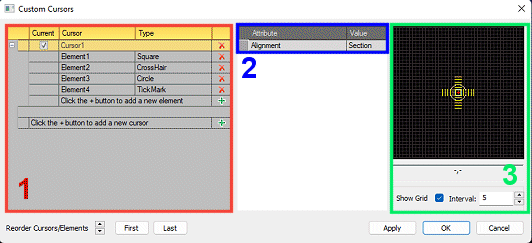

The Custom Cursors dialog is split into 3 key areas;

  1. The Cursors table: this contains a list of all existing custom cursors, each with their own expandable list of cursor elements. This section allows you to
     * Create a new cursor using the green "+" sign next to the "Click the + button to add new cursor" field.
     * Delete an existing cursor using the red "x" next to the cursor name
     * Create a new element using the green "+" button either immediately below a cursor name, or the lowest element name of that cursor.
     * Delete an existing element using the red "x" next to an element description.
     * Rename a cursor or element by typing over the default description. Note that default cursor or element names within the same cursor are not permitted.
     * Activate a cursor using the Current check box next to a cursor name. Only one cursor can be active at any time.
     * Expand and collapse a list of cursor elements using the + and - buttons on the left of the table.
     * Reorder cursors or elements: if a top-level cursor definition is selected, you can move it up or down the list of available cursors. Note that this has no effect on the visualization of the cursor once it is active. Elements, on the other hand, are drawn to the screen in a top-bottom order, so you can change the drawing order of these elements using the same controls. The selected item can also be moved straight to the top or bottom of the list using the First and Last buttons.
  2. The Properties grid: this shows the properties of the currently selected item and will change depending on the type of item selected. This grid is used to show the properties of both cursors and elements. You can find out more about these properties below.
  3. The Preview window: shows a 2D preview of the currently selected cursor (regardless of whether it is active or not). The cursor will always be centered in the middle of the window and will show all elements in their respective sizes and colours. A grid can be overlaid using the Show Grid check box, and you can choose the Interval. This can be helpful in assessing the actual size of cursor elements.

**Note** : A cursor must contain at least one element. Empty cursor definitions are removed when the screen is closed.

## Cursor Properties

A cursor can either be active or inactive as determined by the Current column in the cursors table.

At the cursor level, you can change its Alignment to one of the following options, using the Properties grid:

  * Section   
  
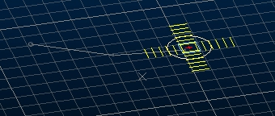   
  
Align the cursor to the current section. This means it may or may not be displayed orthogonally. Depending on the current [Perspective](<../VR_Help/VR_Introduction.md>) setting for the 3D window to which the cursor belongs, the cursor may be displayed isometrically or using vanishing point perspective.
  * Screen   
  
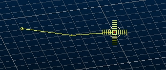   
  
With this setting, you will view the cursor orthogonally. It can be regarded as a 2D option as the cursor design will not change during movement, regardless of the current section or loaded surface data.
  * Surface   
  
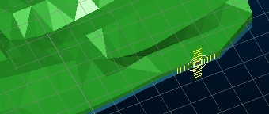   
  
Align the cursor with 3D surface data in the target 3D window. With this setting, the cursor's 3D orientation will automatically adjust to align with the triangle orientation of surface data immediately below the cursor.

## Cursor Element Properties

A cursor's appearance depends on the elements that were used to construct it. These elements are based on primitive shapes and can be used in combination to produce a wide range of cursor designs.

The following element types are available, and can be selected (once a cursor has been created) using the Type drop-down list in the Cursors table:

  * Crosshair   
  
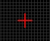   
This element type has one sizing property - Length, which governs the length of both the horizontal and vertical line of the crosshair.  
Other properties supported: Line Thickness, Line Style, Color and Opacity.

  * _Circle_   
  
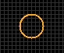   
This element has one sizing property - Radius. Circle elements are also supported by a Segments property, which governs the number of straight line segments are used to construct the circle perimeter; higher values producing smoother results.  
Other properties supported: Line Thickness, Line Style, Color and Opacity.
  * Filled Circle   
  
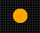   
This is supported by identical properties to the Circle element (see above).  

  * Rectangle   
  
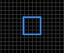   
Two sizing properties exist for this element - Height and Width.  
Other properties supported: Line Thickness, Line Style, Color and Opacity.  

  * Filled Rectangle   
  
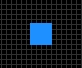   
This is supported by identical properties to the Rectangle element (see above).  

  * _Tick Mark_   
  
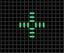   
Tick marks are sized according to a Radius (the bounding circle within which the element is displayed), the Interval (the gap between lines emanating from the center) and **Length**(the length of the straight lines that project from the center.

Any combination of the above can be used to construct a design, and any number of any element.

## Cursor Preview

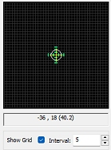

A cursor preview is updated as elements are modified. 

The local coordinates of the mouse (where the origin of the preview \- 0,0 is in the bottom left corner) are dynamically updated as you move your design cursor over the preview window (a default cursor is used here, not the custom cursor being designed).

The value in brackets represents the distance from the center of the preview window, and effectively, the radius of an imaginary circle around this center point. You can show or hide the preview window grid using the Show Grid check box and can control the interval size of the design grid using the Interval field. Neither of these settings will have any effect on the custom cursor design.

Related topics and activities

  * [The Status Bar](<Interface_Status%20Bars.md>)
  * [About the 3D Window](<../VR_Help/VR_Introduction.md>)
  * [Independent 3D Windows](<Independent_3D_Windows.md>)
  * [select-cursor](<../command_help/select-cursor.md>)(command)