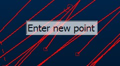

# Cursor Information

**[Status bar](<Interface_Status%20Bars.md>)** messages can sometimes be overlooked. To avoid this happening, your applicatio provides a context-sensitive messaging system that actually displays important system messages in the same location as your cursor.

An example of a cursor tooltip

These messages describe:

  * The next action expected by the system (e.g. Select a point, select a line etc.)
  * Where a system state has been changed (e.g. to categorize evaluation results using a display legend, where strings used for combining are deleted after use, and so on.)
  * Any other system feedback that could assist in progressing an activity

You can adjust the way these messages appear (or even if they appear at all) using the **[System Options](<Options_Environment.md>)** screen.

Related topics and activities

  * [The Status Bar](<Interface_Status%20Bars.md>)

  * [Options: Environment](<Options_Environment.md>)