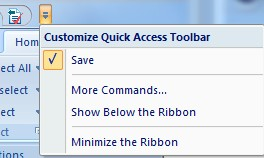
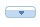

# Customize Quick Access

To access this screen:

  * Expand the [Quick Access toolbar](<Ribbon_Quick_Access.md>). Select More Commands...

Located at the top-left of your screen, and always available, the Quick Access toolbar can be used to create your own group of favourite commands.

The Quick Access toolbar with default contents

By default, the toolbar contains a Save Project button, but this can be disabled in the context-menu menu and/or replaced with whichever commands you like. The same screen is used to remove buttons and to [assign shortcut keys](<Assign_Shortcut_Keys.md>) to these commands.

The Customize screen contains the following sections:

  * [Quick Access Toolbar](<Ribbon_Customize.md>)
  * [Customize Ribbon](<Ribbon_Customization.md>)
  * [Tools](<Customize_Tools.md>)

To configure your Quick Access toolbar:

  1. Display the **Customize** screen, open at the **Quick Access Toolbar** panel.

  2. Expand the Choose commands from list and select the ribbon that contains the command you wish to add to the Quick Access toolbar. 

**Tip** : you can also add menus (containing other commands) to the quick access toolbar.

The list of commands automatically updates to show the commands of the selected ribbon. 

Drop-down menus are represented by this image:

Adding a menu to the Quick Access bar allows you to access all of the commands that are available within it.

  3. Select any command (or menu) on the left and transfer it to the right using **Add**. 

**Tip** : double-click an item on the left to move it to the right.

Items on the right appear on the **Quick Access** toolbar.

**Note** : select an item on the right and click **Remove** to remove it from the toolbar.

  4. Reposition items on the toolbar by selecting them and using the up and down arrows to move them higher or lower in the list. Items higher up appear to the left of items lower down.

  5. Optionally, you can **check** **Show Quick Access Toolbar below the Ribbon** to move it under the main ribbon area.

Related topics and activities

  * [Quick Access Toolbar](<Ribbon_Quick_Access.md>)

  * [Customize](<customize.md>)

  * [Assign Shortcut Keys](<Assign_Shortcut_Keys.md>)