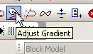

# Customize Options

To access this dialog:

  * Display the [Customize](<customize.md>) screen and activate the Options tab.

Configure general toolbar settings. These settings do not affect ribbon components. To learn more about ribbon customization, see [Ribbon Customization](<Ribbon_Customization.md>).

To configure toolbar visual settings:

  1. Choose how or if tooltips are displayed for toolbar buttons:

     * If Show screen tips on toolbars is **checked** , tooltips are shown as small text descriptions when the mouse hovers over an icon, for example:

If checked, you can also decide whether to **Show shortcut keys in ScreenTips**.

     * If Show screen tips on toolbars is **unchecked** , no toolbar tooltips are displayed. 

**Note** : ribbon tooltips are always displayed when hovering the mouse over a menu item or ribbon button.

  2. Choose the size of your toolbar icons:

     * If **Large Icons** is **checked** , all icons are displayed at 32x32 resolution.

     * If **Large Icons** is **unchecked** (the default), icons are displayed at 16x16 resolution.

**Tip** : if you're using a portable device in low light conditions, larger icons can help.

Related topics and activities

  * [Customize Screen](<customize.md>)

  * [Customize Tools](<Customize_Tools.md>)

  * [Customize Commands](<Customize_Commands.md>)

  * [Customize Keyboard Settings](<Customize_Keyboard.md>)

  * [Customize Toolbars](<Customize_Toolbars.md>)

  * [Customize Menu](<Customize_Menu.md>)

  * [Customize Your Mouse](<Customize_Mouse.md>)