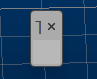

# Customize Toolbars

To access this screen:

  * Display the [Customize](<customize.md>) screen and activate the Toolbars tab.

Configure how toolbars are displayed in your application. 

**Tip** : it's a good idea to make a backup of your current toolbar profile first, so that it can be reinstated quickly and easily if you need to revert to your previous configuration.

To customize existing toolbars:

  1. Display the **Customize Toolbars** screen.

  2. Choose which **Toolbars** you wish to display using the list on the left. **Unchecked** toolbars are hidden.

  3. Select a toolbar to modify.

  4. Modify the selected toolbar using one of these commands:

     * **Reset** reset the selected toolbar to its default arrangement. This reinstates all default buttons and their positions.

You can also use **Reset All** to reset all system toolbars to their default configuration. Custom toolbars can't be reset.

**Warning** : resetting all toolbars forces all system toolbars to be viewed in their default state. This operation cannot be undone so it is recommended that you save your existing profile before attempting this operation 

     * Renamechange the name of a custom toolbar, as appears when the toolbar is undocked. See [Customizing Control Bars](<Customizing.md>).

**Note** : system toolbars can't be renamed, only those you create yourself.

     * **Delete** delete the currently selected custom toolbar from the user interface. 

**Note** : system toolbars can't be deleted, only those you create yourself.

To create a new, custom toolbar:

  1. Display the **Customize Toolbars** screen.

  2. Click **New**.

The **Toolbar Name** popup displays.

  3. Enter a **Toolbar Name**. This should be unique (but it doesn't have to be).

The custom toolbar name displays in the list on the left.

  4. Ensure your custom toolbar is displayed, according to its check box on the left.

The new, empty toolbar displays. It is quite small and easy to miss, for example:

  5. Select the **Commands** tab and display commands to add to the toolbar. See [Customize Commands](<Customize_Commands.md>).

  6. Drag and drop items in the Commands list to the new toolbar location. 

**Note** : by default, icons are displayed, but they can be accompanied with text labels (or displayed simply as text) by right-clicking the newly-placed icon and selecting one of the formatting options.

  7. When you have added all the commands you need, click **Close**.

**Note** : your application profile updates automatically, so the new toolbar is available next time you launch your application. It won't appear, however, in the **Show** menu and can only be shown or hidden using the **Customize Toolbars** screen.

Related topics and activities

  * [Customize Screen](<customize.md>)

  * [Customize Tools](<Customize_Tools.md>)

  * [Customize Options](<Customize_Options.md>)

  * [Customize Commands](<Customize_Commands.md>)

  * [Customize Keyboard Settings](<Customize_Keyboard.md>)

  * [Customize Menus](<Customize_Menu.md>)

  * [Customize Tools](<Customize_Tools.md>)

  * [Customize Your Mouse](<Customize_Mouse.md>)