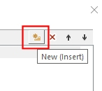
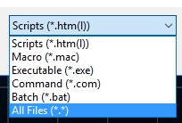

# Customize Tools

To access this dialog:

  * Right-click an empty menu bar area and select Customize.

  * Right-click a toolbar icon and select Customize.

  * Activate the [User Tools](<Ribbon_User_Tools.md>) ribbon and select **Customize** ribbon.

The Tools tab of the Customize screen allows you to configure 3rd party applications for use alongside your application. This includes macros and scripts that you or others have written.

**Note** : whilst a User Tools ribbon is available, and is a good place to add your own commands, you can add any tool to any ribbon.

To create a New User Tool (program, macro or script):

Any executable file can be added as a target for a user tool. By default, commonly used Windows tools (Notepad, Paint and Windows Explorer) are already present (although you can remove these if you want).

  1. Display the Customize screen.
  2. Select the Tools panel.
  3. Click New (Insert) to add a new entry to the Menu contents list.  

  4. Overwrite the tool name to something recognizable.
  5. Click the browse button in the Command field to display a file browser.
  6. Select the File Type browser and choose the kind of tool you're adding:  

  7. If you have selected an executable, command or batch item, you can also specify command line **Arguments** if required, and if a directory parameter is needed, you can specify that too. This doesn't apply to macro or script items.
  8. Unless your application is located on your system on a path that is supported by the windows PATH variable, you will need to specify the location of the executable file in this field. If you wish, you can use the right-facing arrow to add preformatted content to this field.
  9. Delete existing tools by selecting them and pressing the **Delete** button.
  10. Reorder the position of tools in the list using the up and down arrows. This is a purely cosmetic ordering and has no impact on how commands are run.
  11. Click OK
  12. You can now **[add your user tool to the ribbon](<Ribbon_Customization.md>)** and choose a button size if you wish (it will automatically appear on the User Tools ribbon with a small button regardless).

Related topics and activities

  * [Customize Screen](<customize.md>)

  * Customize Tools

  * [Customize Options](<Customize_Options.md>)

  * [Customize Commands](<Customize_Commands.md>)

  * [Customize Keyboard Settings](<Customize_Keyboard.md>)

  * [Customize Menus](<Customize_Menu.md>)

  * [Customize Toolbars](<Customize_Toolbars.md>)

  * [Customize Your Mouse](<Customize_Mouse.md>)