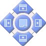
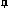

# Customizing Control Bars

Your application includes several control bars which make use an elegant and intuitive tool, called _Smart Docking_ , to enable users to customize their interface to suit their working behavior. Control bars can be positioned anywhere in the application window. They can be grouped, they can be docked and they can be made to hide and reveal themselves automatically.

Smart Docking uses drag-and-drop. When a control bar has been selected and dragged away from a docked position, the Smart Docking buttons appear.  

  
---  
|   |   
| Select to dock panel to top of active window. |   
 |   |    
Select to dock panel to left side of active window. | Select to group with other control bars and create a tab. | Select to dock panel to left side of active window.  
|   |   
| Select to dock panel to bottom of active window. |   
  
As the control bar is dragged over one of the buttons, the position where it would be dropped is highlighted. If no docking location is selected the control bar will float, for example, in the case of this keyboard control bar in Studio Mapper:

Toggle the display of control bars using pin icons:

 |  Permanently displayed - Pinned in position.  
---|---  
 |  Hide and show automatically.  
  
Related topics and activities

  * [Hiding, showing and docking tabs](<Interface_Hide%20and%20Show%20tabs.md>)

  * [Customize Toolbars](<Customize_Toolbars.md>)

  * [Customize Quick Access](<Ribbon_Customize.md>)

  * [Customize Ribbons](<Ribbon_Customization.md>)