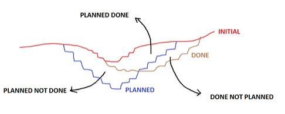
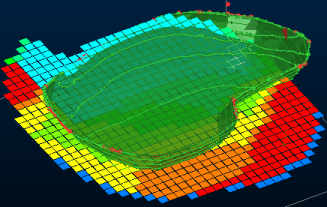
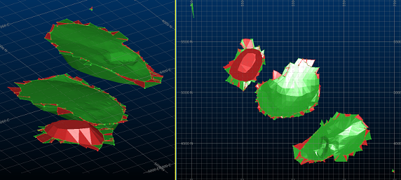
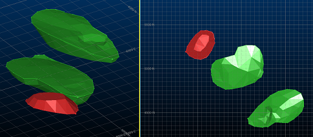

# Cut and Fill Volumes

To access this screen:

  * **Wireframe** ribbon **> > Process >> Cut and Fill Volumes**.

  * Using the **[command line](<Command_Toolbar.md>)** , enter "cut-and-fill-volumes"

  * Display the **[Find Command](<findcommand.md>)** screen, locate **cut-and-fill-volumes** and click **Run**.

See a [Cut and Fill Volumes Example](<Cut%20and%20Fill%20Example.md>).

Create and evaluate cut and fill volumes, based on original and updated wireframe surfaces (DTMs).

The input to this command is two DTM surfaces, commonly representing the progression of a digital terrain model in time. You can select a surface from any loaded wireframe surfaces.

This function will calculate:

  * Volumes that have been planned but not mined
  * Volumes that have been mined and not planned
  * (Optionally) volumes that were planned and mined

### Selecting Wireframe Data

By default, cut and fill volumes are calculated within the common area covered by the two input surfaces.

A supplied cut attribute field is used for the assignment of the cut and fill volumes. Choose the name of this new (numeric) field, and what values will be assigned within 'cut' blocks and 'filled' blocks. 

This enables clear identification of cut and fill volumes, for both evaluation and plotting and display purposes. Setting these values is optional, but recommended. For example, an attribute in the 1st (earlier in time) and 2nd wireframe surfaces could both contain a **MONTH** attribute and 12 unique values. You can then pick the same Keyfield for both surfaces, but a different Value (for example, _MAY_ and _JUNE_ \- this will allow these values to be assigned to the appropriate cut and fill volumes that are generated between the surfaces.

**Note** : You can use the same Keyfield attribute for both wireframe surfaces if you wish, but you cannot assign the same Keyfield and Value combination to both surfaces (this would make it impossible to distinguish cut and fill volumes.

Existing wireframe surfaces can be selected, and you can choose to verify the input wireframes. This is recommended, and is the default setting.  

### Using Outlines

Selection of one or more outlines further restricts the area to the overlap of the common boundary and the selected outlines.

The cut and fill volumes can optionally be calculated within one or more defined boundaries. If no outlines are specified the volumes are calculated within the complete common area covered by both input surfaces. Selection of one or more outlines will further restrict the area to the overlap of the common boundary and the selected outlines. 

### Calculating Volumes Within Benches

You can calculate cut and fill volumes within benches by manually specifying a pattern of bench heights within your pit. A read-only summary of bench information is displayed.

### Evaluating Volumes against a Model

The cut and fill solid volumes can optionally be evaluated against a block model. You can select any model on disk, then the appropriate evaluation keyfield and evaluation legend. 

A block model overlaid onto a surveyed pit surface

If you choose to calculate a table containing the evaluated volume details, you can choose the output file name using the Outputs group at the bottom of the table.

**Tip** : You can leave the **Cut and Fill Volumes** screen on display whilst you continue to work in other areas of the application, providing a cut and fill calculation is not in progress.  

### Using a Reference Surface

Disabled by default, if an actual or reference surface is specified, the output volumes and report will include the data between the reference and First (earlier) and Second (later) surfaces.

When you run the calculation with actual or reference surface, it will compute the volumes between the reference surface and the first and second surfaces. A typical usage would be to have the reference surface set to your previous mined surface, the first surface set to your planned surface, and the second surface set to your current mined surface.

If an actual or reference surface is specified, output results are extended to include the following information:

  * Total common volume (planned and mined)

  * Total first only volume (planned but not mined)

  * Total second only volume (mined but not planned)

  * Total outside volume (planned or mined but in a different area)

Also, when using a reference surface the following additional column is added to the output solids and outlines:

REGION \- This column identifies where the volume lies with respect to the input surfaces. It can have the following values:

  * 1The volume lies between the reference surface and only the first surface and is outside the second surface boundary (coloured grey).
  * 2The volume lies between the reference surface and only the first surface and is inside the second surface boundary (coloured green for above second surface, red for below second surface)
  * 3The volume lies between the reference surface and only the second surface and is outside the first surface boundary (coloured grey).
  * 4The volume lies between the reference surface and only the second surface and is inside the first surface boundary (coloured green for below first surface, red for above first surface).
  * 5The volume lies between the reference surface and both the first and second surfaces (coloured cyan).

When using a reference surface the following additional columns are added to the output result table:

  * CVOL1OUTThe cut volume that lies between the reference surface and only the first surface and is outside the second surface boundary

  * CVOL1INThe cut volume that lies between the reference surface and only the first surface and is inside the second surface boundary

  * CVOL2OUTThe cut volume that lies between the reference surface and only the second surface and is outside the first surface boundary

  * CVOL2INThe cut volume that lies between the reference surface and only the second surface and is inside the first surface boundary

  * CVOL12The cut volume that lies between the reference surface and both the first and second surfaces

  * FVOL1OUTThe fill volume that lies between the reference surface and only the first surface and is outside the second surface boundary

  * FVOL1INThe fill volume that lies between the reference surface and only the first surface and is inside the second surface boundary

  * FVOL2OUTThe fill volume that lies between the reference surface and only the second surface and is outside the first surface boundary

  * FVOL2INThe fill volume that lies between the reference surface and only the second surface and is inside the first surface boundary

  * FVOL12The fill volume that lies between the reference surface and both the first and second surfaces

### Using Outlines

Outlines can be used to constrain the generation of cut and fill volumes.

If no outlines are specified, the volumes are calculated within the complete common area covered by both input surfaces. Selection of one or more outlines will further restrict the area to the overlap of the common boundary and the selected outlines. Alternatively, you can choose an existing outline object.

General rules for using outlines with this command:

  * Strings must be closed.

  * Strings must not have crossovers.

  * For a perimeter to be valid its area must be completely filled with triangles from each of the input surfaces.

The presence of invalid strings will not terminate the process but the invalid string data will not contribute to the results and the associated key field values will not appear in the results table.

If an outlines object has been specified and no valid perimeters are found then the process is terminated and an error message is displayed.

### Output Summary Report

A summary of cut and fill results table is always created. This tabular data includes the following fields:

BOUNDARY |  The boundary ID as identified using the Keyfield from the input outlines table.  
---|---  
CUTVOL |  The total cut volume within the boundary **  
CUTAREA |  The total cut area within the boundary*  
FILLVOL |  The total fill volume within the boundary **  
FILLAREA |  The total fill area within the boundary*  
COMMAREA | The amount of area that is common to both surfaces within the boundary*  
CREST |  The reference top elevation. This will either not be present or contain absent values if no benches have been specified. (Numeric)  
TOE  | The reference bottom elevation. This will either not be present or contain absent values if no benches have been specified. (Numeric)  
  
* The CUTAREA, FILLAREA and COMMAREA fields are only calculated if **Include areas** is checked. This option is unavailable if a third or reference surface is specified.

** The CUTVOL and FILLVOL fields are only calculated if Include volumes is checked.

### Calculate Cut and Fill Volumes Activity

The following activity covers all of the possible settings available for cut and fill analysis. Not all steps may be appropriate to your case. For example, reporting per-bench volumes or evaluating volumes against a loaded model are optional.

To calculate cut and fill volumes

  1. Load the surface wireframes that represent the initial surface, the later surface and (optionally) any reference surface that may be appropriate.

  2. Display the **Cut and Fill Volumes** screen.

  3. Select the First (earlier) surface (this may also be called the _Initial surface_).

**Note** : You can either do this using the drop-down list, or the data picker button on the right, if the required surface is displayed in the 3D window. The input surfaces should be open surfaces, but each input can contain more that one open surface.

  4. Select the Second (later) surface (this may also be called the _Planned surface_).

**Note** : The second surface can be the same as the first surface if a different key field and value pair is selected. If a key field and value is selected for the first surface then the second surface can be the same as the first, but the same key field/value pair cannot be chosen.

  5. Select a **Reference surface** if required. See "Using a reference surface", above).

  6. Check Decimate each input surface to limit its number of triangles to and enter a value to make sure that any generated surface does not include more than a specified number of triangles, potentially speeding up calculation and downstream system performance. Triangles are removed by [decimation](<../command_help/wireframe-decimate.md>).

If this is unchecked, triangles are not constrained in the output wireframe data.

  7. To constrain outputs using OUTLINES:

     * Select the **Outlines** tab.
     * Use selected stringsIf strings are already selected in a 3D window, you can use them with this option.

     * Object selectionAlternatively, select a loaded strings object by or use the pick button to select one in any 3D view. You can also choose:

       * Keyfield & Value: You can also select an optional key field. If a keyfield is specified (if <none> is selected all values are used) cut and fill volumes will be calculated within all valid perimeters. If a key field value is selected then only valid perimeters with that key field value are used.

Test for overlapscheck to see if any of the string entities within the selected object are overlapping, producing ambiguous areas. Recommended.

  8. To assess cut and fill volumes using BENCHES: 

     1. Select the **Benches** tab

     2. Check Calculate volumes with benches.

     3. Choose the Crest elevation (Z) of the highest bench.

     4. Choose the Bench height.

     5. Choose the **No. of benches** to consider. All benches have the same height. 

Note: Benches can be generated with negative elevations (say, below sea level).

     6. Click **Apply**.

The table on the left is appended with new bench information.

**Note** : To define benches of varying heights, use the **Apply** button iteratively to gradually append the table with new information.

You can **Clear** at any time to start a new bench definition table.

  9. To perform a tonnes and grades EVALUATION during cut and fill calculations using a block model:
     1. Click the Evaluation tab.
     2. Check Evaluate the cut volumes against a block model.
     3. To manually select any model for evaluation, expand the **Model** menu to display a list of available loaded data.
     4. Select a **Density** field will automatically be selected if it is found, but you can select any numeric attribute within the model file, and specify the default value to be used where a density value is not found.
     5. Choose an evaluation **Legend**. If a unique value or range legend type is selected then a Column must also be selected (this isn't required for filter legends).

**Note** : You can also use the standard legend toolset to create a default legend for the selected column, edit the legend using the Legends Manager and/or display a summary key of the currently selected legend.

  10. In the **Outputs** section:

     1. Select an output **Summary file** name and location.

     2. Decide if area results are calculated:

        * If Include areas is **checked** , CUTAREA, FILLAREA and COMMAREA fields are calculated.

**Note** : This option is unavailable if a third or reference surface is specified.

        * If Include areas is **unchecked** , area fields are not calculated or presented in summary results.

     3. Decide if volume results are calculated:

        * If Include volumes is **checked** , CUTVOL and FILLVOL fields are calculated and presented.

     4. Choose whether to generate wireframe cut and fill Solids. 

If selected and specified then an output wireframe object is created that contains the cut and fill solids.

     5. Decide if Outlines are generated. 

If selected and specified then an output string object is created that identifies boundaries of cut and fill.

     6. Specify the following data cleanup settings:

Remove solids with volume belowAutomatically strip data (remove complete volumes from output data files if they are below a certain measurement.

Trim solids with thickness belowThis allows you to set a minimum qualifying thickness distance to see if an aspect of a solid qualifies for inclusion or removal. This can be a useful method for removing 'noise' from the resulting cut or fill volumes where a slight misalignment of theoretically common surfaces exists (for example, the difference in surface topography between one scan date and the next, or where surface slopes are slightly different in the area surrounding an excavation or dump.

Take the following example; using a zero thickness setting (meaning a volume thickness check will not be performed), the resulting cut and fill volumes contain an outlier fragment and a lot of thin protruding sheets around both the void and dump volume:  
  
;>)

Recalculating the volumes with a minimum permitted thickness of 10m removes the unwanted data from the resulting volumes, and the generated outlines are also smoother:

;>)

  11. Click **Calculate** to generate cut and fill results and data.

Related topics and activities

  * [Cut and Fill Volumes Example](<Cut%20and%20Fill%20Example.md>)

  * [cut-and-fill-volumes](<../command_help/cut-and-fill-volumes.md>) (command)

  * [DTMCUT process](<../Process_Help_XML/dtmcut.md>)

  * [Current Object Concept](<Concept_Current_Object.md>)