# Cut and Fill Volumes Example

Note: The following information relates to the [Create Ramp String](<Create%20Ramp%20String.md>) screen.

In the following example, the initial topography (Surface 1) is represented by the grey surface and white highlighted intersection. The future surface is represented by the red area and blue intersection. In this scenario, 2 "cut" volumes and 1 "fill" volume are implied.

[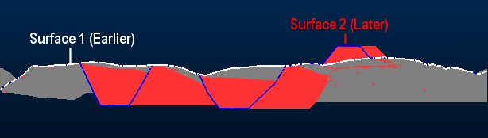](<javascript:void\(0\);>)

In this scenario, no outlines are specified, so the volumes are calculated within the complete common area covered by both input surfaces.

No noise removal is performed and both solids and outlines are generated, along with a report, for example:

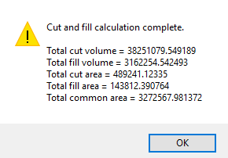

In this example, volumes were generated. These are created using whichever name appears at the bottom of the table in the Outputs group (in this case, the default "CutFillSolids" description is used). These volumes appear as loaded data objects, and an overlay is created in the Sheets control bar.

Displaying only the generated cut and fill volumes and swapping to a plan view reveals unwanted artefacts. With clipping turned off, the distinct cut and fill volumes are identifiable as green and red respectively, but you can see the unwanted fragments that surround each volume, showing a mixture of red (fill) and green (cut) "noise". There are also a pair of outlier data fragments at the original topography object boundary.

[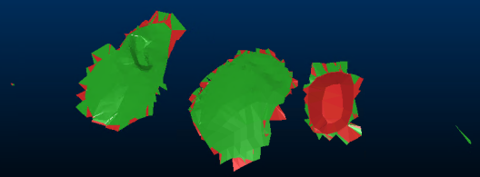](<javascript:void\(0\);>)

These fragments are caused by the near-alignment of surfaces 1 and 2 in some areas (this difference can result from a subtle difference in topography shape between scans, or as a result of smoothing or decimation routines in advance, and so on). The outcome is that volumes exist that can be discounted for the purpose of cut and fill volume assessment.

One method of removing this data is to digitize and/or utilize an outline strings [object](<Concept_Current_Object.md>), containing (in this case) 3 closed perimeters (shown below in same view alignment as the above image):

[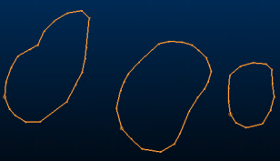](<javascript:void\(0\);>)

The outline-string-approach is useful where there is a likelihood of near-abutting earlier and later surfaces. Strings can be generated by other means, such as using the [convert-wf-hull](<../command_help/convert-wf-hull.md>) command (also known as the "Hull to Strings" command).

Viewing both pre- and post-surfaces together, you can see the discontinuity around the extraction and dump zones clearly. The outline strings (also displayed below) will be used to clean up the edges and provide clean volumes for analysis:

[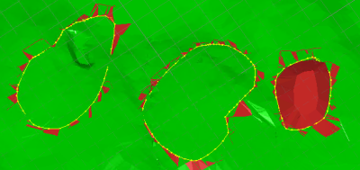](<javascript:void\(0\);>)

Re-running the cut and fill operation with boundary strings is a simple case of selecting the appropriate loaded string object from the drop-down list.

[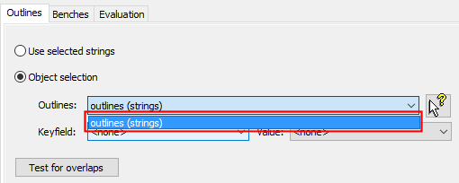](<javascript:void\(0\);>)   

After the calculation has completed, an updated volume and area report is produced and the cut and fill solids can be displayed:

[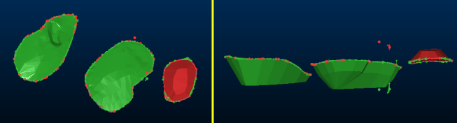](<javascript:void\(0\);>)

Another method of cleaning up the data is to set a minimum surface thickness, below which surfaces will be removed. The choice is dependent on the data input to the process.

### Extended Example: Bench-constrained Results

Continuing the above example, you can easily calculate and evaluate cut and fill volumes within a single or group of benches.

In this case, there are no predefined bench definitions (the Define Benches task on the Reserves ribbon hasn't yet been used for this project), so bench references are added manually, using the Benches tab of the Cut and Fill Volumes screen:

[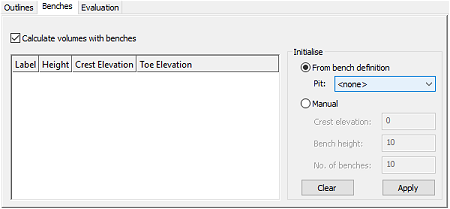](<javascript:void\(0\);>)

As the benches are defined manual, the Manual option is selected and a series 10 x 20m benches are calculated, starting at the Crest Evaluation (the upper elevation of the pit, which in this case is 0m):

[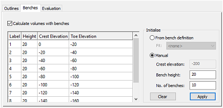](<javascript:void\(0\);>)

The output report states the overall cut and fill volumes and areas as before, but only considers the volume(s) contained within the defined benches. This is also true for the resulting strings and solids; a string is generated for each crest, and the output summary table (Summary file) contains an additional **BENCHID** attribute against each of which cut and fill area/volume and common area values are reported.

[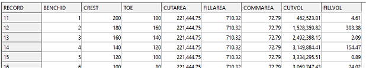](<javascript:void\(0\);>)

Note that the output volumes are terminated at the 0m crest elevation. As some of the dump extends above this elevation, it is omitted from the output and not considered in the corresponding calculation:

[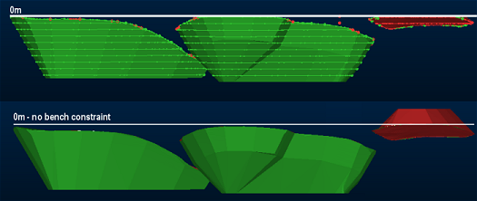](<javascript:void\(0\);>)

Related topics and activities

  * [Cut and Fill Volumes](<Cut%20And%20Fill%20Volumes%20Dialog.md>) (screen)

  * [cut-and-fill-volumes](<../command_help/cut-and-fill-volumes.md>) (command)

  * [DTMCUT process](<../Process_Help_XML/dtmcut.md>)

  * [Current Object Concept](<Concept_Current_Object.md>)

  * [convert-wf-hull](<../command_help/convert-wf-hull.md>)