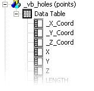
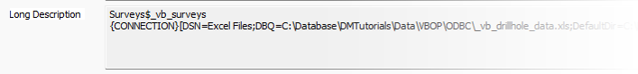

# Data Object Manager

To access this screen:

  * **Data** ribbon **> > Objects >> Manage Objects**.

  * In the [Loaded Data](<Loaded%20Data%20Control%20Bar.md>) control bar, right-click an object, select Data Object Manager....

  * In the [Sheets](<Sheets%20Control%20Bar%20Overview.md>) control bar, right-click an object, select Data Object Manager....

The Data Object Manager utility contains a host of functions that relate to the control and analysis of loaded object data. This screen has the following key areas: 

  * The **Data Object Toolbar** contains buttons which access object-related commands.

  * The **Objects list** displays all currently loaded (in-memory) objects, and can be used to add a data column (property) to the selected object, and other things. See **Loaded Data Objects List** , below. 

  * The **Data Object** tab shows a summary of the selected object's statistics, object filtering and the associated data source. See **Data Object Tab**, below.

  * The Data Table tab shows a view of the contents of the selected object's database table. See [Data Object Manager: Data Table](<Data%20Object%20Manager%20-%20Data%20Table.md>)

### Data Object Manager Menus

#### Data Menu

Import | Displays the **Data Import** screen to load external data into memory via a Data Source Driver. See **[Data Import](<data%20import%20dialog.md>)**. This function is also available as a toolbar button.  
---|---  
Export | Export data to an external file using a Data Source Driver. See **Data Export**. See [Exporting Data](<Export-data.md>). This function is also available as a toolbar button.  
Refresh | Refresh your data object, that is, access the original data source and load it again, updating the in-memory object. This will reflect any recent changes to the original data, in whatever format it is. See [Loading Data](<Concept_Loading%20Data.md>). This function is also available as a toolbar button.  
Refresh All | Refresh all loaded data objects from their original data sources, Datamine or otherwise. See [Loading Data](<Concept_Loading%20Data.md>). This function is also available as a toolbar button.  
Reload  | Reload the selected data object, that is, recreate the currently loaded data object without accessing the original data source. See [Loading Data](<Concept_Loading%20Data.md>). This function is also available as a toolbar button.  
Unload | Unload the selected data object from memory. This function is also available as a toolbar button.  
Combine Objects | Combine one loaded data object with another of the same type. See [Combine Data Objects](<Data%20Objects%20Combine%20Dialog.md>). This function is also available as a toolbar button.  
Extract Objects |  Extract specific aspects of your data to a separate object. See [Extract Data Object](<Data%20Object%20Pick%20Dialog.md>). This function is also available as a toolbar button. **Note** : This function is restricted to point, string and wireframe data only.   
Close | Close the **Data Object Manager**.  
  
#### Edit Menu

The options in this menu are only available if the **Data Table** tab is active.

Find | Find a particular value in the currently displayed table. Various options are available to refine your search.  
---|---  
Find Next | Once a "Find" value has been set (see above), use this to find the next occurrence in the table from a left-right and top-bottom direction.  
Find Previous | As above, but look for the specified value in the opposite direction.  
Go to >> Absolute | Go to a particular record number in the displayed table.  
Go to >> First | Go to the first record of the table.  
Go to >> Previous | Go to the previous record of the table, if possible.  
Go to >> Next | Go to the next record of the table, if possible.  
Go to >> Last | Go to the final record in the table.  
  
#### Tools Menu

Definition Viewer | For the selected data object view the data definition for each attribute (type, length and default value).  
---|---  
Export to Excel | Export the current table to Microsoft Excel. A new workbook and worksheet are created.  
Options  | Format the Data Table view using the **Data Table Format** screen. See [Data Table Format](<DataObjectManager_GridFormat.md>).  
  
#### Help Menu

This menu allows you to display this context-sensitive help.

### Loaded Data Objects List

This area displays a list of all loaded objects. Expanding an object shows the attributes of that object.

Selecting an object in the list will update the contents of the Data Object tab and the Data Table tab.

To add an attribute to an object:

  1. Select an object in the Loaded Data Objects pane (providing it is not write-protected)

  2. Right-click and select Add Column

  3. In the [Add Column](<AddColumn_Dialog.md>) dialog, define the attribute parameters:

     * Define the loaded data **Object** to modify. By default, this is the one previously selected, but you can change the target object to any that is loaded.

     * Choose the attribute **Type** ; either **Numeric** or **Alphanumeric**.

     * Choose the attribute **Name**. See [Attribute Naming Convention](<Attribute_Naming_Convention.md>).

     * For alphanumeric attributes, choose how many characters to permit for storage, also known as the attribute **Length**.

     * Choose the **Default Value** for the attribute. This can be an absent data indicator (default) or any other permitted value. This will be used where no data can be set for a particular data record.

  4. Click OK.

Right click an object attribute to reveal the following options:

  * Delete: delete the selected attribute from the selected object, after confirmation.
  * Set Conversions: specify how special values are converted when a data table is loaded into menu, using the [Data Conversions](<data%20conversions%20dialog.md>) dialog. See [Data Conversions](<data%20conversions%20dialog.md>).
  * [Field Name] properties: open the field properties screen for the selected attribute. See [Item Properties](<Properties%20Dialog.md>).

### Data Object Tab

This tab displays summary information about the selected object, and also provides some useful tools for filtering the view of the selected object in the 3D window(s).

  * Object Name: the name of the currently selected object, with the data type shown in brackets after (e.g. 'MyFile (points)').

  * Description: a brief description of the selected object.

  * Long Description: if a data object is derived from a physical 3D data file, this field shows a fuller description of the selected object including the full file path of the loaded file, the type of data represented, the number of database records associated with it and details of any filters applied during the data load process.

If the data object is derived from a _Data Provider_ connection such as ODBC or acQuire, this field will show the name of the database table or view relating to the data and the connection string used to access it. For example:  
  

  * Time Stamp: if the loaded file has a time stamp, it is shown in this field.

  * Version Info: version information is shown here. If it is not found, a default version of '0.0.0' is applied.

  * Statistics: information relating to the structure of the data found within the file. For example, "129 points' (points file selected), '69037 full cells, 28220 subcells' (block model) etc.

  * Filter: use this field to define a filter expression for the selected object. Clicking Expression Builder... displays the [Expression Builder](<Expression%20Builder%20Dialog.md>) dialog.

The filter expression displayed here applies only to the selected object, but can be the result of defining a filter using one of the following methods:

    * For multiple objects using one of the Format | Filter All Objects | ... commands. In this case the defined filter expression will be displayed in the Data Object Manager, for each of the effected objects.

    * For a single object using this field in the Data Object Manager's Data Object tab.

  * Store in project file: this check box is used to determine the selected data object is archived within the current project file, or is simply referenced by the project as a file on disk. In the latter case, the Data Source is relevant (see below).

  * Data Source: for loaded physical data files, where a file path is relevant, this field shows the path that the selected object data is derived from. Where data has been loaded from a connected data source such as ODBC or acQuire, this path shows the connection string used to connect to the database storing the data object.  
  
Click Save As... to open the Save New 3D Object dialog.  

### Applying View Filters

View Filtering can be applied to any object in memory, including drillholes, to control the data that is displayed at any one time. This is controlled by a filter expression which can be defined by various methods to specifically filter drillhole data, using the [filter-drillholes](<../command_help/filter-drillholes.md>) command.

Drillhole segments and downhole columns will always honor this object-level filter. If data does not pass the filter, neither it nor the associated downhole column data will be shown.

However, the situation is slightly more complex where a 'column-specific' filter exists. All downhole columns can be associated with their own filter (using the [Filter tab on the Format Columns screen](<../PLOTS_LOGS/Format_Column_Filter_Dialog.md>)). In this case, an aspect of the downhole column will only be shown if it passes both the object-level and column-level filters. For example; if a drillhole object was filtered in the Data Object Manager to only show data above the X value 150, only column and drillhole data would be shown above the 150 position. If an AU column was set to show results only where the grade surpasses the 1.0 grade cut-off point, downhole column data would only be shown above 150 in X and where grade values exceed 1.0 ppm.

Related topics and activities

  * [Data Export dialog](<ExportTable.md>)

  * [Data Object Manager - Data Table](<Data%20Object%20Manager%20-%20Data%20Table.md>)

  * [Data Object Manager - Data Table Format](<DataObjectManager_GridFormat.md>)

  * [Data Conversions](<data%20conversions%20dialog.md>)

  * [Data Import](<data%20import%20dialog.md>)