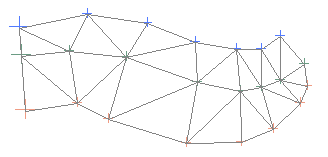
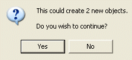
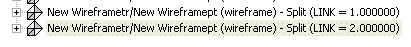
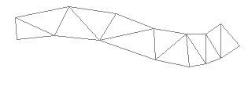
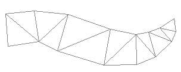

# Extract Data Object

To access this screen:

  * **Data** ribbon **> > Objects >> Extract**.

  * In the [Loaded Data](<Loaded%20Data%20Control%20Bar.md>) control bar, right click any object in memory and select Extract.

  * In the [Data Object Manager](<Data%20Manager%20Dialog.md>), select Extract from Object.

Extract data from loaded objects, and create new objects based on the values contained within a selected field. 

For example, a block model object could be split into separate objects based on the a zone's field value, resulting in the original model being preserved, and a new object created for each unique zone value found within the block model's underlying database values.

**Warning** : as this process creates new objects based on the unique values of a selected field, there can be a potentially large number of new objects created during this process. For example, creating extracted objects for a complex DTM according to the X positional value may result in thousands of new files being created. For this reason, a dialog is shown before the extract operation begins to tell you how many new objects are to be created.

Create extracted objects by either specifying a field within the object's database, meaning all unique values found will be used as a basis for creating a new object, or you can use filter expressions to declare how the original object data is to be used during extraction.

**Note** : you can't extract data from block model objects.

## Extraction By Field Value Example

The wireframe object below is comprised of three linked strings:

Running the Extract Object utility, and selecting the LINK field to act as the extraction key (two link values are present in the database to representing the linking meshes between each of the the three lines), results in the following message:

Selecting Yes shows a series of two alternating progress bars (Apply Filter and Copy File). 

Two new object files are created. You can see their descriptions in the Loaded Data control bar:

From the **Sheets** or **Project Data** control bar, you can show or hide the new objects:

To extract data from a loaded object:

  1. Pick an **Object Name**. All loaded objects display here. This may be automatically populated.

  2. **Choose an Extraction Method** :

     * Extract By Fieldselect a field from the drop-down list. All unique values found within the selected object's database will result in new object creation.
     * Extract Using Filterselect this option to either enter a filter expression manually, or use one of the following options (availability depends on the object type selected):

       * Select By Groupselect a data group from the Design window using the cursor. A filter expression will be created based on the selection.

       * Select By Surfaceselect a surface from the Design window using the cursor. A filter expression will be created based on the selection.

       * Select By Attributeselect an attribute from the Design window using the cursor. A filter expression will be created based on the selection.

       * Customactivates the Filter Wizard button.

       * Filter Wizardcreate a custom expression using the [Data Expression Builder](<ExpressionWizardDialog.md>).

  3. Click **OK**.

New data objects are created containing a subset of the original object.

Related topics and activities

  * [Data Object Manager](<Data%20Manager%20Dialog.md>)

  * [Data Expression Builder](<ExpressionWizardDialog.md>)