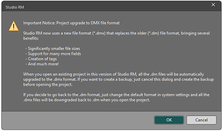
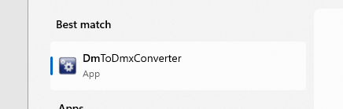
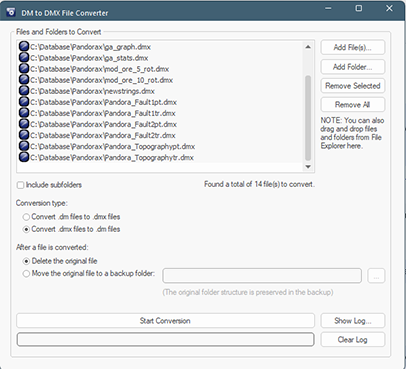
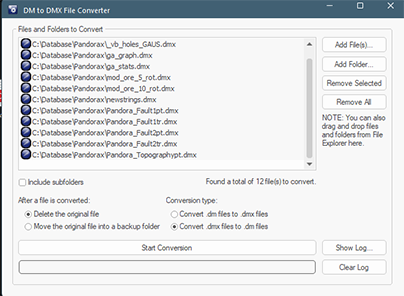

# Datamine File Formats

### Background

The legacy .dm file format used natively by Studio products originated from Datamine's "Native File System" over thirty years ago. It has been maintained and supported by Datamine products since then. The mining industry has seen a significant increase in data volume and complexity during this time, which has started to strain the capabilities of the .dm format. 

Our response to this challenge is a new file format that is more suitable for the current and future data requirements of the mining industry. This format has a new file extension; **.dmx**.

We have designed a format that integrates smoothly with Studio products and your existing workflows and customization scripts. We offer a file format that outperforms our legacy format in every way, but one you can adopt with ease and without any disruption.

**Tip** : A useful **DM to DMX Converter** utility is installed with the **Datamine Data Converter**. Use it to batch convert from the legacy .dm to .dmx format. You can either retain your legacy .dm files (in a dedicated folder) or remove them. This utility can convert entire folders and even subfolders, meaning large numbers of files can be converted in one operation. The utility can be found in the Datamine Data Converter's installation folder (typically **C:\Program Files\Datamine\Data Converter**).

### Benefits

The Datamine Extended Format (.dmx) is not an _updated_ format. It is a completely new format designed from the ground up to support the demands of the mining industry.

The .dmx format offers several advantages over the legacy .dm format by overcoming previous limitations, such as:

  * Data is compressed, which reduces file sizes and saves disk space.

  * Performance of your application after loading data is comparable or better than the old .dm format.

  * Strings are Unicode-compatible, which supports foreign languages.

  * The number of maximum permitted data columns has increased from 256 to 2048.

  * Our new format can be extended to include more features and data types in the future.

  * You add enhance this format with metadata.

### Comparing .dm and .dmx

| .dm | .dmx  
---|---|---  
Data Storage | Uncompressed. Data is stored in a rigid table structure. This is wasteful since repeated data is copied. This results in large file sizes. | Compressed. Data is stored in variable-sized compressed blocks. This results in smaller file sizes.  
Performance | Fast. Raw data is stored so no preprocessing is required. * | Fast. Compression and decompression uses the fast LZ4 technology, and a memory cache helps to reduce disk access.  
String Encoding | ANSI. Characters are stored using the current locale, so will not always display correctly in other locales. | Unicode. Characters are stored in the Unicode character set so will appear the same in all locales. This includes attribute names  
Data Columns (max) | 256\. If alphanumeric columns have been used then this number can be smaller. | 2048 regardless of type.  
Metadata Support | No support | Tags can be added to any .dmx file (including tag/value pairs).  
Extensibility | None | Many future opportunities. The underlying file format allows for any type of data to be stored, making it easy to add additional features in the future.  
  
* Performance here relates to the speed at which data is read from and written to the format, not to be confused with performance of display rendering, which is the subject of ongoing development.

### Legacy File Format Support

Our goal is to gradually replace .dm files with .dmx files, which offer more features and benefits. However, we understand that this transition has to happen at your convenience. Therefore, we will still support .dm files for reading and writing by Studio products, at least for the initial period.

**Note** : Newer products, such as Studio Geo, Studio NPVS+ and Studio PM only operate in "DMX" mode, meaning local project files are automatically converted to the new format if required, when a project opens. These products can still read legacy DM data.

A new system option will let you select your preferred output format. You can stick to the old .dm files if you want, for instance, if other Studio versions in your organisation can't handle the new format just yet (although we do provide a useful .dm to .dmx converter as part of the Datamine Data Converter package). Datamine recommends that you switch to the new format as soon as possible, because it has many advantages over its predecessor.

We are committed to ensuring compatibility with .dm files, as well as other older file formats (such as the Earthworks Exchange Format, which is much older than .dm files). Our goal is to always offer a way to load or import these files, regardless of how the technology evolves.

**Note** : once your system is set to a file format mode, that mode is shared with _all_ Studio applications on your PC. This even extends to external utilities, such as the Table Editor and Data Converter. For example, if your system is running in ".dmx mode", the Data Converter will convert between 3rd party files and the .dmx format, not .dm.

Other situations regarding legacy support are covered in the Q&A section at the end of this document.

## Converting Between Datamine Formats

Your product supports both automatic and manual file conversion. 

#### Automatic Conversion

When you open a project, a check is made to see if there are files in your project folder that are not in the expected format:

As a mixture of file formats can potentially cause issues with processing, all non-default files are updated automatically to the default file format. 

Once project files have been converted, your project is flagged to "convert future files". This means that reopening the project triggers an automated and unprompted check for non-default files, converting them without prompts if detected. 

Once conversion completes, the project opens as normal. Where conversion (prompted or not) happens, you'll see a summary report in the **Command** window when the project opens, for example:

Project files were detected in a non-default format.  
157 files were converted from .dm to .dmx format.

The following 3 files could not be converted:  
D:\Downloads\CORE-9111_attachments\2205_od_pu_geos_240301.dm  
D:\Downloads\CORE-9111_attachments\LOWERPT.dm  
D:\Downloads\CORE-9111_attachments\LOWERTR.dm  

Please ensure these files are not in use and either reopen your project or convert them manually using the DmToDmxConverter utility.  

For more information see C:\Users\MyAccount\AppData\Roaming\Datamine\DmToDmxConverter\log.txt

**Note** : If you subsequently change the default file format (see above), project conversion takes place _in the opposite direction_ when the project is next reopened, meaning potentially all project files are converted again. This may take a few seconds for project folders containing lots of files.

Note: Files referenced by the project that are _outside_ of your project folder are NOT converted. These remain in their original format, and can still be accessed by application functions and processes.

##### Automated Conversion during Project Creation

Automated conversion also occurs if you create a project and specify a folder that contains files in a non-native format. In this situation, you are told that file formats will be automatically changed at the completion of the **Project Wizard**.

#### Manual File Conversion

We have provided a new utility, the DM to DMX File Converter. This is installed as part of your **Data Converter** utility installation. If a standard installation has been performed, this can be found at:

C:\Program Files\Datamine\Data Converter

You can also access this new utility via the Windows **Start** menu. Type "DM" into the search bar:

Once launched, you can use the conversion utility to:

  * Convert legacy .dm files to .dmx format, either singly or as a batch.

  * Convert .dmx files to .dm format, again either one at a time or as a group.

Use the **Type Conversion** options to pick which 'direction' to convert files (DM to DMX or DMX to DM). If files for conversion are already listed, the view updates to show only files relevant to the option selected.

Select one or more .dm files by dragging either those files, or their containing folder (or multiple folders, and optionally including subfolders) into the **Files and Folders to Convert** panel. Files and folders are displayed with corresponding icons, with the total number of detected .dm files shown further below, for example:

You can either retain the existing files as a backup (in a ".dm" or ".dmx" folder in each conversion location) or delete them after conversion. You will need to define the location of your backups.

Warning: Don't back up files in the alternate format to your project folder as they will be automatically reconverted the next time the project is reopened.

Click **Start Conversion** and start enjoying smaller, more capable source data files.

### New Format Availability

The Datamine Extended Format (.dmx) is available in the following Studio product versions (and later ones):

Product | Version  
---|---  
Studio EM | Studio EM 3.0  
Studio Geo | Studio Geo 1.0  
Studio Mapper | Studio Mapper 4.0  
Studio NPVS | Studio NPVS 3.0  
Studio OP | Studio OP 4.0  
Studio PM | Studio PM 1.0  
Studio RM | Studio RM 3.0  
Studio Survey | Studio Survey 3.0  
Studio UG | Studio UG 4.0  
  
### Script Support

Studio offers a variety of customization options, and this includes scripting support for our legacy file format, allowing Datamine tabular data to be read and created using any COM-aware scripting language.

The new .dmx file format uses the same DmFile component and API as the old .dm file format. The only difference is that you need to use a .dmx file extension instead of a .dm file extension when specifying inputs and outputs. It's that simple.

This means that you can easily switch to the new format without modifying your existing scripts. You can also do nothing if you wish, and just continue automating the processing of legacy .dm data (although you're missing out on the new file capabilities).

Moreover, you can access the .dmx format not only through the familiar COM interface, but also through C++ and .NET libraries for even better performance. This gives you far more flexibility and power to customize Studio products.

New features such as tagging with metadata are provided by new API methods. This opens up even more opportunities for customizers. Although, as you would expect, our legacy format won't support these new interface options so, attempting to call these new API methods on the old format will result in an error.

In short, your existing scripts will work as they did before. If you want to work with .dmx files instead of .dm files, you'll simply need to change the file extension you currently specify in your script. A global search and replace could be a very rapid solution!

### File Representation

Legacy .dm and current .dmx file formats are represented differently in the Project Files control bar.

 |  .dmx file |  A file in the proprietary .dmx Datamine binary file format.  
---|---|---  
 |  .dm file |  A file in the legacy .dm Datamine binary file format.  
  
See [Project Control Bar Icons](<Project%20Icon%20Reference.md>).

## Macro File Lookup

Studio macros attempt to find a file in the default file format at the expected location (either within the project folder, or remotely, depending on **!LOCDBON** and **!LOCDBOFF** settings).

For example, consider the following macro to sort a block model on its **IJK** values:
    
    
    !START M1!LOCDBON!SORTX      
  
---  
      
    
    &IN(unsorted_model),&OUT(sorted_model),*KEY1(IJK),@ORDER=1.0,  
      
    
    @KEYSFRST=1.0,@ROWORDER=1.0,@KEYTOL=0.00001  
      
    
    !END  
  
In this situation, **!LOCDBON** is set. This means a check for the file will only be made within the current project folder and its subfolders. 

  * **If the system is running in DMX mode** , a check would first be made for "unsorted_model.dmx" in the project folder, and if that can't be found, a secondary check is made for the alternate file format; "unsorted_model.dm". 

If neither can be found, processing is aborted.

  * **If the system is running in DM mode** , the check is still made in the project folder, but a search for "unsorted_model.dm" is performed first, changing to "unsorted_model.dmx" if that can't be found locally.

If **!LOCDBOFF** is set instead, the search for the input file occurs in stages:

  1. A check is made to see if the **Project Files** database (the information that appears in the **Project Files** control bar) has a matching file name reference. 

  2. If a match is found between the macro &**IN** and the **Project Files** database, the associated file path (for example, a path to a remote file, sitting outside the project folder) is used to start the search.

     1. As before, a check is first made for the default file format in the remote location. 

     2. If no file can be found in the default format, the alternate format is searched for.

     3. If no file can be found in either format, a local project folder search is performed.

  3. If no file has been found in the **Project Files** file path (in either format) the local search follows similar logic:

     1. As before, a check is first made for the default file format in the remote location. 

     2. If no file can be found in the default format, the alternate format is searched for.

     3. If no file can be found in either format, processing aborts.

## Questions & Answers

* * *

### General Information

* * *

What are the benefits of the .dmx file format, compared to the previous .dm format?

Currently, the .dmx format offers two key benefits over its predecessor format:

  * The number of attributes is no longer restricted to 255 (lower if using long alphanumeric field widths). The new limit is 2048 attributes, regardless of width or type.

  * Files are stored in a much more efficient way, compressed to ensure contiguous data values are stored smartly to reduce the size of the generated file (it can be up to 10x smaller than the original). Block models, for example, can be much smaller in .dmx format than their .dm equivalent.

Must I update all of my Studio products in my organization to a .dmx-friendly version when I upgrade?

At Datamine, we recommend upgrading to the latest version of Studio products as soon as you can, but we understand that many organizations exercise careful IT change control and this can delay the uptake of new releases. 

Whilst .dmx files can't be read by a "pre-dmx" application, Datamine Studio products offer an 'opt out' system option to allow later Studio versions to behave as before; reading and writing legacy .dm format files.

Newer products, such as Studio Geo and Studio NPVS+ will only operate in DMX mode. It is not possible to revert these products to the legacy DM mode.

You can still read legacy .dm files into a Studio product running in DMX mode, but any non-default files in the project folder are automatically converted when the project is open.

So, does this mean everything in Studio will be quicker, such as 3D rendering and processing? 

Whilst you are likely to see some performance improvements where data exchange occurs (load, save, import) and there may be small improvements in frame rate when rendering block model data (where disk access is required), the change of file format won't directly improve system performance, rendering or other system functions.

How do I choose the _default_ Datamine file format in applications that support the new format?

Set your default load format using **System Options screen >> Data >> General**. 

This is a **system-level setting** and _applies to all .dmx-supported Studio applications on the system, other than Studio Geo, NPVS+ and PM as these are locked to the new mode_.

If you change this setting, you must restart all running Studio applications for the changes to take effect.

Can I have a mixture of legacy (pre-dmx) and newer (post-dmx) applications on my system?

You can still install a mixture of legacy and new application versions on your PC. Some newer applications can operate in either ".dm" or ".dmx" mode, and brand new products (Geo, NPVS+ and PM) operate only in DMX mode) whilst the legacy applications will continue to expect .dm files as before. 

So, I don't have to upgrade all my Studio versions at once?

Not unless you want to take advantage of the new format in all installed Studio applications. Otherwise, you can continue to use new and legacy applications in parallel (although you're missing out on all the good stuff the new format offers...)

* * *

### Reading Data

* * *

Can I still load .dm files into Studio products?

Yes, you can, in any Studio application. You decide which format of data your Studio applications _create_ via a new system option that will affect all Studio products installed on the target PC, but support for _loading_ .dm files will remain indefinitely. If you choose to remain with the legacy format, all data read and write functions will default to the .dm legacy format. 

**Warning** : Be careful if you save non-default formats to your project folder. They are automatically converted to the default format when the project is reopened.

Can I still import .dm files?

Importing a Datamine file via the extensive "Data Source Drivers" function is another way of adding data to your Studio project (even if you choose not to load it straight away). The "Datamine" import drivers will let you import data in either the .dm legacy or .dmx format. We don't plan to change this.

What about file-based processes and macros?

File-based processes such as **COPY** , **TONGRAD** and so on, respect whichever system option you have enabled, so will generate either .dm or .dmx files. It's up to you. This applies to both running processes interactively or via a macro (or via a script that calls a macro using XRUN).

Can I read a .dmx file in a legacy Studio application?

You can only read DMX files in an application version that supports this format. See "New Format Availability", above, for more information. Application versions produced before the qualifying version will not read DMX files.

Can I drag and drop a .dm file into a .dmx-enabled application?

Yes, you can. Your application will automatically recognise the incoming file data and adapt its load routine accordingly to load the legacy file.

Can I drag and drop a .dm file into a Studio application that has .dmx support, but it is off by default?

Yes, you can. As above, the Studio application will adjust its load routine on-the-fly to load the new format data. 

If I load .dmx files and create a project archive, will it load on a legacy system?

Yes, it will. Loaded data is stored in the project archive in the same manner as in legacy applications, so it won't matter what its original format was. Data can only be saved in the legacy application as .dm format, of course, and if more than 256 data columns exist in an object, it will not be completely saved, but other than that, archives are as transferable as ever.

Can software from other vendors read .dmx files?

Yes. We have already provided our competitor and partner vendors with a Software Development Kit to facilitate reading of DMX files, and supported them as required. We know that it's important for you to share data between multiple vendor systems.

What about projects? What happens if I try and open a project that references .dmx files in a version that doesn't support that format?

In this situation, all file references of the project are preserved, but you won't be able to load project files referencing an unsupported format (in this case, .dmx).

Will auto-reloaded data still occur as before?

Yes, it will.

I currently use the DmFile SDK to read and write Datamine files - can I still do this?

Datamine provide an updated SDK that will allow you to read and write both .dm and .dmx files. Contact your local Datamine office for guidance.

* * *

### Saving Data

* * *

What data format does my application create?

By default, your application will output data in .dmx format. You can change this back to .dm by accessing your **System Options screen >> Data >> General** and choosing from either .dm or .dmx defaults. This applies to all Studio applications installed on the target system (it isn't possible to mix and match default file save formats between applications on the same PC).

Are all output files generated in my default format?

By default, yes, although you can save in either DM or DMX format by changing the file extension of the data to be saved. If you are updating an existing file, the original format is preserved.

Can I swap between default output formats?

Yes, you can change your **System Options screen >> Data >> General** options at any time, but this will affect _all_ Studio systems installed on the local PC, and all of them must be restarted for the changes to take effect.

**Important** : When you restart your application, ALL files in the new non-default format are automatically converted to the default format. Files outside your project folder, even if referenced by your project, are not affected.

Are legacy .dm files created by new Studio versions readable in pre-.dmx Studio versions?  

Yes, there is no change to the legacy .dm file format with these changes. They are still supported and will continue to be recognised by legacy Studio applications, unless a compatibility break is introduced in the future (which is very rare).

Can I save a data object with > 256 columns to a .dmx format file? And can I do the same and save a file in .dm format?

Yes to question one. No to question two. If a data object in memory has up to 2048 columns (regardless of the type of data they contain) you can save it as a .dmx file.

The .dm file format hasn't changed, so the 256-column limit remains, meaning that an object with over 256 data attributes can't be fully saved to a .dm file.

Are .dmx files always smaller than their .dm equivalent?

Yes, although the extent of reduction will differ depending on the patterns of values contained in the data table and the amount of data contained in the file. Some data types where there are a lot of contiguous identical values will compress more significantly than those with highly-randomized contents in each data column. For example, a block model with lots of implicit fields will compress a lot whilst a reserves table is unlikely to compress as much. 

Regardless, overall, you will see useful data size reduction after swapping to the new .dmx format.

Can I edit a file extension to convert between .dm and .dmx formats?

No, you can't. The .dmx format is a completely new binary file format from Datamine so cannot be converted by editing the file extension in a file browser. You can convert between formats using a Studio application, or the provided **DM to DMX Conversion Utility**.

* * *

### Projects

* * *

If I close a project and choose to save data files, what format is saved?

Data generated within your project will be saved to disk (and referenced by your project) if requested using the default output format you have chosen (**System Options screen >> Data >> General**).

Can I convert a .dm file to a .dmx file using Studio?

Yes. One way to do this is to load the file into a .dmx-supported Studio application and save it as a .dmx file (either because the default output format is .dmx, or you intervene and specify the new format to be used).

If you're planning to convert multiple files from .dm to .dmx format, we have added a new **DM to DMX Conversion Utility** to the Datamine Data Converter installation folder (typically, this is found at **C:\Program Files\Datamine\Data Converter**). Use it to convert folders of files and optionally backup your original .dm files.

What happens if I load a project that references .dmx files into an old Studio application?

In this situation, the legacy application will load the files it can, and highlight those that cannot be loaded (reporting each unsupported .dmx file as an 'unrecognised file type'). Data in the new format will not be loaded.

Can I have a mixture of .dm and .dmx files in my project?

Your project can reference files in either format, but files inside the project folder (and subfolders) are automatically converted to the current default format when the project is opened. If files have been modified to a different format during a project session, they are reverted the next time you open the project. This ensures your project folder contains a consistent file format.

You can import either .dm or .dmx files into a project from an external location and have a mixture of file format references. Data generated within your project will be saved to disk (and referenced by your project) in the default format when the project is saved. 

If you choose to automatically reload data when your project is reopened, any automatically converted files (as part of project startup) are reloaded in the new format.

In summary: Project files are converted to the default format on project startup. So, you can have a mixture of file formats in the project folder, but they are made consistent when the project reopens.

* * *

### Working with Data

* * *

Is there still a fixed attribute name length constraint with .dmx files?

Yes. We are still constrained by legacy file-based processes to a maximum of 24 characters.

What's the new limit for the number of attributes in a file?

It's now 2048 attributes, regardless of the attribute width. For example, you could potentially have 2048 alphanumeric attributes of 24 (or more) characters wide.

If I load a big .dmx block model file, what happens?

By default, because of the potential size of the file, Datamine block model files use an 'on-disk' model so that not all of a block model is loaded at once. This improves performance due to a lower system strain (although a fully-in-memory option is available when using Data Source Drivers). This isn't new, we've always handled block model data this way, by default.

This capability continues for both .dm and .dmx files. In this situation, the .dmx format will typically perform better than the .dm format.

When you save the resulting block model data, a .dmx file will typically be (much) smaller than its .dm equivalent and particularly so if there are blocks of contiguous record values (such as absent grade indicators, for example).

Can I use the Table Editor to view and edit both .dm and .dmx files?

Yes. the latest version of Table Editor can read both new and legacy formats. Table Editor will read .dmx files and present their contents as before. You will still be able to edit and save .dmx files using the Table Editor. 

Can I use the Datamine Data Converter to create .dmx files?

Yes. You can use it to create whichever format is appropriate for the current system 'mode'. For example, if your system is configured to generate .dmx files, the Data Converter will generate .dmx files.

If you're planning to convert multiple files from .dm to .dmx format, we have added a new **DM to DMX Conversion Utility** to the Datamine Data Converter installation folder (typically, this is found at **C:\Program Files\Datamine\Data Converter**). Use it to convert folders of files and optionally backup your original .dm files.

Can I convert files from .dm to .dmx format?

Yes. We provide a utility, installed as part of the Datamine Data Converter package that allows you to convert legacy .dm files to the new .dmx format outside of any Studio application. You can also convert files in the reverse direction.

You can convert single files, or whole folders. A backup of your original files can be optioned created, or you can choose to just convert files without backups.

;>)

The DM to DMX File Converter

The conversion utility is available from the Windows Start Menu and a desktop icon, after installing a supporting Studio application.

Can I convert files from .dmx to .dm format?

This isn't recommended, as the new format is more efficient. However, you can either do this on a file-by-file basis by:

  * Loading a file in any format in to a Studio product and saving it out as the legacy format.

  * Open the file in **Table Editor** and save it with the alternate file extension.

  * Use the **DmToDmxConverter** to back convert one or more files.

Note: Non-default files in a Studio project folder are converted automatically to the default format when the project is opened. See "Project Conversion".

* * *

### Scripts & Macros

* * *

Can I still run my legacy macros in a .dmx-supported version of Studio?

Yes. Your macro uses a 'symbolic file name' reference that is either a file in your project directory (if **!LOCDBON** is set) or a project file reference to a file anywhere on your system (if **!LOCDBOFF** is set). Providing the target file is in a format expected by your system (.dm or .dmx, as dictated by your system option), the macro will run as normal, either creating .dm or .dmx output where appropriate, again depending on the system setting.

See "Macro File Lookup" for more information.

I'm not sure I understand. Can you show an example of a macro and how it would behave in a legacy or newer system?

Consider the following macro, which simply copies a file:
    
    
    !START COPY1  
  
---  
      
    
    !LOCDBON  
      
    
    !COPY     &IN(_COPY1),&OUT(out1), AU>0.001, CU>0.001  
      
    
    !END  
  
With a legacy Studio system (where the .dmx format isn't supported) or a newer system that is set to run in legacy ".dm" mode, the input file "_COPY1.dm" is expected (in this case, in the project folder). In both cases, the file "out1.dm" is created.

On a system running with .dmx file support, the input file "_COPY1.dmx" is expected in the project folder (because !LOCDBON is set) and the output file "out1.dmx" is created.

Will my scripts still work?

Yes, even if your scripts explicitly reference a file with a file extension, the latest Studio applications will check for the exact file reference first and, if that fails, it will check for the other file extension after

For example, if you have updated your Studio application to a newer version and are using the (default) .dmx file support, the following script statement will still work if either "1Fault_4x8.dm" or "1Fault_4x8.dmx" exist in the project folder. If both, the explicitly stated file extension is loaded.
    
    
    var myObject = oDmApp.ActiveProject.Data.LoadFile(ProjDir + "/1Fault_4x8.dm");  
  
---  
  
Can I tell which mode I'm running from within a scripting environment?

Yes, you can detect the file format mode using a new method on DmFile. 

For example, you could get the current file format with:
    
    
    var myDmFileObj = new ActiveXObject("DmFile.DmTable");  
  
---  
      
    
    var strDMext = myDmFileObj.DefaultDatamineFormat;  
  
Following this, it would be straightforward to adapt the file load to look for the supported format, e.g.:
    
    
    var myObject = oDmApp.ActiveProject.Data.LoadFile(ProjDir + "/1Fault_4x8" + strDMext);  
  
---  
  
Do I have to change any of my DmFile method calls to work with the new format?

No, the DmFile interface methods of legacy versions are identical in the new version. The only interface changes have been to expose the new `DefaultDatamineFormat `property, otherwise, reading and writing .dm or .dmx files requires the same script calls as before.

If my system is set to legacy ".dm" mode, can I swap it to ".dmx" mode via script?

Yes. You can both get and set `DefaultDatamineFormat `via script although, as a system option, the target application must be restarted for the format change to take effect.

For example, the following sets a Studio application to read and write .dmx format data:
    
    
    set myDmFileObj.DefaultDatamineFormat = ".dmx"  
  
---  
  
However, the target application will continue to run in its existing mode until it is restarted.

My scripts generate Datamine files. What format is created?

Datamine files are created in whichever mode is active. For example, the following statement saves either **myFile.dm** or **myFile.dmx** , depending on the current _DefaultDatamineFormat_ :
    
    
    myLoadedObject.SaveAsDatamineFile("myFile", oDmApp.ActiveProject.ExtendedPrecision, true, "");  
  
---  
  
To be clear; if my system is running in .dmx mode, I can't use a script to save a .dm file without changing the default format and restarting the application?

Yes, that's correct.

I have a script that calls a macro (using _oDmApp.ParseCommand("xrun ...)_. What file format is expected and created by the target macro?

The behaviour is the same as running the macro directly, or running the associated process(es) interactively: The file format expected and written is as set in your system options.

## Appendix A - Example Script

The following script provides a useful helper function for new and existing scripts. It returns the filename of a Datamine file by first looking for a file with // the default Datamine extension. If a file is not found then it will look for a file with the alternate Datamine extension. If a file is still not found then it will use the default Datamine extension.
    
    
    function getDatamineFilename(filename)  
  
---  
      
    
    {  
      
    
    var filePathWithoutExtension = filename.replace(/\.(dm|dmx)$/, '');  
      
    
    var dmTable = new ActiveXObject("DmFile.DmTable");  
      
    
    var defaultDatamineFormat = dmTable.defaultDatamineFormat;  
      
    
    var fileSystemObject = new ActiveXObject("Scripting.FileSystemObject");  
      
    
    if (defaultDatamineFormat == ".dmx")  
      
    
    {  
      
    
    var candidatePath = filePathWithoutExtension + ".dmx";  
      
    
    if (fileSystemObject.FileExists(candidatePath))  
      
    
    {  
      
    
    return candidatePath;  
      
    
    }  
      
    
    candidatePath = filePathWithoutExtension + ".dm";  
      
    
    if (fileSystemObject.FileExists(candidatePath))  
      
    
    {  
      
    
    return candidatePath;  
      
    
    }  
      
    
    }  
      
    
    else if (defaultDatamineFormat == ".dm")  
      
    
    {  
      
    
    var candidatePath = filePathWithoutExtension + ".dm";  
      
    
    if (fileSystemObject.FileExists(candidatePath))  
      
    
    {  
      
    
    return candidatePath;  
      
    
    }  
      
    
    candidatePath = filePathWithoutExtension + ".dmx";  
      
    
    if (fileSystemObject.FileExists(candidatePath))  
      
    
    {  
      
    
    return candidatePath;  
      
    
    }  
      
    
    }  
      
    
    return filePathWithoutExtension + defaultDatamineFormat;  
      
    
    }