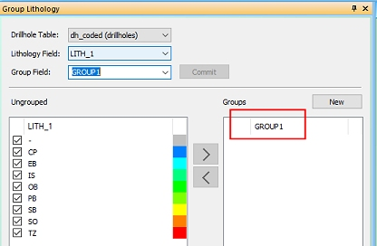
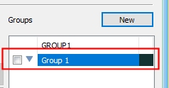
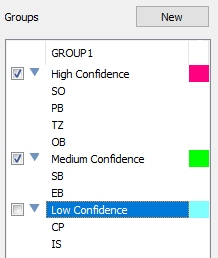
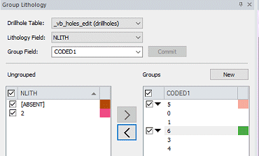
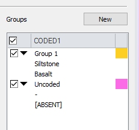

# Group Lithology

To access this screen: 

  * **Implicit** ribbon **> > Domain >> Group**.
  * Enter "group-lithology" into the **Command** toolbar and press <ENTER>

  * Display the **[Find Command](<findcommand.md>)** screen, locate **group-lithology** and click **Run**.

Grouping input samples before downstream processes can make block and/or implicit surface modelling processes simpler and quicker, and can result in more easily-decipherable reserves reports and analyses. In particular, preparing samples for implicit modelling can be a good idea if you wish to generate surfaces or volumes that represent a particular production/operational outcome (dumping, leaching etc.) as the resulting planning model will inherit this simplification and reduce the complexity of the resulting schedule.

It can also be advantageous to create a hierarchical structure within your desurveyed sample lithological/domain groups.

For example, you may wish to categorize granite, rhyolite and quartz as a single lithological and/or rock type domain representing igneous waste, or taconite, schist, and hornblende as metamorphic waste and so on. 

Note: This panel can be displayed whilst you continue to access other Studio commands.

Lithological values (grouped or ungrouped) can be applied to loaded sample intervals using the [Assign Lithology](<Assign_Sample_Lithologies.md>) task. The Group Lithology task is used to perform this preparation. This function is hosted by a [dynamic control bar](<../dynamic%20control%20bars.md>) and requires a loaded input sample file containing at least one data column (numeric or alphanumeric) to which grouping is to be applied.

Grouping is performed using the following workflow:

  1. Set the context of grouping (input samples, attribute to be grouped).
  2. Select or create a grouping field.
  3. If required, create a new group value.
  4. Migrate lithologies to the required group(s).
  5. Apply the new values to the samples.

Once a Drillhole Table and Lithology Field is defined, unique values for the selected field are shown on the left of the panel, in the Ungrouped table. An absent data (-) item will always appear at the top of the list to indicate samples not supported by any lithological value.

Selecting an existing Group Field and clicking Commit will update the panel to show the defined group values on the right (the Groups table), and the lithological values each group contains. 

The selected samples file will be displayed in the 3D window in plan view by default, and will be colored according to the default legend for the selected Lithology Field.

Each lithology is supported by a checkbox indicating visibility; enabling or disabling Ungrouped table items will show or hide the respective sample intervals in the 3D window. If Auto Look is selected, the 3D display will automatically centre and scale the view to fit all displayed items. Both ungrouped and grouped items can be formatted by choosing a color; double-click the color chip on the right of each item to access a color mixer tool. 

Choose a new color to update the panel and the 3D display.You can create a new group by entering a description into the Group Field control (up to 24 characters for long-field-name supported systems and extended precision files, and up to 8 characters for all other system configurations). Press <ENTER> to create the new Group Field attribute and display the attribute name at the top of the right-hand list, for example:

  
If Auto Apply is enabled, your Drillhole Table will be updated automatically to include the new attribute. Any modifications made to the new group will also be applied automatically. If Auto Apply is disabled, the drillhole table will only be updated when you click Apply Now.You can bulk enable or disable Ungrouped fields using the check box in the top left corner of the table.For new or existing Group Fields, add new group values by clicking New. A default group value name will be added, for example:

### Renaming Group Descriptions

You can rename the default description by double-clicking and over-typing. You can also change the color used to display the lithologies within each group by double-clicking the color chip and choosing a suitable color.

## Showing and Hiding Data

As with ungrouped lithologies, you can show or hide lithology groups using the corresponding check box on the left of the group description. Formatting applied to a group will affect all lithologies within it.

The 3D window is automatically updated providing the Auto Apply check box is enabled. If you also want to automatically zoom to the extents of displayed data, select Auto Look.Add lithologies from the right-hand list into the selected and highlighted group by selecting the required lithology on the left and the required group name (or any lithology within it) on the right, then selecting **>**. Any unassigned lithologies can be added to any defined group.

Note: A group does not have to be enabled in order to receive a new lithology value, and you can select multiple lithologies in the left-hand list, using a combination of <CTRL> and <SHIFT> keys before adding them to a group.

Applying grouping to the Drillhole Table will only assign group values to lithologies listed on the right of the panel. If, for example, you define a group name but leave it empty, it will not reappear if you close/reopen the task and reselect the new Group Field.

In other words, when a Group Field is selected, group names and values will only appear in the Groups table if they have been assigned to one or more records, for example, the following image shows lithologies grouped by uncertainty (a measure of the inverse of confidence) resulting in only two groups displayed in the 3D window:

### Numeric and Alphanumeric Data Columns

The behaviour of the Group Lithology panel is slightly different depending on whether you are working with numeric or alphanumeric Lithology Fields.

#### Numeric Lithology Fields

If your Lithology Field is a numeric data type, your Group Field will also be numeric. This means that all descriptions you use to describe groups must also be numeric, and cannot be the same as any of the ungrouped lithological items or other groups.

For example, an **NLITH** attribute contains multiple lithological values as numbers (0-4) and is selected for the Lithology Field. 

A Group Field with an alphanumeric description "CODED1" is created (this is the new attribute name that will be applied to the object), but each group that is created within it must be numeric, and in this case, be a number greater than 4. Creating a New group within the Group Field will automatically apply the value 5. You can add **NLITH** values to the '5' group. Creating a new group uses the default label '6' and so on. 

You can renumber the groups providing the value is not already used, either within the ungrouped items or the grouped items. In short, the number must be unique for the values displayed on screen, for example:

Absent data can be represented in Datamine files and objects with the "-" symbol. If these values are found in your selected Lithology Field, they are represented in the Assign Lithology panel as [ABSENT]. It is not possible, therefore, to create a group with the description "-" as this character is reserved.

#### Alphanumeric Lithology Fields

Alphanumeric Lithology Fields are treated slightly differently to their numeric counterparts.

If you have selected an alphanumeric Lithology Field, an [ABSENT] data item will appear providing there is no data in the selected column for at least one record. The presence of an '-' in a record of an alphanumeric field of the selected drillholes object is not regarded as absent, and is instead considered the same as any other alphanumeric value within the Lithology Field.

This means you can create a group called '-' if you wish and assign ungrouped items to it, even if there is already an ungrouped '-' data item. Providing the group name isn't already used, you can use any description you like. 

Descriptions are not limited by file or field naming conventions; all items within the group and ungrouped list are alphanumeric values in an object.

Multiple groups can be useful if you wish to provide two or more grouping mechanisms within the same file, e.g. one for sample confidence grouping and another for lithology parent domain grouping.

## Grouping Lithologies

To group lithologies in loaded drillhole data objects:

  1. Load drillhole data containing lithology values to be grouped.

  2. Display the **Group Lithology** screen.

  3. Select a loaded **Drillhole Table** overlay from the drop-down list. Only [desurveyed drillhole data](<filetype.md#Desurveyed>) object overlays display.

Why overlays and not objects? This approach allows you to format a selected overlay for a drillholes object whilst retaining the formatting of other overlays. This can be useful, for example, if you wanted to compare an overlay of a drillhole table without grouping (e.g. coloured using the native lithological field) against a grouped overlay of the same object (e.g. colored using the Grouping Field).

  4. Go to the bottom of the screen and choose the behaviour to perform when making changes:

     * Auto Look If **checked** , any changes made within the form will be reflected automatically in the 3D display. This means the view will both scale and center so that displayed data is maximized within the display area. 

If **unchecked** , the 3D view direction and magnification will remain static regardless of changes made in the Group Lithology task.

     * Auto Apply If **checked** , any changes made to the grouping of lithologies, including the creation of new grouping fields and group values/assignments, will be instantly reflected in the loaded drillhole data object (but not the physical file). 

If **unchecked** , changes made will not be applied to the data object until Apply Now is clicked.

  5. Choose a Lithology Field. This is the attribute in the Drillhole Table (see above) that includes lithological values to be grouped. All non-system attributes are listed. When selected, all unique values appear in the Ungrouped table below.

  6. The Group Field lists all numeric and alphanumeric non-system fields in the Drillhole Table. 

Select an existing group field or enter a new description and press ENTER to generate a new grouping attribute. 

**Note** : If Auto Apply (see below) is checked, the drillhole object is automatically updated.

  7. Click **Commit** to populate the rest of the screen. This option is enabled if you change your data context. That is, you change the Drillhole Table, Lithology Field or Group Field.

  8. Review the Ungrouped table. This contains a list of all unassigned Lithology Field values. You can edit the colour of each value and hide or show values using the check boxes. Use the top-level check box to manage the display of all items in one go.

  9. Select (left click) one or more **Ungrouped** lithology values to add to a group.

  10. Click **>** to transfer selected values into the selected group on the right.

The selected items transfer from the **Ungrouped** list to the **Groups** list.

**Note** : Remove unwanted values from the Group using **<**.

  11. If **Auto Apply** is unchecked, click Apply Now to update your loaded drillhole object. If **Auto Apply** was already checked, changes have been applied throughout the activity.

  12. Optionally, to commit your changes to the physical data file represented by the Drillhole Table, click Save File. 

Warning: These changes can't be undone automatically.

  13. Click **Close**.

  14. Save your project and, if required, associated data files.

Related topics and activities

  * [Assign Sample Lithologies](<Assign_Sample_Lithologies.md>)

  * [assign-lithology](<../command_help/assign-lithology.md>)
  * [group-lithology](<../command_help/group-lithology.md>)

  * [Dynamic Control Bars](<../dynamic%20control%20bars.md>)