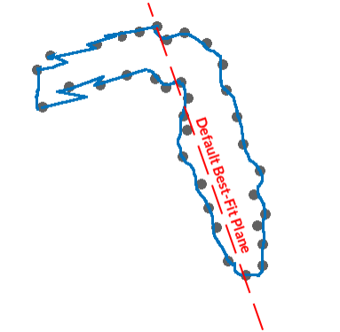
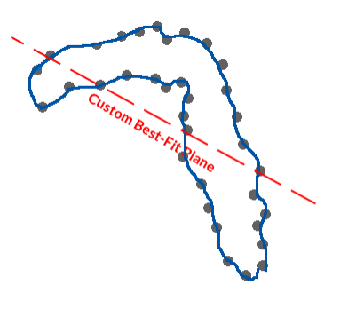
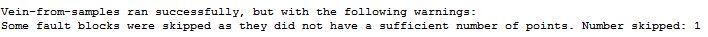
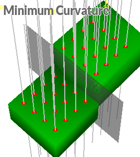
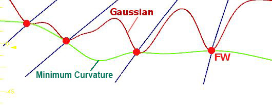

# Minimum Curvature Modelling Method

Note: A Datamine [eLearning course](<https://datamine.learnupon.com/>) is available that covers functions described in this topic. Contact your local Datamine office for more details.

[Vein modelling](<Create_Vein_Surfaces_Overview.md>) and [contact surface modelling](<../STUDIO_RM/Surface_From_Samples.md>) tasks use a Minimum Curvature method to model surfaces between known data points. It is the default method. This method, based on the principles of contouring, is likely to create a less undulating surface between positive sample points than other surfacing techniques, such as a Gaussian projection, whilst retaining a practical level of continuity between points, unlike a more direct point-to-point approach such as used in tesselation. 

This method is exclusive to Datamine Studio products. We created it as many of the off-the-shelf solutions used by other mining software vendors weren't suitable for modelling geology effectively. We wanted a method that produced natureform results, even with complex data inputs, requiring as little parameter editing as necessary. In short, a reliable solution.

This method contours data points, using a mean plane to determine surface normals. This plane can be chosen, either as the automatically calculated mean plane through the positive sample intervals, or any custom plane configured in advance. This allows a wider range of data inputs to be considered, particularly where the trend of the structure isn't necessarily planar. The plane is used purely for surface normal calculations, and shouldn't be seen as a 'trend surface'. 

Consider the following example, where input samples, in cross-section, show an inverted "L" trend. As a single mean plane is supported for the minimum curvature calculation, the section orientation at the top, representing the mean plane of the data, may not be suitable for surface generation, causing an erratic surface profile (shown in blue) where there is a sharp change in trend direction:

Altering the 'best-fit' plane to a bias, skewed from each branch of the shape in roughly equal amounts, allows a surface to be generated that is more reasonable.

Surface generation can be further controlled by other parameters, including:

  * Sample pre-selection: if no samples are selected, all will be considered, otherwise only selected intervals will contribute to the modelled output. [More...](<Create_Vein_Surfaces_1_Data.md>)
  * Best-fit plane parameters: see above.
  * Sample reversal or obviation: other than pre-selection, you can disable or reverse samples as required. [More...](<Create_Vein_Surfaces_6_Reversal.md>)
  * Additional points: custom points or, if supported, intervals to refine the shape of the modelled output. [More...](<Create_Vein_Surfaces_9_Adding.md>)
  * Fault data: model fault blocks by specifying fault wireframes. [More...](<Create_Vein_Surfaces_10_Faults.md>)
  * Thickness constraints: define the minimum or maximum thickness and determine if pinching out is permitted. 
  * Resolution: control the density of output wireframe data.

As there is no sample 'power' or covariance associated with Datamine's vein and surface modelling method, there is no tendency for surfaces to converge on the mean plane over distance. That said, 'pinching out' will still occur in the presence of negative samples whilst vein modelling, caused by samples not carrying the modelled attribute value and, therefore, where a void is expected.

The implication for the geologist here is that modelled surfaces don't suffer from 'dimpling' associated with other methods of implicit modelling, where sample covariance is used to control the influence of positive sample intercept or contact surface locations over distance. A comparative example of Datamine's method and a Gaussian equivalent output is shown further below.

Without the tendency for surfaces to converge on a trend surface or mean plane over distance, output results are easier to control. If a particular shape is required, but isn't implied directly by the input samples, you can create points and (in the case of vein modelling) insert dummy intervals to match a shape based on intuition or other evidence not inherent in the input sample data. "Additional points" are a useful way of manipulating the calculated results. You can even generate contact surfaces in Studio RM based purely on [additional points](<Create_Vein_Surfaces_9_Adding.md>) if you wish.

**[Boundary control](<Vein_Modelling_Boundary_Clipping.md>)** presents several options, although in all cases, boundary clipping is performed as a post-processing step. Boundaries can be shaped mathematically using an alpha shape approach or the output can be constrained to a cuboid of specified proportions. For more precise shaping of the structure boundary (or boundaries). string data can be created or selected to act as a cutter for the raw output surface or volume. 

## Fault Modelling Considerations

The Minimum Curvature modelling method is used by the vein-from-samples and surfaces-from-samples commands.

This method doesn't employ a trend surface to determine surface direction, but instead contours data between points. As such, it requires at least three positive sample intercepts (for each surface) to exist in each fault block.

If an insufficient level of positive sample data isn't found in a fault block, it is skipped and reported in the Output window, e.g.:

### Minimum Curvature vs. Gaussian 

The [Create Vein Surfaces](<Create_Vein_Surfaces_Overview.md>) tool uses a **Minimum Curvature** surfacing method, which is a contouring-style approach to surfacing between positive sample points. Generally, it will produce geologically realistic structures. 

The Minimum Curvature calculation attempts to generate surface edges between known positive sample points without converging the surface(s) to a mean trend surface. This approach is similar to the approach taken when contouring between points and, as such, is not managed by a covariance function that reduces the influence of a sample over distance. 

The Minimum Curvature method is suited for a wide range of input configurations, including irregular hangingwall (HW) and footwall (FW) layouts and scenarios where neighbouring sample elevations vary widely. It avoids excessive surface undulation and is therefore a good 'all-rounder' method, and is the default setting.  
  
Generally, surface thickness will remain continuous with a minimal tendency for HW and FW surfaces to move towards a mean trend surface over distance. So, it is a useful option where the personality of the lithology is a more continuous, linear deposit.  
  
A volume profile generated below for the same data and comparable settings, showing how the Minimum Curvature method compares to a more probabilistic, Gaussian result.

**Note** : Gaussian processes are not used in implicit modelling in Studio products due to their tendency to produce excessively convoluted surface shape and a potential for the generated surface to deviated from known sample intercept locations.

;>)

Related topics and activities

  * [Implicit Modelling Overview](<../STUDIO_RM/Implicit_Modelling_Overview.md>)

  * [Positive and Negative Samples](<Create_Vein_Surfaces_5_PositiveNegative.md>)

  * [Add Extra Vein Points & Intervals](<Create_Vein_Surfaces_9_Adding.md>)

  * [Adding Points for Implicit Modelling](<Create_Contact_Surfaces_Adding.md>)

  * [Model Faults](<Create_Vein_Surfaces_10_Faults.md>)

  * [Vein Modelling](<Create_Vein_Surfaces_Overview.md>)

  * [Create Contact Surface](<../STUDIO_RM/Surface_From_Samples.md>)