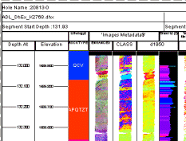
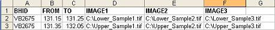

# Adding Images to your Drillhole Display

The information in this article relates to both adding images to 3D window downhole columns and log sheets.

As the functionality of the Log View Properties ([Columns](<../PLOTS_LOGS/Format%20Log%20View%20Columns%20Page.md>)) tab and the Drillhole Properties ([Columns](<../VR_Help/DH_PropDialog_Columns.md>)) tab are so similar, they will both be referred to as the "Columns tab" throughout this topic.

The display of images in 3D and log views can help to clarify the 'real world' relationship between log split formatting and survey data.

;>)

3D window data showing downhole image columns

Samples can be 'linked' to an external file containing a list of images. In fact, a particular hole display can be linked to any number of images. 

_Image data rendered in a log sheet_

## Images and Inverted Log Splits

The aspect ratio of an external image will always be maintained. If the available rectangle width on the log plot is not wide enough to contain the whole image, it will be clipped.

Also, if log views are inverted, either automatically (if the Invert Display for up holes check box is selected on the Log View Properties screen's [Hole](<../PLOTS_LOGS/Log%20View%20Hole%20Properties.md>) tab, and the collar position of said hole is higher than the end-of-hole position) or an inversion is forced (if the Always invert display check box is selected in the same area), all images within the log view in question will also be inverted.

## Linking to external images

Setting up downhole formatting to use external imagery involves the following basic steps:

  1. Either configure a standard log view with the required columns and scale (for more information on creating a basic log view from survey data, see [Working with Hole Logs](<../PLOTS_LOGS/aboutlogs.md>)) or select a downhole attribute in the 3D window using the Drillhole Properties \- [Columns](<../VR_Help/DH_PropDialog_Columns.md>) tab.

  2. Create an external file (in any format that can be imported, including Excel, Datamine format and text) containing a list of images, and which particular downhole segment they are associated with. This file is then imported to your project using the Data Source Drivers and subsequently loaded.

**Note** : images can be in any industry-standard format and image paths in external documents can be either a full system path or a path that is relative to the project folder. If you are planning to transmit your project folder or an archive elsewhere, relative paths provide a more portable solution.

  3. Add a log view columns based on the fields (columns) set up in your external image list file, or just apply the [External Image File] option in the Format Hole window for 3D window formatting.

### Static versus Dynamic Holes

  * Dynamic holes can display an independent image for each FROM-TO interval. 
  * Both static and dynamic drillholes can be image-supported in the 3D window.
  * Static holes can display a single image for the entire downhole length.
  * Static holes can only be image-supported in the 3D window (log views require dynamic holes).
  * Converting an image-supported dynamic holes dataset to static holes is possible; from-to intervals will still be honored in the target file format.

## Image not displayed?

There are several reasons why an image may not be displayed in your new column. If this is the case, check the following:

  * An incorrect path is specified in the external file - path names can be relative or absolute.

  * The log view or 3D scale does not show the image file clearly - when an external file is loaded, the Log View extents will default to Automatic (see [Log View Hole Properties](<../PLOTS_LOGS/Log%20View%20Hole%20Properties.md>) for more details). Sometimes, if the scale of the default log is far less than the FROM and TO length specified in the external file, the image portrayed may be so 'squashed' as to appear as a thin line, or at best, unclear. You can alter the Log View scale using the Log View Properties screen's [Hole](<../PLOTS_LOGS/Log%20View%20Hole%20Properties.md>) tab.

  * The hole description specified in the external file (and subsequently mapped to the expected BHID field) does not match the corresponding field for the surveys file in memory. Make sure that the nomenclature and mapping between the image list file and in-memory surveys file is commensurate.

  * If you are using 3D window formatting, the image(s) are displayed on a section that is at an oblique angle to the current view. Rotate the view to see them.

To create a database for displaying downhole images

**Note** : the image list used for log or 3D window formatting is identical.

  1. Create a blank table in any importable format. For this procedure, an Excel spreadsheet is created.

In your new table, you will need to ensure that the following data columns (as a minimum) are present (although the specific naming of each column is not critical at this stage - as fields are 'mapped' during the log view column creation process, later):

    * The borehole Identification code or name. This field should be alphanumeric.

    * A FROM value to indicate the start position of the downhole sample. This field should be numeric.

    * A TO value to indicate the end position of the downhole sample. This field should be numeric.

    * A uniquely named column dictating at least one full image path.

For example, the image below shows a simple spreadsheet containing a series of 3 images each for two separate downhole intervals:  
  

  3. In the above example, the fields (columns) IMAGE1, IMAGE2 and IMAGE3 can be set up as log column view for a dynamic hole. Once all fields and rows have been defined, you can save your spreadsheet.

If you are setting up an image list for static holes (where a single image is supported for the entire downhole length), the first (possibly only) **FROM** and final (possibly only) **TO** interval for a recorded image will be used to set the position and scale of the image in the 3D window. 

  4. This spreadsheet can be imported into your project as per normal - using the Data Source Drivers. For more information on importing data files into your project, see [Importing and Exporting Data](<Concept_Importing%20and%20Exporting%20Data.md>).

To display images down STATIC drillholes:

  1. Load the static drillhole file.

  2. Display the **3D Drillhole Properties** screen. For example, double-click or tap a displayed drillhole in a 3D view.

  3. Activate the **Columns** tab.

  4. Check Display downhole columns.

  5. Click Insert and select the attribute containing the file path to the image.

  6. Using the Format Downhole Screen screen, pick _External Image File_ from the Style list.

  7. Further refine your configuration using the [Border/Color](<../PLOTS_LOGS/Format_Column_Borders_Dialog.md>), [Text](<../PLOTS_LOGS/Format_Column_Text_Dialog.md>), [Alignment](<../PLOTS_LOGS/Format_Column_Alignment_Dialog.md>), [Width/Margins](<../PLOTS_LOGS/format_column_margins_dialog.md>) , **[Image](<../VR_Help/DH_PropDialog_Columns_Image.md>)** and [Filter](<../PLOTS_LOGS/Format_Column_Filter_Dialog.md>) tabs.

  8. Click OK or Apply to apply imagery to your downhole display. A section of the image for each sample is displayed between the FROM and TO positions specified in the external file.   
  
Note that the image will not be scaled in width.

To display images in a LOG view of DYNAMIC drillholes:

  1. With a defined image list, imported into your project, you can add a new log view column by right-clicking a log view and selecting **Properties**.

  2. Display the Columns tab.

  3. Select the column (left click) above the position you wish to add a new 'image' column.

  4. Click Add... (logs) or Insert (3D) and select a Data Column(you are going to select one of the image path columns in the external image list file).

  5. In the Select the table for columns list select the description relating to the table containing your image list data.

  6. In the Select the fields to add list, select a field from your image list that relates to the 'incoming' file. 

  7. In the following screen \- select the _External Image File_ option. This instructs your application that the contents of the log column will contain references to external images, and if resolved, enforce the display of these images. Click End to add the new column to the Columns in View list.

  8. You are returned to the Log View Properties screen. Your new column is displayed and you can select it to further refine its configuration, using the [Border/Color](<../PLOTS_LOGS/Format_Column_Borders_Dialog.md>), [Text](<../PLOTS_LOGS/Format_Column_Text_Dialog.md>), [Alignment](<../PLOTS_LOGS/Format_Column_Alignment_Dialog.md>), [Width/Margins](<../PLOTS_LOGS/format_column_margins_dialog.md>) , **[Image](<../VR_Help/DH_PropDialog_Columns_Image.md>)** and [Filter](<../PLOTS_LOGS/Format_Column_Filter_Dialog.md>) tabs.

  9. Click OK or Apply to either insert or append the new log column. Your image will be displayed between the FROM and TO positions specified in the external file. Note that the image will not be scaled in width (only clipped if required by the extents of the log column in question).

 |  Related Topics  
---|---  
|  [3D Formatting: the Columns Tab](<../VR_Help/DH_PropDialog_Columns.md>)   
[3D Formatting: the Format Downhole dialog](<../VR_Help/DH_PropDialog_Columns_Format.md>) [Modify Angle template Style](<../PLOTS_LOGS/Modify%20Column%20Angle%20Style.md>)[  
Modify Graph template style](<../PLOTS_LOGS/LogColumnStyleGraph.md>)   
[Modify Trace template style](<Downhole_Columns_Format_Trace.md>) [Log View Hole Properties dialog](<../PLOTS_LOGS/Log%20View%20Hole%20Properties.md>)[  
Formatting Log Columns](<../PLOTS_LOGS/FormatLogColumn.md>)[  
Working with Hole Logs](<../PLOTS_LOGS/aboutlogs.md>)