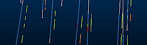

# Downhole Formatting: Trace

Note: A Datamine [eLearning course](<https://datamine.learnupon.com/>) is available that covers functions described in this topic. Contact your local Datamine office for more details.

The following information applies to controls located on both the [Format Downhole](<../VR_Help/DH_PropDialog_Columns_Format.md>) screen (3D window) and the Log View Properties table ([Columns](<../PLOTS_LOGS/Format%20Log%20View%20Columns%20Page.md>) tab) (Plots, Logs windows)

This information applies to the following downhole formatting styles:

  * Trace

You can enhance the display of your loaded static or dynamic drillhole data using inline formatting. 

Trace formatting can be useful if you wish to indicate the value of one attribute against the attribute currently used to color the drillholes. For example, if your samples are colored based on a mineral grade, you may want to align a colored trace indicating the lithology, or view rock type versus fragmentation index.

For this downhole formatting type, you have access to the following property menus:

  * Alignment: define how the downhole column is aligned with the sample to which it belongs. This menu also allows you to merge identical records and hide absent data, amongst other useful tools. 
  * See [Overlay Formatting: Alignment](<../PLOTS_LOGS/Format_Column_Alignment_Dialog.md>).

  * Border/Color: specify if/how downhole formatting is bordered, and which colors to use (either fixed or using a legend). 

See [Downhole Formatting: Border/Color](<../PLOTS_LOGS/Format_Column_Borders_Dialog.md>)

  * Filter: apply a filter to your formatting to restrict which sample items are enhanced (see "Drillholes, Object Filters, Columns and Column Filters", below). 

See [Overlay Formatting: Filter](<../PLOTS_LOGS/Format_Column_Filter_Dialog.md>).

  * Graph/Color: define the Y axis range of your angle indicators and other visual formatting options. 

See [Overlay Formatting: Graph/Color](<../PLOTS_LOGS/Format_Column_Graph_Dialog.md>).

  * Text: determine how text is presented (note that the plain Bars Style type can access this panel, but all options are disabled). 

See [Overlay Formatting: Text](<../PLOTS_LOGS/Format_Column_Text_Dialog.md>).

  * Trace: define how your trace is colored (fixed or legend-based).

See [Downhole Formatting: Trace](<../PLOTS_LOGS/Format%20Column%20Trace%20Dialog.md>).

  * Width/Margins: controls how your formatting is positioned with respect to the sample interval. Set margins and how wide your formatting will be. 

See [Overlay Formatting: Width/Margins](<../PLOTS_LOGS/format_column_margins_dialog.md>).

  * Width/Margins: controls how your formatting is positioned with respect to the sample interval. Set margins and how wide your formatting will be. [More...](<../PLOTS_LOGS/format_column_margins_dialog.md>)

### Drillholes, Object Filters, Columns and Column Filters

Drillhole data objects are often coupled with 'downhole column' data to provide more information about the drillhole data. This could be in the form of a histogram, listed grade values, braces, bar charts etc. Downhole columns are formatted separately (using this Format Column screen) from the actual 3D drillhole data (using the [Drillholes Folder](<../VR_Help/Sheets_Drillholes.md>)).

View filtering can be applied to any object in memory, including drillholes, to control the data that is displayed at any one time. This is controlled by a filter expression which can be defined by various methods, including the [Data Object Manager](<Data%20Manager%20Dialog.md>) or, to specifically filter drillhole data, using the [filter-drillholes](<../command_help/filter-drillholes.md>) command. Drillhole segments and downhole columns will always honour this object-level filter. If data does not pass the filter, neither it nor the associated downhole column data will be shown.

However, the situation is slightly more complex where a 'column' filter exists; all downhole columns can be associated with their own filter. In this case, 3D downhole formatting (the downhole 'column' will only be shown if it passes both the object-level and column-level filters. 

For example; if a drillhole object was filtered in the Data Object Manager to only show data where X>150, only column and drillhole data would be shown above the 150 position. If an AU downhole column was set to show results only where AU>1.0, downhole column data would only be shown grade values exceed 1.0 ppm and only for unfiltered data (above 150 in X).

To configure a downhole column trace:

  1. If you are using the [Log View Properties](<../PLOTS_LOGS/Format%20Log%20View%20Columns%20Page.md>) page, select the column name in the Columns in View list on the left. If you are formatting 3D downhole columns, your attribute has already been selected.

  2. The Style drop-down list displays the default style, or the one currently applied to the downhole column. Select the [style](<../VR_Help/DH_PropDialog_Columns_Format.md>) you require.

Note: Each Style is supported by its own list of properties that can be modified (see below for details and access to more help).

  3. Select a property (_Alignment_ , _Border/Colour_ and so on) using the list provided. This will update the panel on the right.
  4. Update the relevant fields.
  5. Once all properties have been defined as you want them, click Apply to update the view (either the Plot, Log, Design or 3D view).

Tip: Move all floating screens to a second monitor when using this tool, so you can apply changes and review the impact on the view, without having to close screens.

Related topics and activities

  * [Modify Text Template Style](<Downhole_Columns_Format_Text.md>)

  * [3D Formatting: Using the Columns Tab](<../VR_Help/DH_PropDialog_Columns.md>)

  * [3D Formatting: Downhole Images](<Downhole_Columns_Format_Images.md>)

  * [Plots and Logs: Format Log View Columns](<../PLOTS_LOGS/Format%20Log%20View%20Columns%20Page.md>)

  * [Plots and Logs: Adding and Removing Columns](<../PLOTS_LOGS/FormatLogColumn.md>)

  * [Plots and Logs: Adding and Removing Column Titles](<../PLOTS_LOGS/FormatLogViewTitle.md>)

  * [Plots and Logs: Formatting Header and Footer](<../PLOTS_LOGS/FormatHeader.md>)

  * [Format Downhole Screen](<../VR_Help/DH_PropDialog_Columns_Format.md>)

  * [Modify Graph Template Style](<Downhole_Columns_Format_Graphs.md>)

  * [Modify Angle Template Style](<../PLOTS_LOGS/Modify%20Column%20Angle%20Style.md>)