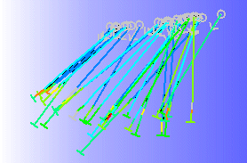
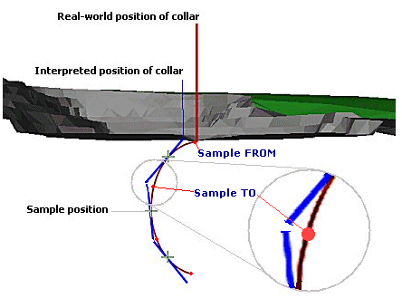
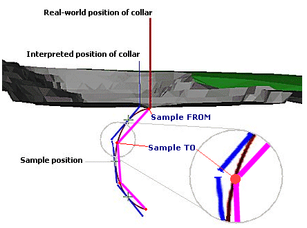

# Drillhole Representation

Your application represents drillholes according to the way that underlying program data has been created, based on the real-world location of definition points. Whichever method is used, it is important to understand that the data represented on the screen is an emulation of the actual drillhole position, shape and direction. 

There are two distinct types of data interpretation, based on the source of the data used to define drillhole strings; static drillholes and dynamic drillholes.

_Drillhole data in a 3D window_

The simplest method of calculating coordinates down a hole is the _straight-line method_. In this method, the hole direction at each survey point is projected to the depth of the next survey point. This has the advantage of being very easy to compute. Coordinates at each survey point are computed directly by simple trigonometry from the position and orientation of the previous survey point. Unfortunately, this method leads to large errors which increase with depth through ignoring the fact that a drillhole is in fact continuously curved, and does not bend abruptly and only at points where survey readings happen to have been taken.

There is a systematic bias in the interpreted coordinates, in that each surveyed direction is taken to apply for a length of hole below - but not above - the position of the measurement. A centred straight-line method avoids the bias problem, by assigning a given direction to a length of hole both above and below each measurement, half-way to the next higher or lower measurement. Unfortunately this method still does not account for the real curvature of the hole.

## Desurveying

Desurveying a drillhole is the process of determining the actual XYZ coordinates down a drillhole given the collar location and survey data. It is customary to survey a hole to obtain known values of the azimuth and dip at regular downhole distances along its length. From the collar location and survey measurements the actual XYZ coordinates along the hole are then calculated.

## What are 'Static' Drillholes?

A _Static_ drillhole is a single Datamine file which contains a set of XYZ sample centre points, lengths and directions which represent the hole traces. The desurveyed file maintains the sample lengths and centre points as specified in the raw drillhole data. Static drillholes are derived from physical database files. Static drillholes are also known by the term "desurveyed drillholes" as they are produced using the DESURV process to model the hole trace.

The [DESURV](<../Process_Help_XML/desurv.md>) process produces a curved-hole interpretation using spherical arcs;

The survey measurements are treated as unit vectors in 3D space in order that the dip and azimuth of each measurement is not treated independently. Between any two orientations, for a given (and known) downhole length, there is exactly one spherical arc between them. Knowing the coordinates of the first point, the coordinates of the second are uniquely fixed, as are the positions of every point between. Furthermore, since the spherical arc is tangential to the orientation at each survey point, curvature along the entire hole is guaranteed to be continuous, with no sharp angles as in any straight-line method. Starting from the known surveyed collar location the XYZ coordinates are progressively calculated down the hole.

The following image shows a highly exaggerated example of the deviation of a screen-based drillhole line segment from a real-world drillhole location:

Note how the sample positions (shown as crosses) lie on the actual plane of the drillhole raw data, but the projected strings deviated both above and below this point. Also note the position of the interpreted collar position, offset from the real-world collar coordinates due the projection of the first line segment above the initial sample point (a deviation of this magnitude in reality is, however, highly unlikely to exist).

Finally, it is important to note that the length of the sample along the real-world curvature of the drillhole is maintained in the flat-line segment, thus a 'gap' is created to compensate. Preserving segment lengths for flat-line segments is essential to preserve ore grade locations along the segment, so this issue is unavoidable.

In addition to survey data the input data to the desurveying process is typically defined by a set of samples of known lengths and distances down the hole. For grade estimation it is best to retain the exact lengths of these samples, for length weighting, and to produce a set of (sample centre) points that lie on the calculated curved hole trace. However, it is not mathematically possible to do this and to also have the end points of adjacent sample segments exactly meet or have their end points also lie on the curved trace. Therefore, there will be instances whereby aspects of the known-length samples, comprised of vectors do not match raw XYZ drillhole location points. However, for grade interpolation purposes, this is the most accurate method, even though the screen representation of the drillhole (a simulation, not an exact replication) may not match raw data in some points, including the collar location.

**Tip** : The differences between real-world and interpreted screen data can be minimized by compositing or dividing samples into smaller segments before running the DESURV command.

## What are 'Dynamic' Drillholes?

A dynamic drillhole (sometimes referred to as a drillhole trace, trace or drillhole string) is a set of XYZ points that represent the location of the hole in space. Drillhole traces are calculated 'on-the-fly' by desurveying. Drillhole strings are calculated from drillhole data, which consists of collar coordinates, survey information and assay sample information etc. The traces are used in conjunction with formatting options to create a holes overlay for display purposes.

This process differs from the way in which static drillholes are managed in that the in-memory coordinate data ensures that hole segments are drawn that meet exactly at their ends, and that the hole starts at exactly the collar position. It should be noted, however, that this is at the expense of retaining precise sample lengths, and the centre points of each sample are not maintained as being on the calculated hole trace as calculated from the spherical arcs interpretation.

The following image shows the same topography as illustrated above, with an exaggerated example of dynamic drillhole string projections:

Note that in this situation, sample lengths have been compromised, but the collar position is in the correct place. Also, the middle point of each string segment does not lie at the same position as the raw drillhole data. For this reason it is not recommended that this type of drillhole data be used for interpolation purposes.

## Subdividing Samples

The images shown above show an extreme view of the data deviations that occur with both desurveying methods. Your product provides functions to enable this deviation to have minimal impact by creating smaller (and subsequently a larger number of) drillhole segments. This 'sample subdivision' is one of the Project Options available for handling drillhole data.

## Which Method is Best?

For the reasons explained above, drillhole representations have both advantages and disadvantages, and your choice of which one to use will be based on what you want to use the drillhole data for:

If you intend to use current drillhole data for the purposes of interpolating grades, a static drillhole will provide a more accurate result, but the displayed screen image will not match the raw drillhole coordinates along the full length of the drillhole if any curvature is present.

If you wish to display your drillhole more accurately, particularly with regard to the collar positions, but aren't concerned with subsequent grade interpolation, a dynamic drillhole will provide the visual accuracy at the expense of less accurate sample positions.

## What difference does it make?

In reality, very little. The effects of differences between data and real-world coordinates, although increasing in line with the curvature of a drillhole along it's overall length, can be minimized by a combination of the following actions:

  * Compositing prior to desurveying.

  * Dividing samples into smaller segments before desurveying.

  * Selecting the appropriate data type for the function you are going to perform (display or grade interpolation).