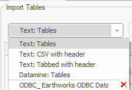

# Import and Map Data

To access this screen:

  * Run the command "drillhole-importer". The **Import** screen displays by default.

The **Import** screen is part of **[Drillhole Importer](<DrillholeImporter-screen.md>)**.

You import component drillhole tables such as assays, collars and survey data using the Import screen. You also set up data import scenarios with different import, validation and desurvey scenarios.

You can also build or rebuild drillholes from existing loaded drillhole component objects. For the purposes of this help file, importation from an external data source is assumed.

Another important function of this screen is field mapping. Whilst you can simply replicate imported field names in the output static drillhole file, you can also map to a different name, say, to adhere to an established naming convention that fits in with existing macros and scripts downstream. You can also convert incoming data using formulae. For example, you could convert all input coordinate collar fields to 2 decimal places.

Once importation is complete, the scenario can potentially be exported to other systems, ensuring a consistent desurveying process between separate projects for the same data. Other scenario functions are accessed using the toolbar provided.

**Note** : Whilst a typical drillhole importation scenario includes a Survey file, one is optional. If you decide to desurvey without a survey database, all data is assumed to be vertical, and this is highlighted when you actually desurvey the validated input data on the **[Desurvey](<DrillholeImporter-Desurvey.md>)** screen.

## Scenarios

Data used for this tool is stored as a "scenario". This collection of parameters can be exported, imported and managed as a whole, making transfer of information between different systems easy.

Importation scenarios are managed using the toolbar at the top of the screen.

  1. Scenario selection list.
  2. Create a new scenario.
  3. Copy the existing scenario to a new one.
  4. Delete the current scenario.
  5. Import a scenario. 
  6. Export a scenario. 

**Note** : All table columns can be dynamically resized.

## Drillhole Importer Data Sources

Each Drillhole Importer scenario has its own _data source_. A data source is where exploration data comes from, and is translated into information your application understands using data conversion routines, known as 'data source drivers'.

Whilst your scenario describes all of the parameters of your drillhole data importation process, it is the data source that denotes the type of data that you are importing. You only need to set this up a data source once (as outlined in activities below). Whilst it is common for a scenario to reference a single data source for its ground data, you can set up multiple sources if you need to. Say, some of your data is held in intermediate text files, and the rest in a Datamine Fusion database, for example.

Drillhole Importer provides default data sources for common data input situations, including:

  * _Text: CSV with Header_ Import a comma-delimited text file. No driver option screens display.
  * _Text: Tabbed_ Import a text file containing data delimited by a tab. No driver option screens display.
  * _Text: Tables_ Import text data using the text data source driver. All driver option screens display.
  * _Datamine: Tables_ Data held in Datamine's proprietary binary format (.dm or .dmx).

### Custom Data Sources

You can also set up a connection to an ODBC database, such as Datamine's Fusion database, or an Excel or other SQL data source, for example. These configurations, due to their many possible input parameters, are created using the Add Connection list to initiate the import process, and once complete, the configuration is stored as a _custom data source_.

The main difference between system and custom data sources is that a custom data source can be deleted, using the data source list.

_The Data Sources list showing system sources and one custom source (showing a red delete button)_

To import a component drillhole table using a new data connection:

  1. Open **Drillhole Editor**.
  2. Use the **Scenarios** toolbar (see "Managing Scenarios", above) to create a new scenario, or copy an existing one, if required.
  3. Define a data connection by expanding the **Add Connection** list.
  4. Pick a data connection type:
     * _acQuire_ \- Import data from a Datamine acQuire database.
     * _Fusion_ \- Import data directly from a Datamine Fusion Geological Data Management System. This can be a local or remote database.
     * _ODBC_ \- Import data from an ODBC-compliant data source, such as Excel, for example.
     * _Load Connections_ Choose a previously saved Datamine Database Connection file (.cfg) to reinstate a connection.

Alternatively, expand the **Import Tables** list to select the format of data to be imported the next time a table is added, choosing from a default table type. See Drillhole Importer Data Sources, above.

  5. Specify a data file to be imported. 

     * To import a file and let Drillhole Importer determine the component Type (assays, surveys etc.):

       1. Click **Add Table**.
       2. Locate and select the target drillhole component data item. 
       3. Depending on the select data format, import screens will appear specific to the selected data connection type (for example, if importing a text table, you define a delimiting character or field widths, but if importing via an ODBC Excel data source, you select a worksheet). 

Complete the screens to configure your external data import.

       4. The imported file displays in the menu structure in the most appropriate folder.
     * To preview the contents of an imported file in the Tables window of your application:

       1. Right-click any folder in the menu.

       2. Select **View Table**.

Your application displays a Tables window, showing the initial records of the specified file.

**Note** : This file preview is not editable and does not update automatically if subsequent file changes are made.

     * To drag and drop data from your operating system:

       1. Display the text (ASCII) data file(s) you wish to add to **Drillhole Importer**.
       2. Drag and drop one or more files into the **Import** screen.

Imported files appear on the **Import** screen, automatically categorized based on the detection of fields in the file.

  6. Review the table properties on the left of the screen:

     * **Name** : The name of the file as it appeared on disk. You can change this by typing a new name if you want. Click the name to edit and press <ENTER> to update.

     * **Source** : The original location of the imported file. This can't be edited.

     * **Type** : Displays the data format, and is linked to the selection made using **Define tables for import**.

     * **Records** : The number of independent data records in the imported file. 

     * **Mapped** : Shows a green tick if all fields in the file have been successfully mapped (see below for a mapping activity). A red cross appears if the data is not yet mapped. Tables must be mapped to continue.

     * **Date last imported** : This is updated each time a file is imported or reimported (see below for a reimporting activity).

**Tip** : Imported tables can be dragged between different folders.

To import a component drillhole table using an existing data connection:

  1. Open **Drillhole Editor**.
  2. Expand the **Import Tables** list to reveal both standard and custom data connections.S

Standard data connections appear at the top of the list, before the horizontal separator:

     * _Text: Tables_ import ASCII table data and define its expected format using the Text Data Source Driver.

     * _Text: CSV with Header_ import comma-delimited data with header information.

     * _Text: Tabbed with Header_ import tab-delimited data with header information.

     * _Datamine: Tables_ import data from Datamine binary files (.dm or .dmx).

     * _Loaded Data_ import data from existing loaded objects.

  3. Click **Add Table** to display the appropriate import screens for the selected data import type. For example, if _Loaded Data_ was selected previously, a list of loaded objects appears.
  4. Select the file to import and, if required, complete additional import screens.

To map imported fields to fields in the output static drillhole file:

  1. On the left of the screen, select an imported drillhole table containing attributes to be mapped.

The **Field Definitions** table updates to show the following columns:

     * **Include** : If checked, the associated attribute will be included in the desurveying process. If unchecked, it will be ignored. By default, all attributes of the selected file are included.

**Tip** : select multiple records using SHIFT and CTRL key shortcuts, then **right-click** any selected field and choose **Include** or **Exclude** to change the status of multiple fields at once.

     * **Column Name** : The name of the data attribute in the selected file. This field is read-only.

     * **Mapping Type** : Select the general attribute type, with respect to the desurveying process. This will be one of the following:

       * **None** : The attribute doesn't relate directly to desurveying, i.e. it doesn't relate to drillhole assay, density, bearing, dip or interval definition (FROM, TO etc.). In this case, the **Output Name** will match the **Column Name** by default (but can be changed).

       * **BHID** : A unique identifier for a drillhole. Can only be set for one attribute.

       * **At** : Represents an interval's AT value. Can only be set for one attribute.

       * **FROM** : Represents an interval's FROM value. Can only be set for one attribute.

       * **TO** : Represents an interval's TO value. Can only be set for one attribute.

       * **X/Y/Z** : Any recognizable coordinate field name will be automatically mapped to X, Y or Z.

       * **Length** : The length of an interval.

       * **Density** : A density field. 

       * **Dip** : The dip of the sample.

       * **Bearing** : The bearing of the sample.

       * **Assay** : An attribute containing assay values.

**Note** : **Drillhole Importer** attempts to automatically map imported attribute types if recognizable attribute names are detected, including from 3rd party vendors such as Leapfrog. These automatic assignments can be overridden.

     * **Output Name** : The name of the attribute included in the desurveyed output drillhole file. Editable field.

     * **Alpha Width** : If the field is alphanumeric, its width is shown here. This is not editable.

     * **Create Legend** : when drillholes are created, create a default legend for the column (this option is not available for system fields **Dip** , **Bearing** and **AT**).

If re-running a previous drillhole import, if fields were previously checked, they are shown with an 'indeterminate' state, meaning the previous legends won't be recreated. Instead, the previous legends are set as the default for the target field when desurveying next occurs. If the box is fully checked, legends are recreated.

     * **Note** : selected attribute(s) can be used to colour generated data using **[Desurvey](<DrillholeImporter-Desurvey.md>)** screen options.

     * **Formula** : If a formula is used to calculate the value of a numeric attribute, it will appear here. Clicking in this cell accesses the Edit Formula screen. See [Edit Formula](<DmEditEditFormula.md>).

     * **Source Tables** : Displays the imported table or tables from which the attribute was derived. For example, BHID is likely to be found in multiple tables.

  2. You can hide any fields where **Include** is unchecked by checking Hide unselected columns.

**Note** : You can reimport all drillhole tables at any time (to update the Drillhole Importer with the latest source file changes) using **Re-import**.

Related topics and activities

  * [Drillhole Importer](<DrillholeImporter-screen.md>)
  * [Validate Imported Drillhole Tables](<DrillholeImporter-Validate.md>)
  * [Desurvey Validated Drillhole Data](<DrillholeImporter-Desurvey.md>)
  * [Edit Formula](<DmEditEditFormula.md>)