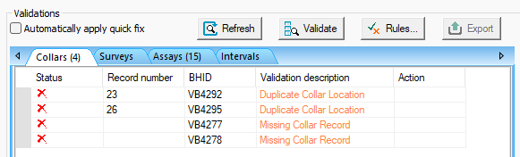

# Drillhole Importer

To access this screen:

  * Run the command "drillhole-importer".

The **Drillhole Importer** simplifies the import of downhole data (collars, assays, surveys, depths, and intervals) from various sources. It validates the imported data for errors and converts it into a static drillhole file. For example, you can easily import drillholes with the latest assay data from the grade control database for short-term planning and blast modeling. 

You can also build or rebuild drillholes from existing loaded drillhole component objects. For the purposes of this help file, importation from an external data source is assumed.

**Note** : Whilst a typical drillhole importation scenario includes a Survey file, one is optional. If you decide to desurvey without a survey database, all data is assumed to be vertical, and this is highlighted when you actually desurvey the validated input data on the **[Desurvey](<DrillholeImporter-Desurvey.md>)** screen.

Another common use case is updating geological wireframes by obtaining current drillholes from a Datashed grade control database after each bi-monthly RC drilling campaign. 

Configure your data connections to access and store a wide range of database formats, ensuring quick and easy reconnection for data updates.

See **[Static vs. Dynamic Drillholes](<Drillhole%20Representation%20in%20Studio.md>)**.

You may need, for example. to have access to drillholes with the most recent assay data from the grade control database to have a grade control model ready for short term planning with each blast. If blasting is, say, twice per week, you'll need a consistent way of importing, mapping, validating and desurveying the latest ground data. Another typical use case would be to get a current set of drillholes from a Datashed grade control database to update the geological wireframes for use in the grade control model after each RC drilling campaign twice per month.

Each importation and desurveying configuration can be stored as an independent _scenario_. These scenarios can be exported and imported and are thus easily transferable between systems or for local storage.

As a minimum, an input collars and surveys table must be imported. Additional tables can be imported and desurveyed, essentially any data with an appropriate interval range, including assays, depths and intervals. You can add one or more of any drillhole data type. For example, your collar data may be spread across multiple files.

**Note** : **Drillhole Importer** table columns are dynamically resized to fit the largest data item.

## Scenarios

Data used for this tool is stored as a "scenario". This collection of parameters can be exported, imported and managed as a whole, making transfer of information between different systems easy.

Importation scenarios are managed using the toolbar at the top of the screen.

  1. Scenario selection list.
  2. Create a new scenario.
  3. Copy the existing scenario to a new one.
  4. Delete the current scenario.
  5. Import a scenario. 
  6. Export a scenario. 

**Note** : All table columns can be dynamically resized.

## Data Mapping and Output Field Names

For each imported table, you can map assign any attribute to an information type. Where possible, attribute names will be automatically mapped based on their description. So, for example, if your imported collars file contains either an _X_ , _XCOLLAR_ , _XP_ or _XPT_ field name, it is assumed to be a coordinate field and will be mapped to the appropriate type and will be mapped to an appropriate output field name for a static drillhole file (in this case, _X_) during desurveying, the final step.

You can adjust field mappings for any attribute and can set any output field name, providing it is under 24 characters.

If required, you can include or exclude attribute data within any file so that it is not considered when creating composite intervals by desurveying. 

**Warning** : If excluding fields, it must still be possible to desurvey across the multiple imported tables. For example, negating coordinate fields in a collars file, or the BHID attribute of a surveys file will cause validation errors and prevent you from desurveying that data.

See [Import and Map Data](<DrillholeImporter-Import.md>).

## Data Validation

Drillhole Importer checks your imported component files for potential errors that may cause inaccurate desurveying results or even cause desurveying to fail. For example, duplicate collar locations (which may or may not be an error - for fan drilling, for example, it could be deliberate), missing collars or unexpectedly large gaps between interval records (that is, between the TO of one segment and the FROM of the subsequent interval). Other checks are made for significant changes in dip or bearing which may indicate a sampling or logging error.

With respect to the rules used for validation, you define these yourself. The **Validation Rules** screen lets you choose what is considered a duplicate collar, the gap size threshold between intervals and the bearing and dip curvature error triggers.

_Drillhole Importer showing results of a validation run_

Where possible, and if the solution is obvious, Drillhole Importer can fix errors during the validation stage so that, the next validation run removes all the solvable problems, leaving others to be actioned using one of the options available.

Validation is performed across each imported table independently. See [Validate Imported Drillhole Tables](<DrillholeImporter-Validate.md>).

## Desurveying Imported Drillhole Data

Desurveying a drillholes is the process of determining the actual XYZ coordinates down a drillhole given the collar location and survey data. It is customary to survey a hole to obtain known values of the azimuth and dip at regular downhole distances along its length. From the collar location and survey measurements the actual XYZ coordinates along the hole are then calculated.

Once core data has been imported, mapped and validated (and errors resolved), you can desurvey your component tables into a single static drillhole file for downstream processes such as implicit modelling and grade estimation. See **[Dynamic vs. Static Drillholes](<Drillhole%20Representation%20in%20Studio.md>)**.

Various desurveying options are available in Drillhole Importer, including setting a dip convention (positive up or down), injecting dummy intervals for gaps, including sample end coordinates and so on.

Once desurveying is complete, a summary report displays indicating statistics for the generated static drillhole file.

## Refreshing and Reloading Imported Data

Static drillhole files resulting from desurveying via the Drillhole Importer can be **[refreshed and reloaded](<Concept_Loading%20Data.md>)**. When this happens, reloading or refreshing is performed using the settings of the scenario from which the data was created.

  * **Reload** : Changes to dynamic drillhole component files are reloaded and reflected in the loaded object. The data is imported using existing importation scenario settings.

  * **Refresh** : This will re-desurvey the existing component files to update the static drillhole object. No component file changes are applied.

If a drillhole importation scenario can be detected when a reload or refresh is requested, those scenario settings are used to update a load static drillhole object. This ensures that data imported using Drillhole Importer remains consistently validated and desurveyed.

Related topics and activities

  * [Import and Map Data](<DrillholeImporter-Import.md>)

  * [Validate Imported Drillhole Tables](<DrillholeImporter-Validate.md>)

  * [Drillhole Validation Errors](<DrillholeImporter-Errors.md>)

  * [Desurvey Validated Drillhole Data](<DrillholeImporter-Desurvey.md>)

  * [Dynamic vs. Static Drillholes](<Drillhole%20Representation%20in%20Studio.md>)