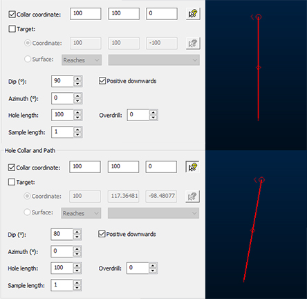
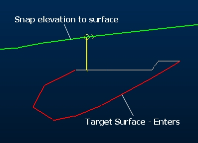
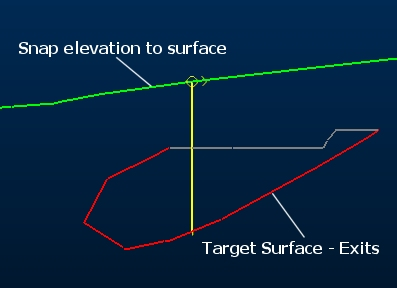
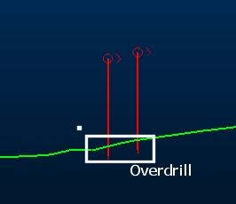

# Edit Planned Drillholes

The [Drillhole Planner](<DrillholePlannerDialog.md>) is used to interactively plan exploration, infill and production drilling patterns.

You can create new drillhole data and, as this topic covers, editing existing hole parameters, specifying important instructions to define the drillhole direction and for any expected hole deviations.

See Edit Planned Drillholes and [Drillhole Deviation Planning](<DrillholePlanner-Lift-Drift.md>).

To edit existing holes using the Drillhole Planner:

  1. Display the [Drillhole Planner](<DrillholePlannerDialog.md>).

  2. Select the Drillhole Table containing holes to be edited.

  3. In the Select Planned Holes section, expand Hole name.

All holes associated with the Drillhole Table are listed, as distinguished by their unique BHID reference.

Note: Selecting a hole highlights it in the 3D window, and will update the Hole collar and path and [Deviations](<DrillholePlanner-Lift-Drift.md>) settings of that hole.

  4. At this stage, you can enter or edit an existing Comment. Comments are freeform text used to provide additional information about a hole.

  5. Delete a hole by either clicking into the 3D window and pressing DELETE or using the red cross icon in the **Drillhole Planner**. 

Tip: Use box-selection techniques in the 3D window to delete holes if you wish. The Hole name automatically updates to reflect any recent changes. 

Tip: Even with no hole selected, the Hole collar and path and Deviations controls are still enabled. This lets you set up design parameters for the next hole to be digitized, using Add new hole(s). The only time these controls are disabled is where a Drillhole Table has not been selected, or the current table has been unloaded.

  6. Right-click the **Hole Name** field for more options:

     * **Rename** You cannot rename a drillhole if that BHID name is already used by an existing hole within the same drillhole object. A drillhole name cannot be empty.

     * **Look At** Focus the 3D view on the selected hole.

     * **Delete**

  7. Adjust **Hole Collar and Path** settings. Use these controls to edit the position, composition and orientation of a hole and view auto-calculated values. It is also used to set dip convention and set the origin position of the next hole; (collar or target). 

     * Collar or **Target coordinate** Select the corresponding check box to edit the XYZ position of the currently selected hole target or collar.

       * If only the Collar coordinate check box is selected: you can edit the 3D location of the collar position and/or interactively pick a 3D window location using the corresponding picker tool (which will automatically update the XYZ fields). 

In this case, you cannot edit the target location directly, but you can edit the Dip, Azimuth and Hole length values (and Deviations) to adjust it indirectly: in this situation, the Target coordinate values are automatically calculated. For example, the image at the top, below, shows a default drillhole with a 90 degree Dip, meaning the only difference between collar and target is the depth value. On the bottom image, the Dip is reduced to 80 degrees, automatically adjusting the Target coordinate values:

;>)

       * Similarly, if only the _Target_ check box is selected, you can manually or interactively set the target location for the active hole by selecting the Coordinate option.

If the Target check box is selected (and the Coordinate option selected) this also instructs Drillhole Planner to position the next new hole (offset or manually positioned) using the mouse to define the target (not the collar) of the hole.

If Target and Coordinate are selected and an offset hole is applied, the next hole will be offset at the target position and maintain the specified positional and directional settings in relation to the next parallel hole. New offset hole targets will be snapped to a surface if one is specified.

       * Similarly, if the Target check box is selected, you can manually or interactively set the target location for the active hole by selecting the Coordinate option. This will automatically calculate the collar position by adjusting Dip, Azimuth, Hole length and/or Deviations.

If the Target check box is selected (and the Coordinate option selected) this also instructs Drillhole Planner to position the next new hole (offset or manually positioned) using the mouse to define the target (not the collar) of the hole.

       * If Target and Coordinate are selected and an offset hole is applied, the next hole will be offset at the target position and maintain the specified Dip, Azimuth, Hole Length and Deviations to position the next parallel hole. New offset hole targets will be snapped to a surface if one is specified.

       * If both Collar coordinate and Target/Coordinate check boxes are enabled, the Dip, Azimuth and Hole length settings will be automatically calculated, and so are disabled for input. You can still apply deviations, as deviations will be applied between collar and target, anchoring their positions to the given tolerance (this tolerance can be configured in the [Advanced Settings](<DrillholePlannerAdvancedDialog.md>) screen). 

Note: You can still edit the Sample length of the hole and any planned Overdrill setting in this case.

If both Collar coordinate and Target/Coordinate check boxes are enabled, the next new hole will be digitized by defining a collar position, with the target being set to the preset XYZ values.

In this case, creating an offset hole will be offset at both collar and target positions and maintain the specified Dip, Azimuth, Hole Length and Deviations to position the next parallel hole. New offset hole collars will be snapped to a surface if one is specified.

       * If the Target radio button is selected, and Surface is selected, this instructs **Drillhole Planner** to locate the end-of-hole position in relation to a loaded surface or volume (the wireframe object is selected from the corresponding drop-down list; only loaded objects are listed).

Choose from the following options:

         * Reaches Terminate the hole at the first point the hole intercepts the specific wireframe object or preselected wireframe triangles (you can edit the way wireframe data is selected using the **[Project Settings: Wireframeing](<Project%20Settings_Wireframing.md>)** screen), even if there are multiple intercept points (such as with a 3D volume, or a folded structure).

Either specify a target wireframe object, or _< selected triangles>_, meaning any wireframe surface or partial surface (in any loaded object) can be used as a terminating surface.

Overdrill (see below) will be added afterwards, if it is specified, causing the hole to push through the surface by the specified amount. This is regardless of the direction from which the hole intercepts the surface or volume.

         * Enters Similar to _Reaches_ above, terminate the hole at the point it first intercepts a boundary of a surface or volume. This is useful where a structure volume denotes the end of the hole. **Overdrill** is applied if specified. For example:

;>)

As with the other options in this group, your target wireframe can either be a loaded wireframe object or any selected wireframe triangles (within one or more loaded objects).  

         * Exits In this case, the final intercept of the hole and surface or volume will be used to terminate the hole. This is useful for progressing a hole through a mineral-bearing structure for example, terminating the sample as it leaves the structure. For example:

;>)

Enters Similar to the _Reaches_ , terminate the hole at the point it first intercepts a boundary of a surface or volume. This is useful where a structure volume denotes the end of the hole. **Overdrill** is applied. For example:  
  
;>)

As with the other options in this group, your target wireframe can either be a loaded wireframe object or any selected wireframe triangles (within one or more loaded objects).

  8. Define the Dip and dip convention of the selected hole. Dip values must be between -90 and 90.

Note: Toggling **Positive downwards** automatically inverts the **Dip** value.

Note: Offset holes store data internally using a positive-downwards convention, but will be displayed as positive upwards values in the Drillhole Planner if the Positive downwards check box is disabled.

  9. Define the **Azimuth** of the selected hole. This must be between 0 and 360.

  10. Set the Hole length. 

Note: If you are fitting the hole to both a collar and target coordinate, then hole length will be automatically calculated and shown, but will not be editable

  11. Define Overdrill. This is the distance past the target the hole must extend. This does not normally affect the hole length itself, but simply downhole depth at which the target occurs. 

One exception to this is when defining holes using both collar and target position. In this case, the resultant hole length will that sufficient to travel between the collar and the target, plus the required overdrill distance. The effects of overdrill are particularly obvious when defining target position, for example by snapping to a wireframe surface. In these case, the hole will not terminate at the surface, but will continue the specified overdrill distance past it, for example:

  12. Define the Sample Length down the hole. 

Warning: This will override custom intervals down the hole and apply a consistent composited interval.

  13. Define any planned drillhole **Deviations**. See [Drillhole Deviation Planning](<DrillholePlanner-Lift-Drift.md>).

  14. Define [Advanced Settings](<DrillholePlannerAdvancedDialog.md>).

  15. Click **Save to Tables** to output component drillhole tables in CSV format (collars, surveys, samples) using the [Save Drillhole Tables](<DrillholePlannerSaveDialog.md>) screen.

Related topics and activities

  * [Drillhole Planner](<DrillholePlannerDialog.md>)

  * [Drillhole Planner: Create Holes](<DrillholePlanner-Create-New.md>)

  * [Drillhole Deviation Planning](<DrillholePlanner-Lift-Drift.md>)

  * [Save Drillhole Tables](<DrillholePlannerSaveDialog.md>)

  * [Advanced Drillhole Planner Settings](<DrillholePlannerAdvancedDialog.md>)